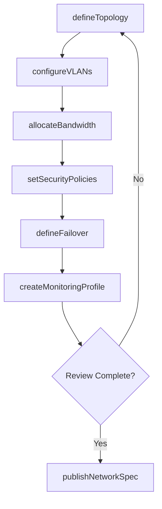
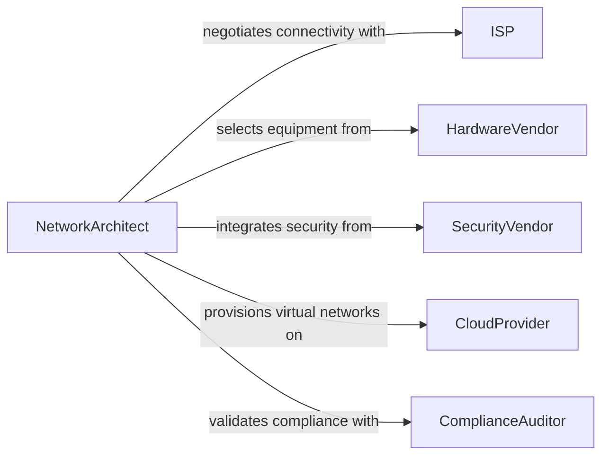

# Develop Specifications for Computer Network Operation

> Business-as-Code definition for developing technical specifications that define network architecture, protocols, bandwidth requirements, and operational procedures for computer networks.

## Overview

Computer network operation specifications define the topology, protocol standards, bandwidth allocations, security policies, and monitoring requirements for enterprise and data center networks. This definition models the process of documenting network architecture decisions, capacity planning parameters, failover configurations, and operational runbooks that enable consistent network provisioning and management.

## Actors

| Actor | Description |
|-------|-------------|
| ISP | Internet service provider delivering upstream connectivity |
| HardwareVendor | Supplier of switches, routers, and network appliances |
| SecurityVendor | Provider of firewalls, IDS/IPS, and security appliances |
| CloudProvider | Platform providing virtual network infrastructure |
| ComplianceAuditor | External party reviewing network security compliance |
| TenantOrganization | Internal department or customer consuming network services |

## Roles

| Role | Description |
|------|-------------|
| NetworkArchitect | Designs network topology and defines specifications |
| NetworkEngineer | Implements configurations based on specifications |
| SecurityAnalyst | Defines network security policies and access controls |
| CapacityPlanner | Models bandwidth needs and growth projections |

## Entities

| Entity | Description |
|--------|-------------|
| NetworkSpec | Complete specification for a network environment |
| TopologyDiagram | Visual representation of network architecture |
| BandwidthAllocation | Capacity reserved for a segment or service |
| SecurityPolicy | Rules governing traffic filtering and access |
| FailoverConfig | Redundancy and failover mechanism definitions |
| MonitoringProfile | Alerting thresholds and metric collection settings |
| VLANDefinition | Virtual LAN segmentation and tagging rules |

## Actions

| Action | Description |
|--------|-------------|
| defineTopology | Document the network architecture and connectivity |
| allocateBandwidth | Specify capacity for network segments and services |
| configureVLANs | Define virtual LAN segmentation and routing |
| setSecurityPolicies | Establish firewall rules and access control lists |
| defineFailover | Specify redundancy and automatic failover behavior |
| createMonitoringProfile | Set alerting thresholds and metric collection |
| publishNetworkSpec | Release the finalized network specification |

## Events

| Event | Description |
|-------|-------------|
| topologyDefined | Network architecture has been documented |
| bandwidthAllocated | Capacity has been assigned to segments |
| vlansConfigured | Virtual LAN segmentation has been defined |
| securityPoliciesSet | Firewall rules and ACLs have been established |
| failoverDefined | Redundancy mechanisms have been specified |
| monitoringProfileCreated | Alerting and metrics collection has been configured |
| networkSpecPublished | The finalized network specification has been released |

## Searches

| Search | Description |
|--------|-------------|
| findNetworkSpecs | Search specifications by site, environment, or status |
| getBandwidthAllocations | Retrieve capacity assignments for a network |
| listSecurityPolicies | Enumerate firewall rules and ACLs |
| getVLANDefinitions | Look up VLAN configurations by network |
| findFailoverConfigs | Locate redundancy settings for critical segments |

## Workflow



## Actor Relationships



## Usage

### Calling Actions

```typescript
import { developSpecificationsComputerNetworkOperation } from '@headlessly/develop-specifications-computer-network-operation'

const netSpec = developSpecificationsComputerNetworkOperation()

// Define network topology
const topology = await netSpec.defineTopology({
  name: 'Corporate HQ Network',
  type: 'spine-leaf',
  sites: ['hq-dc1', 'hq-dc2'],
  uplinks: [
    { provider: 'primary-isp', bandwidth: '10Gbps' },
    { provider: 'backup-isp', bandwidth: '1Gbps' }
  ]
})

// Configure VLANs
await netSpec.configureVLANs({
  networkId: topology.id,
  vlans: [
    { id: 10, name: 'management', cidr: '10.0.10.0/24' },
    { id: 20, name: 'production', cidr: '10.0.20.0/24' },
    { id: 30, name: 'guest', cidr: '10.0.30.0/24', isolated: true }
  ]
})

// Set security policies
await netSpec.setSecurityPolicies({
  networkId: topology.id,
  rules: [
    { source: 'vlan-30', destination: 'vlan-20', action: 'deny' },
    { source: 'vlan-10', destination: 'any', action: 'allow' }
  ]
})
```

### Event-Driven Automation

```typescript
// Alert when security policies change
netSpec.securityPoliciesSet(async ({ networkId, ruleCount }) => {
  await notify({
    to: 'security-ops',
    message: `${ruleCount} security policies updated for network ${networkId}`
  })
})

// Auto-create monitoring after spec is published
netSpec.networkSpecPublished(async ({ networkId }) => {
  await netSpec.createMonitoringProfile({
    networkId,
    metrics: ['bandwidth-utilization', 'packet-loss', 'latency'],
    alertThreshold: { packetLoss: 0.1, latency: 50 }
  })
})
```
