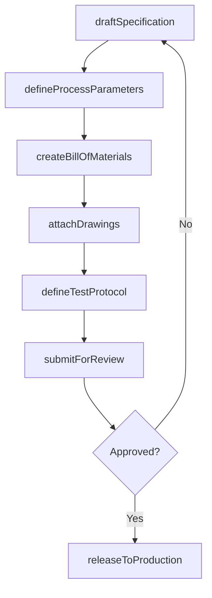
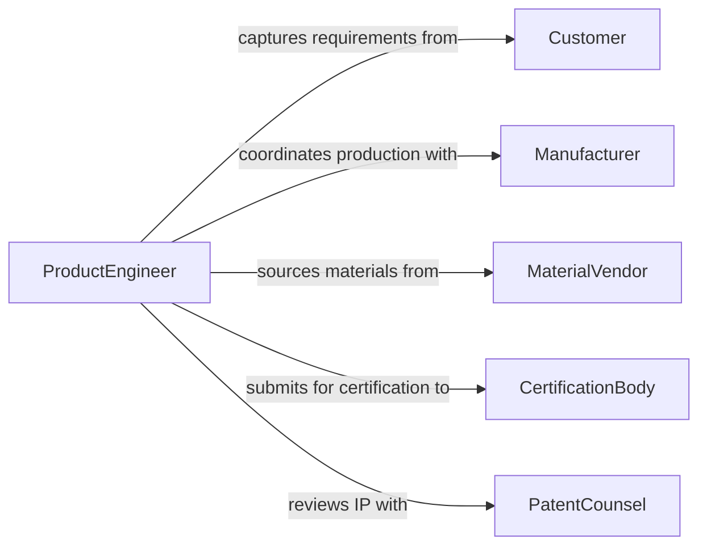

# Develop Specifications for New Products or Processes

> Business-as-Code definition for developing detailed specifications that define the materials, dimensions, performance, and manufacturing requirements for new products or processes.

## Overview

Product and process specification development translates conceptual designs into documented technical requirements that manufacturing, procurement, and quality teams can execute against. This definition covers the full specification lifecycle including material selection, dimensional tolerancing, process parameter definition, and formal review and release to production.

## Actors

| Actor | Description |
|-------|-------------|
| Customer | Party defining product requirements and acceptance criteria |
| Manufacturer | Facility producing the product per specification |
| MaterialVendor | Supplier of raw materials and components |
| CertificationBody | Organization certifying product compliance |
| PatentCounsel | Legal entity reviewing intellectual property implications |
| DistributionPartner | Channel partner with packaging or labeling requirements |

## Roles

| Role | Description |
|------|-------------|
| ProductEngineer | Authors technical specifications for new products |
| ProcessEngineer | Defines manufacturing process parameters |
| QualityManager | Establishes inspection and acceptance criteria |
| R&DLead | Validates feasibility of specification requirements |

## Entities

| Entity | Description |
|--------|-------------|
| ProductSpec | Complete specification document for a new product |
| ProcessSpec | Detailed parameters for a manufacturing process |
| BillOfMaterials | List of components and materials required |
| DimensionalDrawing | Engineering drawing with tolerances and dimensions |
| TestProtocol | Procedure for validating product against specification |
| RevisionHistory | Tracked changes across specification versions |
| ComplianceMatrix | Mapping of requirements to regulatory standards |

## Actions

| Action | Description |
|--------|-------------|
| draftSpecification | Create an initial specification document |
| defineProcessParameters | Specify manufacturing process settings and limits |
| createBillOfMaterials | Assemble the list of required materials and components |
| attachDrawings | Link engineering drawings to the specification |
| defineTestProtocol | Establish validation procedures for the product |
| submitForReview | Route specification to stakeholders for feedback |
| releaseToProduction | Finalize and distribute specification for manufacturing |

## Events

| Event | Description |
|-------|-------------|
| specificationDrafted | An initial specification has been created |
| processParametersDefined | Manufacturing parameters have been documented |
| billOfMaterialsCreated | The materials list has been assembled |
| drawingsAttached | Engineering drawings have been linked |
| testProtocolDefined | Validation procedures have been established |
| specificationReviewed | Stakeholder review has been completed |
| specificationReleased | Specification has been released to production |

## Searches

| Search | Description |
|--------|-------------|
| findSpecifications | Search specifications by product line or status |
| getBillOfMaterials | Retrieve the materials list for a specification |
| listRevisions | View revision history for a specification |
| findTestProtocols | Locate test procedures by product or standard |
| getComplianceStatus | Check regulatory compliance mapping |

## Workflow



## Actor Relationships



## Usage

### Calling Actions

```typescript
import { developSpecificationsNewProductsProcesses } from '@headlessly/develop-specifications-new-products-processes'

const specs = developSpecificationsNewProductsProcesses()

// Draft a product specification
const spec = await specs.draftSpecification({
  productName: 'Titanium Alloy Bracket',
  category: 'structural-component',
  revision: 'A',
  requirements: [
    { name: 'tensileStrength', value: 900, unit: 'MPa' },
    { name: 'weight', max: 2.5, unit: 'kg' }
  ]
})

// Create bill of materials
await specs.createBillOfMaterials({
  specId: spec.id,
  items: [
    { material: 'Ti-6Al-4V', quantity: 3.2, unit: 'kg' },
    { material: 'Corrosion-resistant coating', quantity: 0.5, unit: 'L' }
  ]
})

// Release to production
await specs.releaseToProduction({ specId: spec.id })
```

### Event-Driven Automation

```typescript
// Notify manufacturing when spec is released
specs.specificationReleased(async ({ specId, productName }) => {
  await notify({
    to: 'manufacturing-ops',
    message: `Specification ${specId} for ${productName} is released to production`
  })
})

// Auto-create test protocol after BOM is finalized
specs.billOfMaterialsCreated(async ({ specId }) => {
  await specs.defineTestProtocol({
    specId,
    type: 'incoming-inspection',
    standard: 'AMS-2750'
  })
})
```
