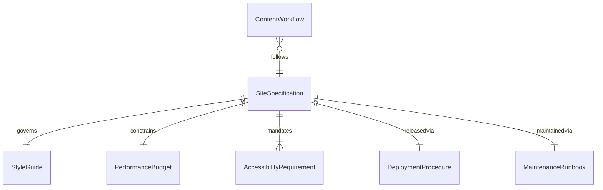
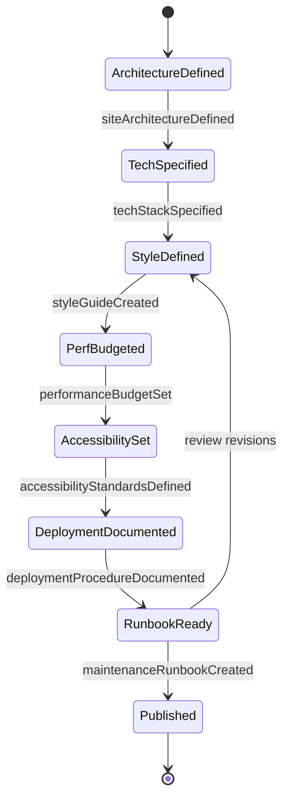
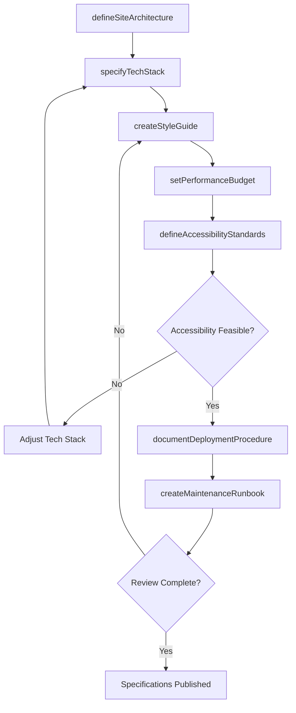
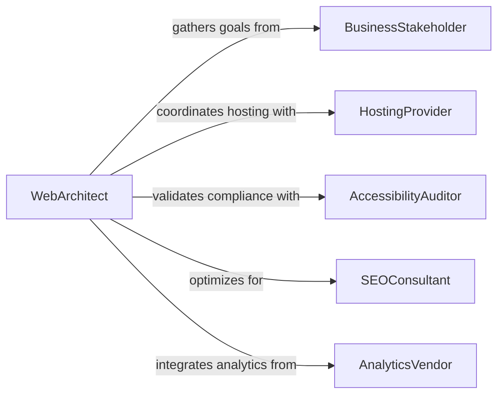

# Develop Specifications or Procedures for Website Development

> Business-as-Code definition for developing technical specifications and procedural guidelines that govern website design, development, deployment, and ongoing maintenance.

## Overview

Website specification and procedure development establishes the technical standards, architectural patterns, content management workflows, and quality assurance processes that guide web development teams. This definition covers site architecture documentation, front-end and back-end technology specifications, accessibility compliance requirements, deployment procedures, and maintenance runbooks.

## Actors

| Actor | Description |
|-------|-------------|
| BusinessStakeholder | Internal party defining website goals and content needs |
| HostingProvider | Platform or vendor hosting the website infrastructure |
| AccessibilityAuditor | External evaluator assessing WCAG compliance |
| SEOConsultant | Specialist advising on search engine optimization |
| ContentCreator | Writer or designer producing website content |
| AnalyticsVendor | Provider of web analytics and tracking tools |

## Roles

| Role | Description |
|------|-------------|
| WebArchitect | Defines site structure, technology stack, and standards |
| FrontendDeveloper | Implements user interfaces per specification |
| DevOpsEngineer | Establishes deployment and maintenance procedures |
| QALead | Creates testing specifications and acceptance criteria |

## Entities

| Entity | Description |
|--------|-------------|
| SiteSpecification | Technical document defining website architecture and standards |
| DeploymentProcedure | Step-by-step process for releasing website updates |
| StyleGuide | Design and coding standards for consistent implementation |
| AccessibilityRequirement | WCAG conformance criteria for the website |
| MaintenanceRunbook | Operational procedures for ongoing site management |
| PerformanceBudget | Target metrics for page load times and resource sizes |
| ContentWorkflow | Process governing content creation, review, and publishing |

## Actions

| Action | Description |
|--------|-------------|
| defineSiteArchitecture | Establish the information architecture and URL structure |
| specifyTechStack | Document the front-end and back-end technology choices |
| createStyleGuide | Author design and coding standards for the team |
| setPerformanceBudget | Define page weight and load time targets |
| documentDeploymentProcedure | Write the release and rollback process |
| defineAccessibilityStandards | Specify WCAG conformance levels and testing approach |
| createMaintenanceRunbook | Document ongoing operational procedures |

## Events

| Event | Description |
|-------|-------------|
| siteArchitectureDefined | The information architecture has been documented |
| techStackSpecified | Technology choices have been formalized |
| styleGuideCreated | Design and coding standards have been published |
| performanceBudgetSet | Load time and resource targets have been established |
| deploymentProcedureDocumented | Release process has been written |
| accessibilityStandardsDefined | WCAG compliance requirements have been specified |
| maintenanceRunbookCreated | Operational procedures have been documented |

## Searches

| Search | Description |
|--------|-------------|
| findSpecifications | Search website specs by project or technology |
| getStyleGuide | Retrieve the active style guide for a project |
| listProcedures | Enumerate deployment and maintenance procedures |
| getPerformanceBudget | Look up performance targets for a site |
| findAccessibilityRequirements | Query accessibility standards by conformance level |

## Entity Relationships



## State Diagram



## Workflow



## Actor Relationships



## Usage

### Calling Actions

```typescript
import { developSpecificationsProceduresWebsiteDevelopment } from '@headlessly/develop-specifications-procedures-website-development'

const webSpecs = developSpecificationsProceduresWebsiteDevelopment()

// Define site architecture
const architecture = await webSpecs.defineSiteArchitecture({
  projectName: 'Corporate Rebrand',
  sections: ['home', 'products', 'about', 'blog', 'contact'],
  urlPattern: 'slug-based',
  sitemapDepth: 3
})

// Specify technology stack
await webSpecs.specifyTechStack({
  projectId: architecture.id,
  frontend: { framework: 'Next.js', styling: 'Tailwind CSS' },
  backend: { runtime: 'Node.js', cms: 'headless-cms' },
  hosting: { provider: 'Cloudflare Pages', cdn: 'global' }
})

// Set performance budget
await webSpecs.setPerformanceBudget({
  projectId: architecture.id,
  targets: {
    lcp: 2500,
    fid: 100,
    cls: 0.1,
    totalPageWeight: '500KB'
  }
})
```

### Event-Driven Automation

```typescript
// Notify team when deployment procedures are ready
webSpecs.deploymentProcedureDocumented(async ({ projectId }) => {
  await notify({
    to: 'devops-team',
    message: `Deployment procedure documented for project ${projectId}`
  })
})

// Schedule accessibility audit after standards are defined
webSpecs.accessibilityStandardsDefined(async ({ projectId, level }) => {
  await scheduleAudit({
    projectId,
    type: 'wcag-compliance',
    level
  })
})
```
