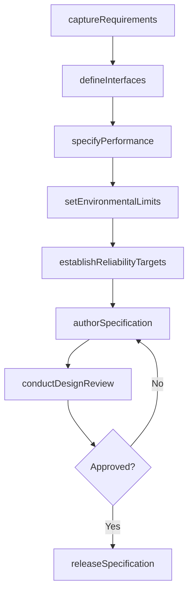
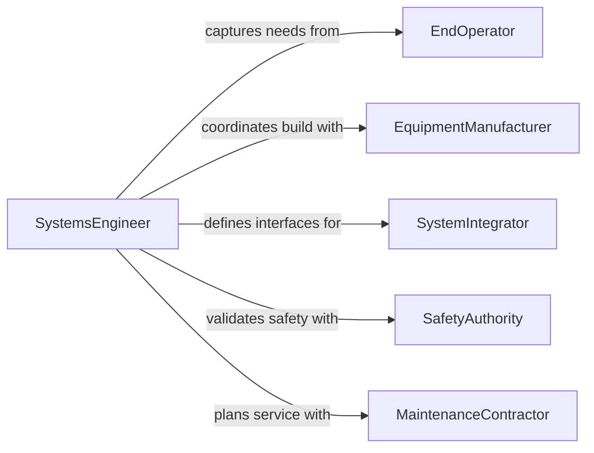

# Develop Technical Specifications for Systems or Equipment

> Business-as-Code definition for developing technical specifications that define the performance, interfaces, and operational parameters of systems and equipment.

## Overview

Technical specification development for systems and equipment encompasses the documentation of functional requirements, interface definitions, environmental operating conditions, reliability targets, and maintenance intervals. This definition models the process from initial requirements capture through specification authoring, technical review, and formal release, providing a programmable framework for engineering teams to standardize equipment procurement and system integration.

## Actors

| Actor | Description |
|-------|-------------|
| EquipmentManufacturer | Vendor building equipment to the specification |
| SystemIntegrator | Organization assembling subsystems into a complete solution |
| EndOperator | Personnel or organization operating the equipment |
| SafetyAuthority | Regulatory body enforcing equipment safety standards |
| MaintenanceContractor | Party responsible for servicing the equipment |
| InsuranceUnderwriter | Entity assessing equipment risk for coverage |

## Roles

| Role | Description |
|------|-------------|
| SystemsEngineer | Authors system-level technical specifications |
| MechanicalEngineer | Defines mechanical performance and interface specs |
| ReliabilityEngineer | Establishes MTBF targets and maintenance intervals |
| ProcurementSpecialist | Translates specs into procurement requirements |

## Entities

| Entity | Description |
|--------|-------------|
| SystemSpec | Complete technical specification for a system |
| InterfaceDefinition | Documented connection points between subsystems |
| PerformanceRequirement | Quantified capability the system must achieve |
| EnvironmentalEnvelope | Operating temperature, humidity, and vibration limits |
| ReliabilityTarget | Mean time between failures and availability goals |
| MaintenanceSchedule | Planned service intervals and procedures |
| ConformanceReport | Document verifying equipment meets specification |

## Actions

| Action | Description |
|--------|-------------|
| captureRequirements | Collect operational needs from stakeholders |
| defineInterfaces | Document physical and logical connection points |
| specifyPerformance | Set quantified performance thresholds |
| setEnvironmentalLimits | Define operating condition boundaries |
| establishReliabilityTargets | Set MTBF, MTTR, and availability goals |
| authorSpecification | Write the formal technical specification |
| conductDesignReview | Facilitate peer review of the specification |
| releaseSpecification | Publish the finalized specification |

## Events

| Event | Description |
|-------|-------------|
| requirementsCaptured | Stakeholder requirements have been collected |
| interfacesDefined | System interface definitions have been documented |
| performanceSpecified | Performance thresholds have been set |
| environmentalLimitsSet | Operating condition boundaries have been defined |
| reliabilityTargetsEstablished | Availability and failure targets have been set |
| specificationAuthored | The formal specification has been written |
| designReviewConducted | Peer review of the specification is complete |
| specificationReleased | The finalized specification has been published |

## Searches

| Search | Description |
|--------|-------------|
| findSystemSpecs | Search specifications by system type or project |
| getInterfaces | Retrieve interface definitions for a system |
| listPerformanceRequirements | Enumerate performance criteria for a specification |
| findConformanceReports | Locate verification reports for equipment |
| getMaintenanceSchedule | Retrieve planned service intervals |

## Workflow



## Actor Relationships



## Usage

### Calling Actions

```typescript
import { developTechnicalSpecificationsSystemsEquipment } from '@headlessly/develop-technical-specifications-systems-equipment'

const sysSpec = developTechnicalSpecificationsSystemsEquipment()

// Capture requirements
const reqs = await sysSpec.captureRequirements({
  systemName: 'Industrial Cooling Unit',
  stakeholders: ['facilities-ops', 'safety-team', 'maintenance'],
  operationalContext: 'continuous-24x7'
})

// Specify performance
await sysSpec.specifyPerformance({
  systemId: reqs.systemId,
  requirements: [
    { name: 'coolingCapacity', value: 500, unit: 'kW' },
    { name: 'powerConsumption', max: 150, unit: 'kW' },
    { name: 'noiseLevel', max: 75, unit: 'dB' }
  ]
})

// Set reliability targets
await sysSpec.establishReliabilityTargets({
  systemId: reqs.systemId,
  mtbf: 8760,
  mttr: 4,
  availability: 99.5
})
```

### Event-Driven Automation

```typescript
// Notify procurement when spec is released
sysSpec.specificationReleased(async ({ systemId, specId }) => {
  await notify({
    to: 'procurement',
    message: `Technical specification ${specId} released for RFQ preparation`
  })
})

// Auto-generate maintenance schedule from reliability targets
sysSpec.reliabilityTargetsEstablished(async ({ systemId, mtbf }) => {
  const intervalHours = Math.floor(mtbf * 0.8)
  await sysSpec.authorSpecification({
    systemId,
    section: 'maintenance',
    interval: intervalHours
  })
})
```
