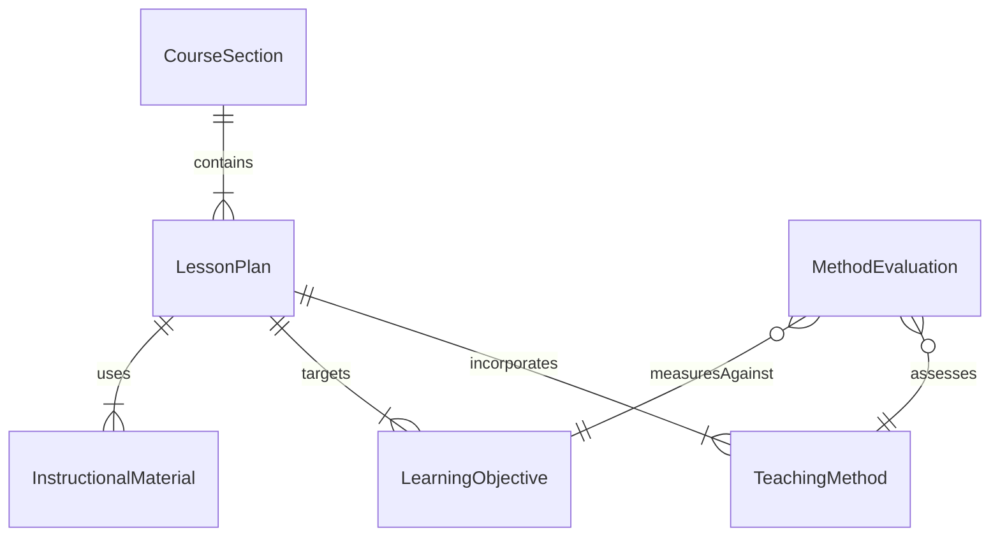
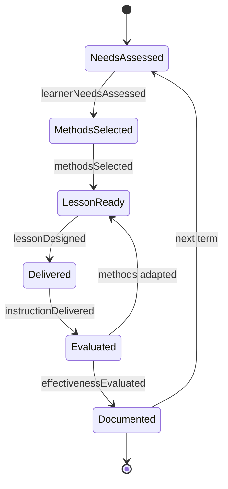
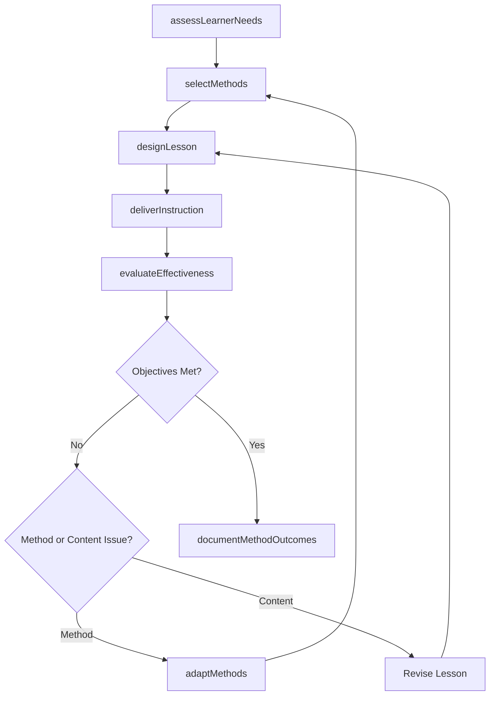
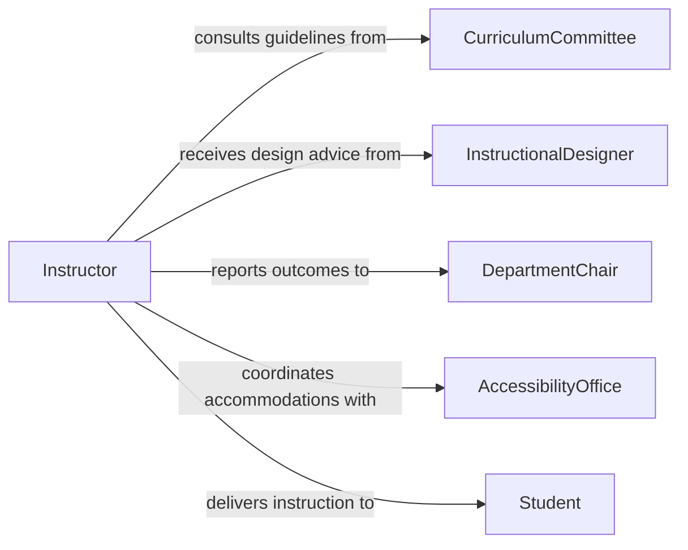

# Apply Multiple Teaching Methods

> Business-as-Code definition for applying multiple teaching methods. Models the selection, implementation, and evaluation of diverse instructional strategies to maximize learner engagement and outcomes.

## Overview

Applying multiple teaching methods involves selecting and combining diverse instructional approaches -- such as lectures, discussions, hands-on activities, and multimedia -- to accommodate varied learning styles and subject requirements. This definition exposes actions for method selection, lesson planning, delivery, and effectiveness evaluation, along with events that trigger adaptive teaching workflows.

## Actors

| Actor | Description |
|-------|-------------|
| Student | The learner who benefits from varied instructional approaches |
| CurriculumCommittee | Sets standards and guidelines for acceptable teaching methods |
| InstructionalDesigner | Advises on pedagogical strategies and learning technologies |
| DepartmentChair | Oversees teaching quality and method adoption within a department |
| AccessibilityOffice | Ensures teaching methods meet accessibility and accommodation requirements |

## Roles

| Role | Description |
|------|-------------|
| Instructor | Selects and delivers instructional methods in the classroom |
| CourseDesigner | Plans course structure incorporating multiple pedagogical approaches |
| TeachingAssistant | Supports delivery of varied instructional activities |
| AssessmentSpecialist | Evaluates effectiveness of teaching methods against learning outcomes |

## Entities

| Entity | Description |
|--------|-------------|
| TeachingMethod | A defined instructional approach such as lecture, seminar, or lab |
| LessonPlan | A structured plan specifying methods, materials, and timing |
| LearningObjective | A measurable goal that instruction is designed to achieve |
| MethodEvaluation | An assessment of how effectively a teaching method achieved outcomes |
| CourseSection | A specific offering of a course with assigned methods and schedule |
| InstructionalMaterial | Resources and media used to support a teaching method |

## Actions

| Action | Description |
|--------|-------------|
| assessLearnerNeeds | Evaluate student demographics, styles, and prerequisites |
| selectMethods | Choose appropriate teaching methods for the learning objectives |
| designLesson | Create a lesson plan incorporating multiple instructional strategies |
| deliverInstruction | Execute the lesson using the selected teaching methods |
| evaluateEffectiveness | Measure learning outcomes against objectives for each method |
| adaptMethods | Adjust teaching approach based on evaluation results |
| documentMethodOutcomes | Record which methods produced the best results for future reference |

## Events

| Event | Description |
|-------|-------------|
| learnerNeedsAssessed | Student learning profiles have been evaluated |
| methodsSelected | Teaching methods have been chosen for a lesson or course |
| lessonDesigned | A multi-method lesson plan has been created |
| instructionDelivered | A lesson using multiple methods has been completed |
| effectivenessEvaluated | Method outcomes have been measured against objectives |
| methodsAdapted | Teaching approach has been adjusted based on feedback |
| methodOutcomesDocumented | Effectiveness data has been recorded for institutional knowledge |

## Searches

| Search | Description |
|--------|-------------|
| findMethodsByObjective | Retrieve teaching methods suited to specific learning objectives |
| getMethodEffectiveness | Query historical effectiveness ratings for teaching methods |
| findLessonPlans | Search lesson plans by subject, method type, or instructor |
| getLearnerProfiles | Retrieve student learning style and preference data |

## Entity Relationships



## State Diagram



## Workflow



## Actor Relationships



## Usage

### Calling Actions

```typescript
import { applyMultipleTeachingMethods } from '@headlessly/apply-multiple-teaching-methods'

const methods = applyMultipleTeachingMethods()

// Assess learner needs for a course section
const needs = await methods.assessLearnerNeeds({
  courseSectionId: 'cs-bio-101-fall',
  studentCount: 35,
  surveyResults: { visual: 40, auditory: 30, kinesthetic: 30 }
})

// Select and combine methods for the course
const selected = await methods.selectMethods({
  courseSectionId: 'cs-bio-101-fall',
  learningObjectives: ['Explain cell division', 'Identify organelles under microscope'],
  methods: ['lecture', 'labExercise', 'groupDiscussion', 'multimediaPresentation']
})

// Evaluate effectiveness after delivery
const evaluation = await methods.evaluateEffectiveness({
  courseSectionId: 'cs-bio-101-fall',
  assessmentScores: { preTest: 52, postTest: 78 },
  methodBreakdown: selected.methods
})
```

### Event-Driven Automation

```typescript
// Trigger method adaptation when effectiveness is low
methods.effectivenessEvaluated(async ({ courseSectionId, results }) => {
  const underperforming = results.filter(r => r.score < 0.6)
  if (underperforming.length > 0) {
    await methods.adaptMethods({
      courseSectionId,
      replacements: underperforming.map(m => ({
        current: m.method,
        suggested: m.alternativeMethod
      }))
    })
  }
})

// Auto-document outcomes at end of term
methods.instructionDelivered(async ({ courseSectionId, lessonId, methodsUsed }) => {
  await methods.documentMethodOutcomes({
    courseSectionId,
    lessonId,
    methodsUsed,
    timestamp: new Date().toISOString()
  })
})
```
