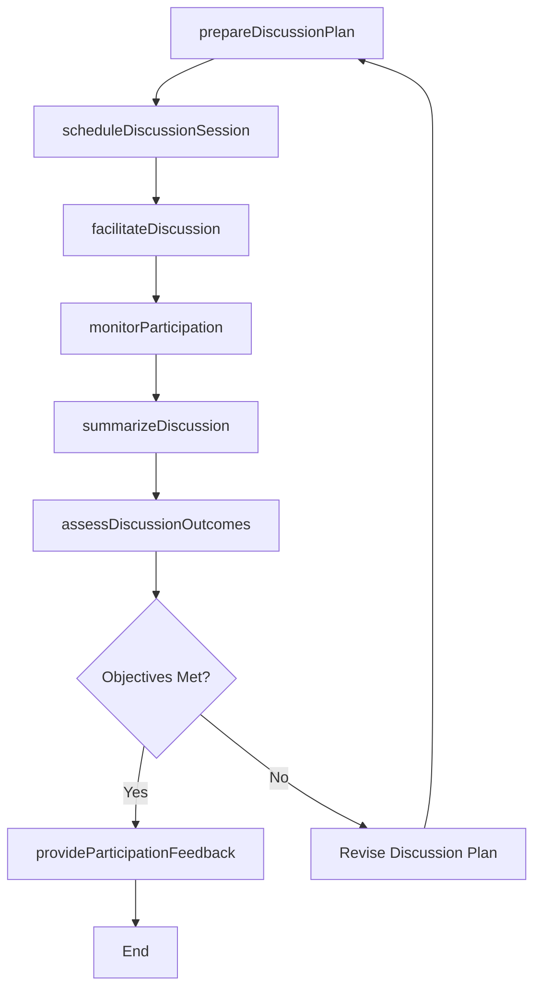
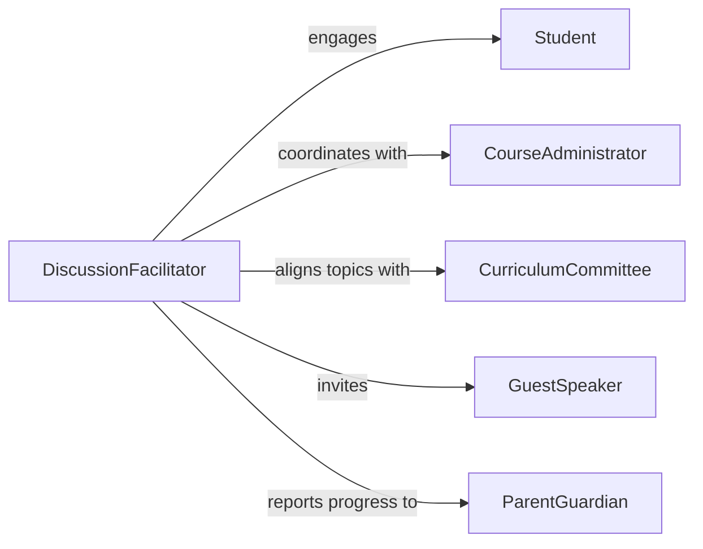

# Guide Class Discussions

> Business-as-Code definition for guiding class discussions. Models the process of planning discussion topics, facilitating structured classroom dialogue, monitoring participant engagement, and assessing learning through discussion-based interaction.

## Overview

Guiding class discussions involves preparing discussion topics aligned with learning objectives, facilitating open dialogue among students or trainees, encouraging critical thinking and participation, and using discussion outcomes to assess comprehension. This definition exposes actions for designing discussion frameworks, managing real-time facilitation, documenting participation and contributions, and evaluating whether discussion-based learning objectives have been achieved.

## Actors

| Actor | Description |
|-------|-------------|
| Student | Individual participating in guided classroom discussions |
| CourseAdministrator | Manages course scheduling, enrollment, and academic records |
| CurriculumCommittee | Establishes learning standards and discussion topic requirements |
| GuestSpeaker | External subject matter expert invited to contribute to discussions |
| ParentGuardian | Stakeholder interested in student participation and academic progress |

## Roles

| Role | Description |
|------|-------------|
| DiscussionFacilitator | Plans and leads class discussions to meet learning objectives |
| TeachingAssistant | Supports discussion facilitation and monitors small group interactions |
| AssessmentCoordinator | Evaluates student learning outcomes from discussion participation |
| ContentDeveloper | Creates discussion prompts, case studies, and reference materials |

## Entities

| Entity | Description |
|--------|-------------|
| DiscussionPlan | A structured outline of topics, prompts, and objectives for a class discussion |
| DiscussionSession | A scheduled class meeting focused on guided dialogue |
| ParticipationRecord | Documentation of student engagement, contributions, and interaction quality |
| DiscussionPrompt | A question or scenario designed to stimulate critical thinking and dialogue |
| LearningOutcome | A measurable objective that discussion activities are designed to achieve |
| SessionSummary | A documented recap of key points, insights, and conclusions from a discussion |

## Actions

| Action | Description |
|--------|-------------|
| prepareDiscussionPlan | Design topics, prompts, and objectives for a class discussion |
| scheduleDiscussionSession | Plan a discussion session with date, participants, and format |
| facilitateDiscussion | Lead real-time classroom dialogue on prepared topics |
| monitorParticipation | Track student engagement and contribution quality during discussion |
| summarizeDiscussion | Document key insights, conclusions, and unresolved questions |
| assessDiscussionOutcomes | Evaluate whether learning objectives were achieved through discussion |
| provideParticipationFeedback | Deliver individualized feedback on discussion engagement and quality |

## Events

| Event | Description |
|-------|-------------|
| discussionPlanPrepared | Topics, prompts, and objectives for a discussion have been designed |
| discussionSessionScheduled | A class discussion session has been planned and confirmed |
| discussionFacilitated | A guided class discussion has been conducted |
| participationMonitored | Student engagement during a discussion has been tracked |
| discussionSummarized | Key points and conclusions from a discussion have been documented |
| discussionOutcomesAssessed | Learning achievement through discussion has been evaluated |
| participationFeedbackProvided | Individual feedback on discussion engagement has been delivered |

## Searches

| Search | Description |
|--------|-------------|
| findDiscussionPlans | List discussion plans by course, topic, or learning objective |
| getParticipationRecords | Retrieve student participation data by session, student, or engagement level |
| getSessionSummaries | Look up discussion summaries by date, course, or topic |
| findLowEngagement | Identify students with below-threshold participation across sessions |

## Workflow



## Actor Relationships



## Usage

### Calling Actions

```typescript
import { guideClassDiscussions } from '@headlessly/guide-class-discussions'

const discussions = guideClassDiscussions()

// Prepare a discussion plan
const plan = await discussions.prepareDiscussionPlan({
  courseId: 'HIST-301',
  topic: 'Industrial Revolution: Economic and Social Impact',
  prompts: [
    'How did mechanization reshape labor markets?',
    'What parallels exist between industrial and digital transformation?',
    'Evaluate the role of government regulation during rapid economic change.'
  ],
  learningObjectives: ['critical-analysis', 'historical-comparison', 'argumentation']
})

// Schedule and facilitate
const session = await discussions.scheduleDiscussionSession({
  planId: plan.id,
  scheduledDate: '2026-04-08',
  format: 'seminar-style',
  participantCount: 25
})

// Assess outcomes
const outcomes = await discussions.assessDiscussionOutcomes({
  sessionId: session.id,
  criteria: ['depth-of-analysis', 'evidence-use', 'peer-interaction']
})
```

### Event-Driven Automation

```typescript
// Auto-generate participation feedback after each session
discussions.discussionSummarized(async ({ sessionId }) => {
  const records = await discussions.getParticipationRecords({ sessionId })
  for (const record of records) {
    await discussions.provideParticipationFeedback({
      studentId: record.studentId,
      sessionId,
      engagementScore: record.score,
      notes: record.observations
    })
  }
})

// Flag low-engagement students for follow-up
discussions.participationMonitored(async ({ sessionId, lowEngagementStudents }) => {
  if (lowEngagementStudents.length > 0) {
    await notify({
      to: 'course-instructor',
      message: `${lowEngagementStudents.length} students had low engagement in session ${sessionId}`
    })
  }
})
```
