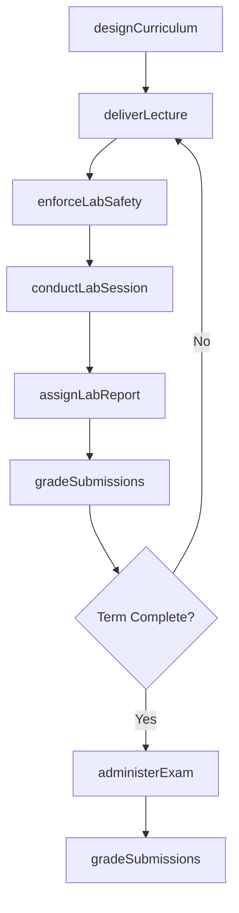
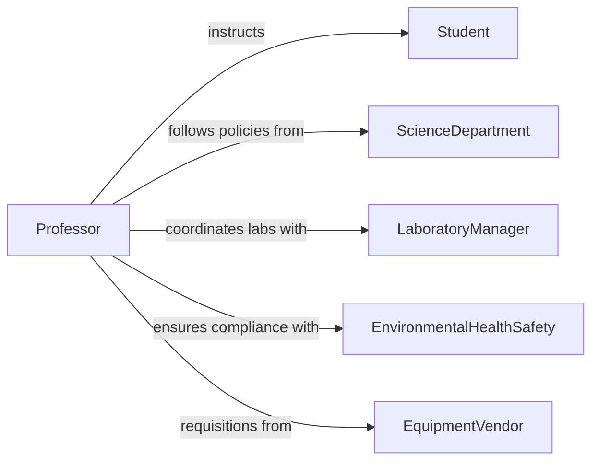

# Instruct College Students Physical Life

> Business-as-Code definition for instructing college students in physical or life sciences. Models the delivery of lectures, laboratory sessions, and assessments across disciplines such as biology, chemistry, physics, and earth sciences.

## Overview

Instructing college students in physical or life sciences involves delivering theoretical lectures, supervising laboratory experiments, demonstrating scientific methods, and assessing student comprehension through exams and lab reports. This definition exposes actions for course delivery, lab management, and student evaluation, along with events for safety compliance and academic milestone tracking.

## Actors

| Actor | Description |
|-------|-------------|
| Student | Undergraduate or graduate learner enrolled in a science course |
| ScienceDepartment | Governs curriculum standards and laboratory policies |
| LaboratoryManager | Maintains lab facilities, equipment, and safety protocols |
| ResearchFundingAgency | Provides grants that may support teaching-related research |
| EquipmentVendor | Supplies scientific instruments and consumables |
| EnvironmentalHealthSafety | Enforces lab safety regulations and hazardous materials handling |

## Roles

| Role | Description |
|------|-------------|
| Professor | Designs curriculum and delivers lectures in physical or life sciences |
| LabInstructor | Supervises hands-on laboratory sessions and demonstrations |
| TeachingAssistant | Assists with grading, tutoring, and lab section facilitation |
| CourseCoordinator | Manages logistics across multi-section science courses |

## Entities

| Entity | Description |
|--------|-------------|
| Course | A physical or life science course with lecture and lab components |
| LaboratorySession | A scheduled hands-on experiment or demonstration session |
| LabReport | A student-authored document analyzing experimental procedures and results |
| Examination | A written or practical exam assessing scientific knowledge |
| SafetyProtocol | Documented procedures for safe conduct in laboratory settings |
| EquipmentReservation | A booking for specialized scientific instruments or lab space |

## Actions

| Action | Description |
|--------|-------------|
| designCurriculum | Develop course structure integrating lectures, labs, and assessments |
| deliverLecture | Present theoretical content on a scientific topic |
| conductLabSession | Supervise students performing experiments in a laboratory |
| assignLabReport | Distribute lab report requirements and rubrics |
| administerExam | Create, proctor, and collect science examinations |
| gradeSubmissions | Evaluate lab reports, exams, and other student work |
| enforceLabSafety | Verify compliance with safety protocols before and during labs |

## Events

| Event | Description |
|-------|-------------|
| curriculumDesigned | Course structure and materials have been finalized |
| lectureDelivered | A lecture session has been completed |
| labSessionConducted | A laboratory experiment session has been supervised |
| labReportAssigned | Lab report requirements have been distributed |
| examAdministered | An examination has been proctored and collected |
| submissionsGraded | Student work has been evaluated and scores recorded |
| labSafetyEnforced | Safety compliance has been verified for a lab session |

## Searches

| Search | Description |
|--------|-------------|
| findCourses | List science courses by department, term, or instructor |
| getLabSchedule | Retrieve laboratory session schedules by course or facility |
| findStudentGrades | Query student grades by course, assignment type, or score range |
| getLabSafetyRecords | Retrieve safety compliance records by lab or term |
| getEquipmentAvailability | Check availability of scientific instruments and lab spaces |

## Workflow



## Actor Relationships



## Usage

### Calling Actions

```typescript
import { instructCollegeStudentsPhysicalLife } from '@headlessly/instruct-college-students-physical-life'

const sciences = instructCollegeStudentsPhysicalLife()

// Design a biology course with lab component
const course = await sciences.designCurriculum({
  title: 'Molecular Biology',
  department: 'Biology',
  term: 'Spring 2026',
  lectureHours: 3,
  labHours: 3,
  objectives: [
    'Describe DNA replication and transcription',
    'Perform gel electrophoresis',
    'Analyze gene expression data'
  ]
})

// Conduct a lab session
await sciences.conductLabSession({
  courseId: course.id,
  week: 5,
  experiment: 'Gel Electrophoresis of DNA Fragments',
  safetyProtocols: ['ppe-required', 'chemical-handling'],
  equipmentNeeded: ['electrophoresis-apparatus', 'uv-transilluminator']
})

// Grade lab reports
await sciences.gradeSubmissions({
  courseId: course.id,
  assignmentType: 'labReport',
  rubric: { methodology: 30, results: 30, analysis: 25, formatting: 15 }
})
```

### Event-Driven Automation

```typescript
// Verify safety compliance before every lab
sciences.labSessionConducted(async ({ courseId, labId, safetyStatus }) => {
  if (safetyStatus !== 'compliant') {
    await escalate({
      to: 'environmental-health-safety',
      message: `Lab ${labId} safety issue detected in course ${courseId}`
    })
  }
})

// Auto-notify students when grades are posted
sciences.submissionsGraded(async ({ courseId, assignmentTitle }) => {
  const roster = await getEnrolledStudents(courseId)
  await notifyAll({
    to: roster,
    message: `Grades for ${assignmentTitle} have been posted`
  })
})
```
