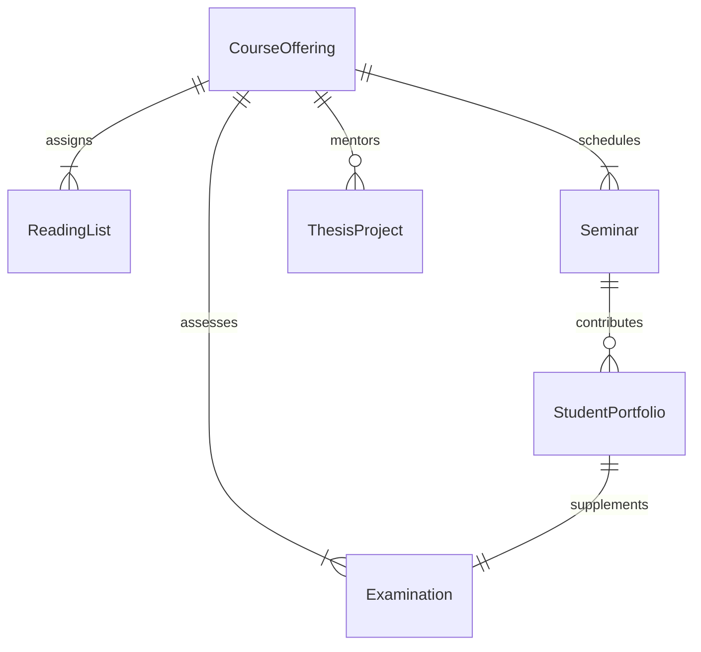
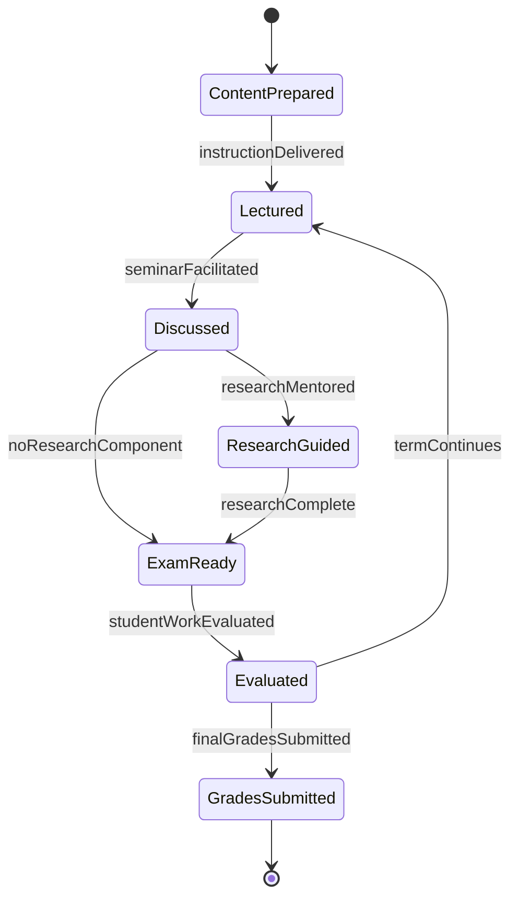
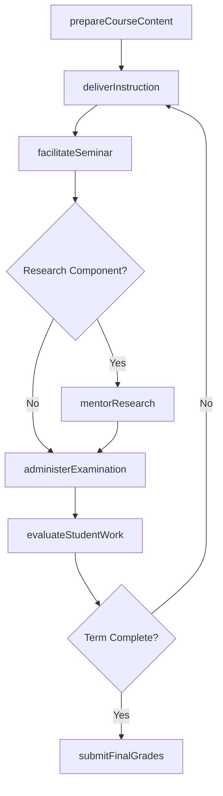
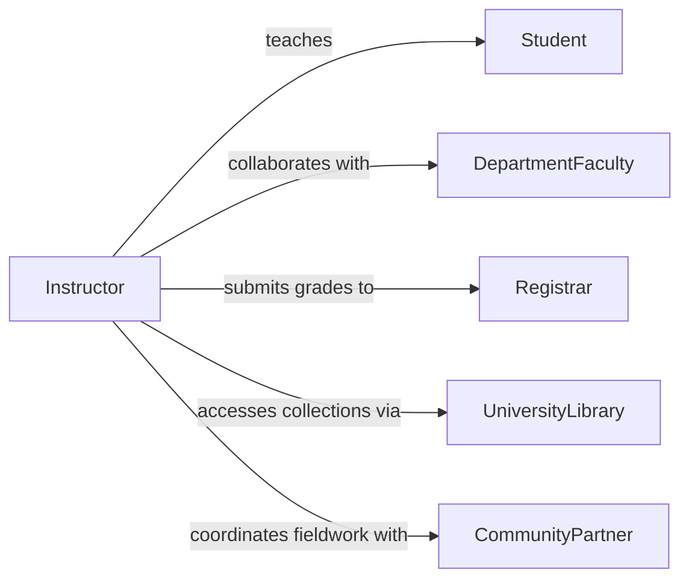

# Instruct College Students Social Sciences

> Business-as-Code definition for instructing college students in social sciences or humanities disciplines. Models the delivery of lectures, seminars, and assessments across fields such as history, philosophy, anthropology, and interdisciplinary humanities.

## Overview

Instructing college students in social sciences or humanities disciplines involves preparing and delivering course content, facilitating critical analysis and scholarly discourse, mentoring student research, and assessing comprehension through written work and examinations. This definition exposes actions for instructional delivery, student engagement, and academic evaluation, along with events for tracking teaching milestones.

## Actors

| Actor | Description |
|-------|-------------|
| Student | Undergraduate or graduate learner enrolled in a social sciences or humanities course |
| DepartmentFaculty | Peer faculty who collaborate on curriculum and cross-disciplinary offerings |
| Registrar | Manages enrollment, scheduling, and academic records |
| UniversityLibrary | Provides access to archives, databases, and special collections |
| PeerReviewBoard | Evaluates instructional quality and tenure-related teaching portfolios |
| CommunityPartner | External organizations providing fieldwork or service-learning opportunities |

## Roles

| Role | Description |
|------|-------------|
| Instructor | Delivers course content and manages the classroom experience |
| GraduateTeachingAssistant | Leads recitation sections and assists with grading |
| CurriculumDesigner | Develops course sequences and interdisciplinary programs |
| ResearchMentor | Guides students through independent study and thesis projects |

## Entities

| Entity | Description |
|--------|-------------|
| CourseOffering | A scheduled section of a social sciences or humanities course |
| ReadingList | Curated set of texts, articles, and primary sources for a course |
| Seminar | A discussion-based instructional session emphasizing critical analysis |
| Examination | A formal assessment such as a midterm, final, or oral exam |
| StudentPortfolio | A collection of student work demonstrating learning outcomes |
| ThesisProject | An extended research project undertaken by an advanced student |

## Actions

| Action | Description |
|--------|-------------|
| prepareCourseContent | Develop lectures, reading lists, and discussion prompts |
| deliverInstruction | Present course material through lectures, seminars, or workshops |
| facilitateSeminar | Lead a discussion-based session analyzing texts or case studies |
| mentorResearch | Guide student research projects and thesis development |
| administerExamination | Create, distribute, and proctor examinations |
| evaluateStudentWork | Grade essays, portfolios, and exams with detailed feedback |
| submitFinalGrades | Record and submit end-of-term grades to the registrar |

## Events

| Event | Description |
|-------|-------------|
| courseContentPrepared | Lectures and materials have been finalized for a course |
| instructionDelivered | A lecture or instructional session has been completed |
| seminarFacilitated | A discussion-based seminar has been conducted |
| researchMentored | A mentoring session for student research has occurred |
| examinationAdministered | An exam has been distributed and proctored |
| studentWorkEvaluated | Student submissions have been graded with feedback |
| finalGradesSubmitted | End-of-term grades have been submitted to the registrar |

## Searches

| Search | Description |
|--------|-------------|
| findCourseOfferings | List course sections by discipline, term, or instructor |
| getStudentRoster | Retrieve enrolled students for a specific course section |
| findStudentWork | Search student submissions by course, assignment, or grade range |
| getTeachingEvaluations | Retrieve student evaluations of instruction by term or course |

## Entity Relationships



## State Diagram



## Workflow



## Actor Relationships



## Usage

### Calling Actions

```typescript
import { instructCollegeStudentsSocialSciences } from '@headlessly/instruct-college-students-social-sciences'

const instruction = instructCollegeStudentsSocialSciences()

// Prepare course content for a history seminar
const content = await instruction.prepareCourseContent({
  courseId: 'hist-301-fall',
  title: 'Modern European History',
  readingList: [
    { title: 'The Age of Revolution', author: 'Hobsbawm' },
    { title: 'Postwar', author: 'Judt' }
  ],
  weeks: 15
})

// Facilitate a seminar discussion
await instruction.facilitateSeminar({
  courseId: 'hist-301-fall',
  week: 4,
  topic: 'Nationalism and State Formation',
  discussionPrompts: [
    'How did industrialization shape national identity?',
    'Compare top-down vs. bottom-up nationalism'
  ]
})

// Submit final grades
await instruction.submitFinalGrades({
  courseId: 'hist-301-fall',
  term: 'Fall 2026'
})
```

### Event-Driven Automation

```typescript
// Notify students when course materials are ready
instruction.courseContentPrepared(async ({ courseId, title }) => {
  const roster = await getStudentRoster(courseId)
  await notifyAll({
    to: roster,
    message: `Course materials for ${title} are now available`
  })
})

// Flag low-performing students for advising outreach
instruction.studentWorkEvaluated(async ({ courseId, studentId, grade }) => {
  if (grade < 60) {
    await createAdvisingAlert({
      studentId,
      courseId,
      reason: 'Below-passing grade on recent assignment'
    })
  }
})
```
