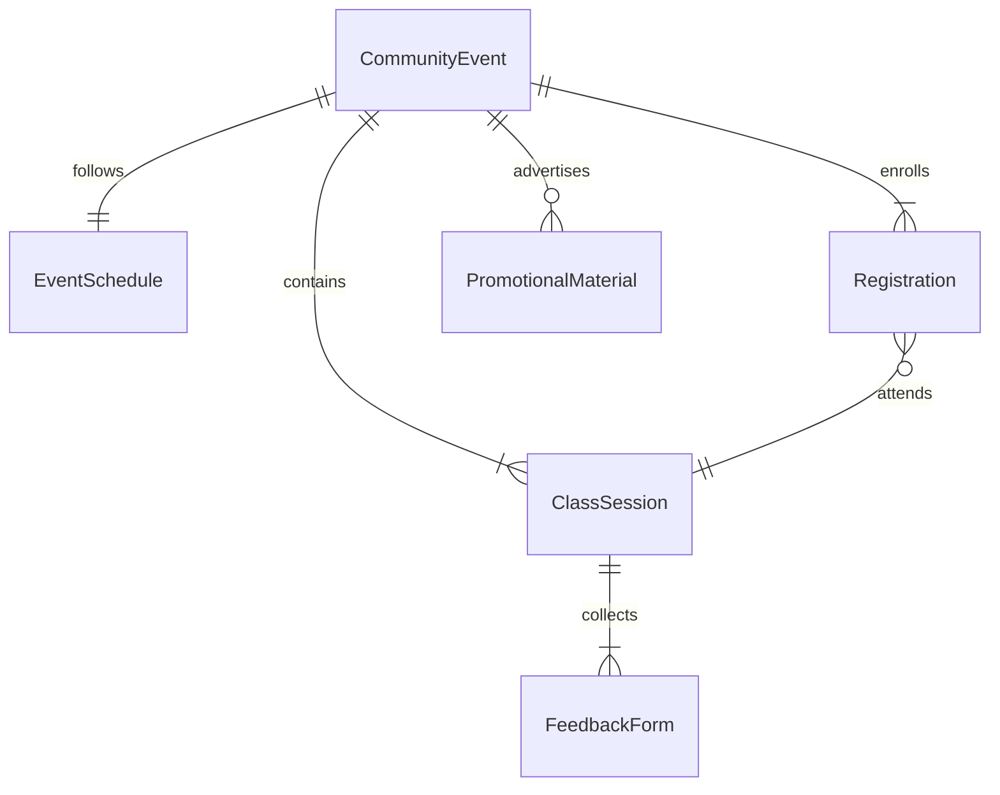
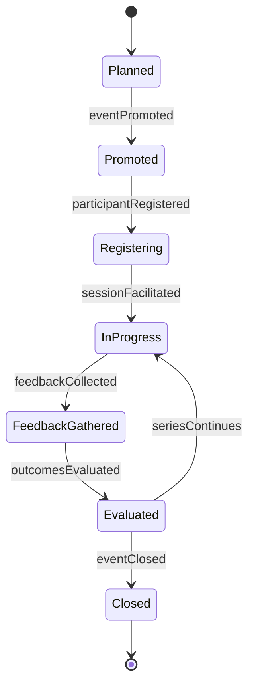
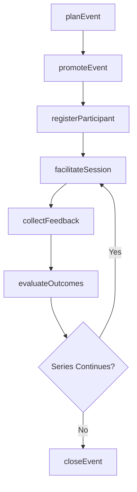
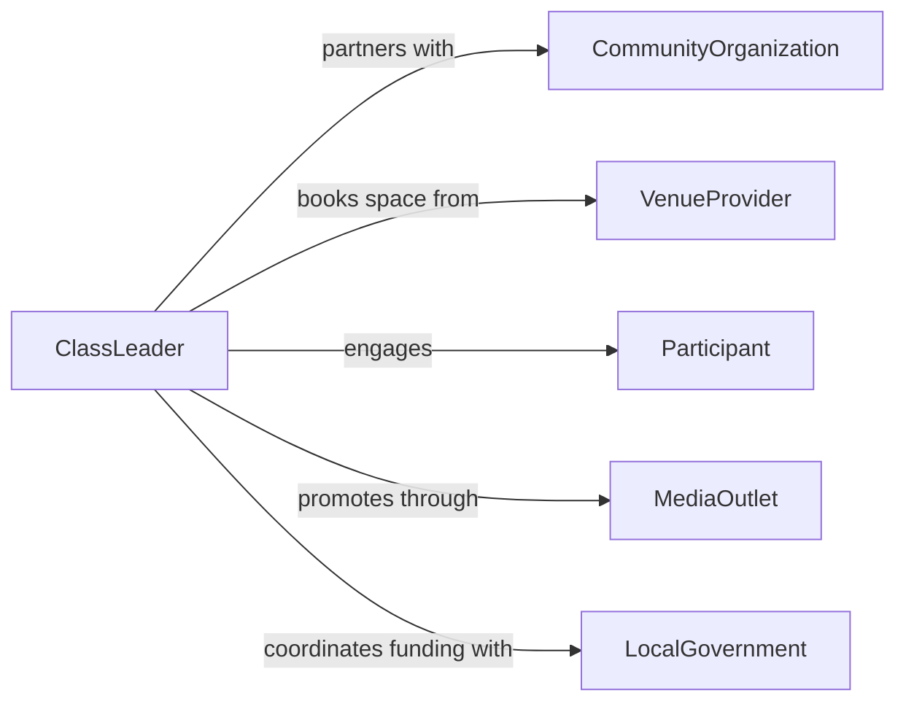

# Lead Classes Community Events

> Business-as-Code definition for leading classes or community events. Models the planning, promotion, delivery, and evaluation of educational classes and public engagement events in community settings.

## Overview

Leading classes or community events involves organizing and facilitating educational sessions, workshops, or public programs outside traditional academic settings. This includes community education courses, public lectures, cultural events, and outreach programs. This definition exposes actions for event planning, participant registration, session facilitation, and post-event evaluation.

## Actors

| Actor | Description |
|-------|-------------|
| Participant | Individual attending the class or community event |
| CommunityOrganization | Local group or nonprofit that sponsors or hosts events |
| VenueProvider | Facility that provides space for classes and events |
| LocalGovernment | Municipal body that may fund or regulate community programming |
| MediaOutlet | Local press or social media channels used for promotion |

## Roles

| Role | Description |
|------|-------------|
| ClassLeader | Plans and facilitates the class or community event |
| EventCoordinator | Handles logistics, scheduling, and vendor management |
| OutreachSpecialist | Promotes events and manages participant registration |
| Volunteer | Assists with setup, registration, and participant support |

## Entities

| Entity | Description |
|--------|-------------|
| ClassSession | A scheduled educational session with defined topic and format |
| CommunityEvent | A public engagement event such as a workshop, fair, or lecture |
| Registration | A participant's enrollment record for a class or event |
| EventSchedule | The timeline and agenda for a class series or event |
| FeedbackForm | A post-event survey collecting participant impressions |
| PromotionalMaterial | Flyers, social media posts, and announcements for outreach |

## Actions

| Action | Description |
|--------|-------------|
| planEvent | Define the scope, topic, venue, and schedule for a class or event |
| promoteEvent | Create and distribute promotional materials to reach target audiences |
| registerParticipant | Enroll an individual in a class or community event |
| facilitateSession | Lead the class or event, delivering content and managing activities |
| collectFeedback | Gather participant evaluations and satisfaction data |
| evaluateOutcomes | Analyze attendance, feedback, and impact metrics |
| closeEvent | Finalize records, send follow-ups, and archive event materials |

## Events

| Event | Description |
|-------|-------------|
| eventPlanned | A class or community event has been defined and scheduled |
| eventPromoted | Promotional materials have been distributed |
| participantRegistered | An individual has enrolled in the event |
| sessionFacilitated | A class or event session has been delivered |
| feedbackCollected | Participant evaluations have been gathered |
| outcomesEvaluated | Event impact and success metrics have been analyzed |
| eventClosed | Event records have been finalized and archived |

## Searches

| Search | Description |
|--------|-------------|
| findEvents | List classes or community events by date, topic, or venue |
| getRegistrations | Retrieve participant registrations for a specific event |
| getEventFeedback | Query feedback data by event, rating, or date range |
| findVenues | Search available community venues by capacity, location, or amenities |

## Entity Relationships



## State Diagram



## Workflow



## Actor Relationships



## Usage

### Calling Actions

```typescript
import { leadClassesCommunityEvents } from '@headlessly/lead-classes-community-events'

const events = leadClassesCommunityEvents()

// Plan a community workshop
const event = await events.planEvent({
  title: 'Financial Literacy for Families',
  type: 'workshop',
  venue: 'Westside Community Center',
  date: '2026-04-12',
  capacity: 40,
  topics: ['Budgeting Basics', 'Saving Strategies', 'Understanding Credit']
})

// Register participants
await events.registerParticipant({
  eventId: event.id,
  name: 'Maria Torres',
  email: 'maria@example.com.ai'
})

// Evaluate outcomes after the event
const outcomes = await events.evaluateOutcomes({
  eventId: event.id,
  metrics: ['attendance', 'satisfaction', 'knowledgeGain']
})
```

### Event-Driven Automation

```typescript
// Send confirmation when a participant registers
events.participantRegistered(async ({ eventId, name, email }) => {
  const eventDetails = await events.findEvents({ id: eventId })
  await notify({
    to: email,
    message: `You are registered for ${eventDetails.title} on ${eventDetails.date}`
  })
})

// Trigger follow-up when feedback is collected
events.feedbackCollected(async ({ eventId, averageRating }) => {
  if (averageRating < 3.0) {
    await createImprovementTicket({
      eventId,
      reason: 'Below-average participant satisfaction rating'
    })
  }
})
```
