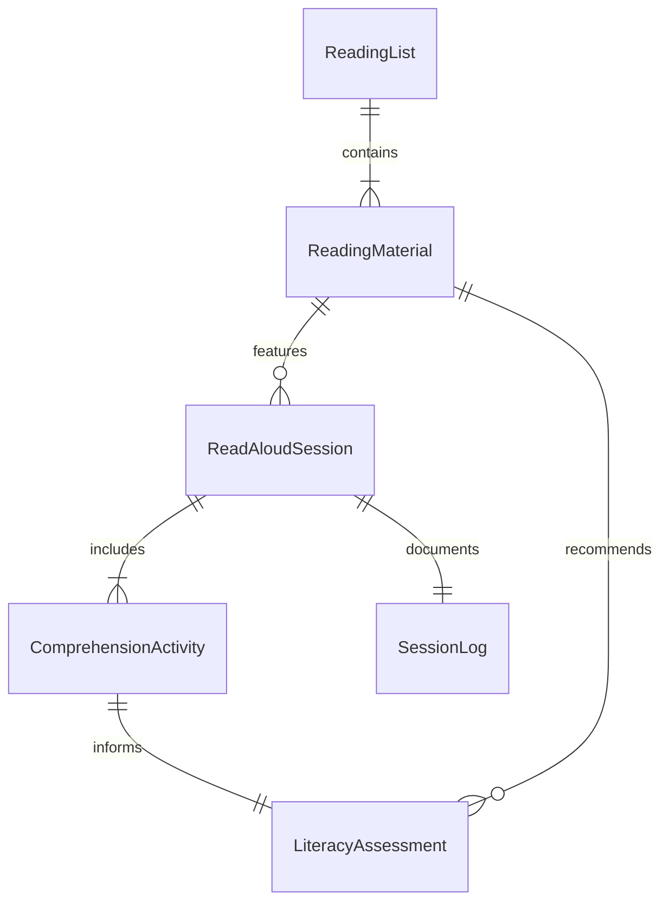
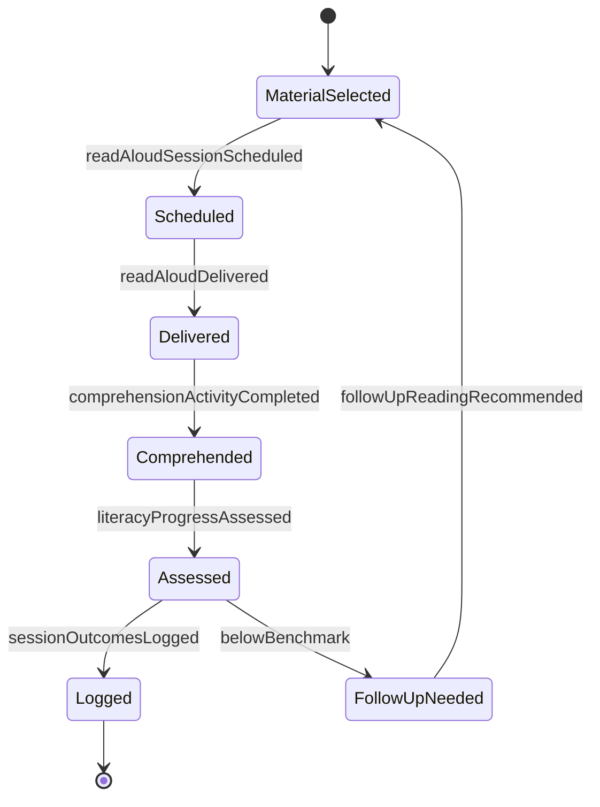
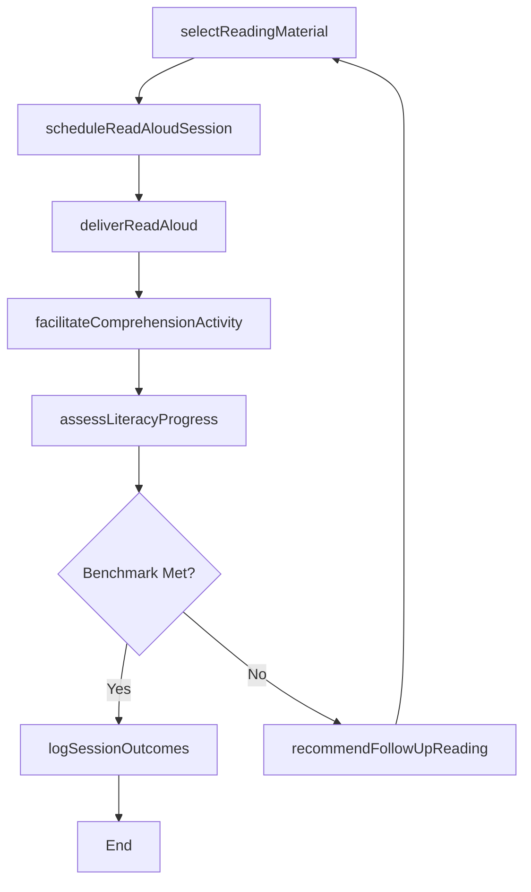
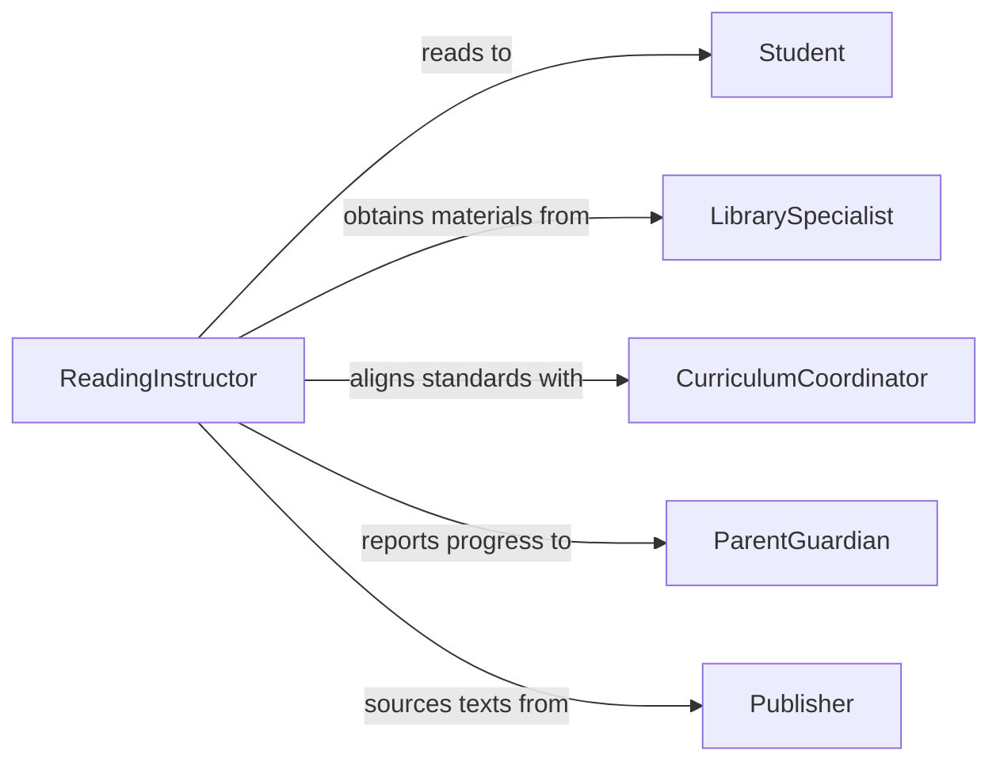

# Read Students

> Business-as-Code definition for reading to students. Models the process of selecting appropriate reading materials, delivering read-aloud sessions, engaging students through comprehension activities, and tracking literacy development outcomes.

## Overview

Reading to students involves selecting age-appropriate and curriculum-aligned texts, delivering read-aloud sessions that model fluency and expression, engaging learners through guided comprehension activities, and assessing the impact of reading sessions on vocabulary acquisition and literacy development. This definition exposes actions for curating reading materials, scheduling read-aloud sessions, facilitating interactive reading experiences, and documenting student comprehension and engagement.

## Actors

| Actor | Description |
|-------|-------------|
| Student | Learner participating in read-aloud and guided reading sessions |
| LibrarySpecialist | Curates and recommends reading materials aligned with curriculum standards |
| CurriculumCoordinator | Establishes reading standards and literacy benchmarks for instruction |
| ParentGuardian | Supports at-home reading practice and receives progress updates |
| Publisher | Provides texts, reading programs, and supplementary literacy materials |

## Roles

| Role | Description |
|------|-------------|
| ReadingInstructor | Delivers read-aloud sessions and models reading fluency |
| LiteracyCoach | Supports reading strategy development and provides instructional guidance |
| ComprehensionEvaluator | Assesses student understanding of texts read during sessions |
| ReadingProgramCoordinator | Manages the selection, scheduling, and tracking of reading activities |

## Entities

| Entity | Description |
|--------|-------------|
| ReadingMaterial | A text selected for read-aloud sessions, including books, articles, or stories |
| ReadAloudSession | A scheduled event where an instructor reads text to students |
| ComprehensionActivity | An exercise designed to assess and reinforce understanding of read material |
| ReadingList | A curated collection of texts organized by topic, level, or curriculum unit |
| LiteracyAssessment | An evaluation of student reading comprehension and vocabulary development |
| SessionLog | A record of what was read, activities conducted, and student responses |

## Actions

| Action | Description |
|--------|-------------|
| selectReadingMaterial | Choose texts aligned with curriculum objectives and student reading levels |
| scheduleReadAloudSession | Plan a reading session with date, participants, and selected materials |
| deliverReadAloud | Conduct a read-aloud session modeling fluency, expression, and comprehension |
| facilitateComprehensionActivity | Lead a guided activity to reinforce understanding of the text |
| assessLiteracyProgress | Evaluate student comprehension and vocabulary growth after reading sessions |
| logSessionOutcomes | Document materials read, activities completed, and student engagement |
| recommendFollowUpReading | Suggest additional texts for independent or guided reading practice |

## Events

| Event | Description |
|-------|-------------|
| readingMaterialSelected | A text has been chosen for an upcoming read-aloud session |
| readAloudSessionScheduled | A reading session has been planned and confirmed |
| readAloudDelivered | A read-aloud session has been conducted with students |
| comprehensionActivityCompleted | A guided comprehension exercise has been finished |
| literacyProgressAssessed | Student reading comprehension and vocabulary growth have been evaluated |
| sessionOutcomesLogged | Reading session details and student responses have been documented |
| followUpReadingRecommended | Additional reading materials have been suggested for continued practice |

## Searches

| Search | Description |
|--------|-------------|
| findReadingMaterials | List available texts by topic, reading level, or curriculum alignment |
| getSessionLogs | Retrieve read-aloud session records by date, instructor, or class |
| getLiteracyAssessments | Look up comprehension evaluation results by student or assessment period |
| findReadingGaps | Identify students with below-benchmark literacy progress |

## Entity Relationships



## State Diagram



## Workflow



## Actor Relationships



## Usage

### Calling Actions

```typescript
import { readStudents } from '@headlessly/read-students'

const reading = readStudents()

// Select reading material
const material = await reading.selectReadingMaterial({
  gradeLevel: 2,
  subject: 'language-arts',
  theme: 'community-helpers',
  readingLevel: 'guided-level-J'
})

// Schedule and deliver a read-aloud session
const session = await reading.scheduleReadAloudSession({
  materialId: material.id,
  classId: 'class-2b',
  scheduledDate: '2026-04-09',
  duration: { minutes: 30 }
})

await reading.deliverReadAloud({
  sessionId: session.id,
  focusSkills: ['vocabulary-in-context', 'prediction', 'character-analysis']
})

// Assess literacy progress
const assessment = await reading.assessLiteracyProgress({
  classId: 'class-2b',
  assessmentType: 'comprehension-check',
  materialId: material.id
})
```

### Event-Driven Automation

```typescript
// Auto-recommend follow-up reading when students are below benchmark
reading.literacyProgressAssessed(async ({ studentId, belowBenchmark, readingLevel }) => {
  if (belowBenchmark) {
    await reading.recommendFollowUpReading({
      studentId,
      currentLevel: readingLevel,
      focusAreas: ['fluency', 'vocabulary-building']
    })
  }
})

// Notify parents of reading session outcomes
reading.sessionOutcomesLogged(async ({ sessionId, classId }) => {
  const logs = await reading.getSessionLogs({ sessionId })
  await notify({
    to: `parents-${classId}`,
    message: `Read-aloud session completed: "${logs.materialTitle}". Comprehension activities included.`
  })
})
```
