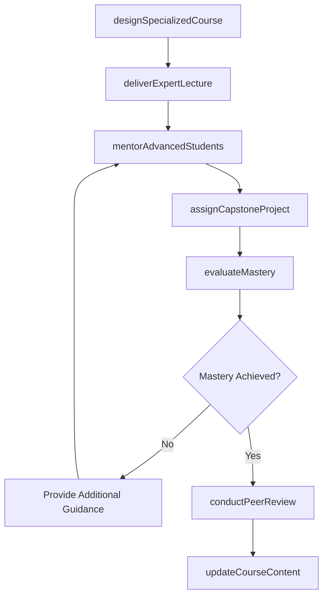
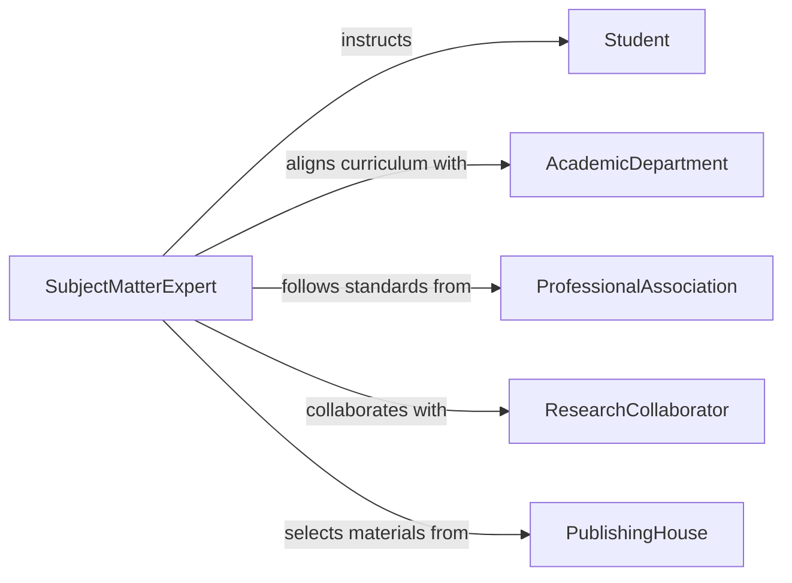

# Teach Classes Area Specialization

> Business-as-Code definition for teaching classes in an area of specialization. Models the design, delivery, and assessment of advanced or focused courses where the instructor applies deep subject-matter expertise.

## Overview

Teaching classes in an area of specialization involves leveraging deep domain knowledge to design advanced coursework, deliver expert-level instruction, mentor students in specialized topics, and assess mastery through rigorous evaluations. This definition exposes actions for specialized course design, expert instruction delivery, and competency assessment, along with events for tracking academic outcomes in focused disciplines.

## Actors

| Actor | Description |
|-------|-------------|
| Student | Learner enrolled in an advanced or specialized course |
| AcademicDepartment | Oversees curriculum standards and approves specialized course offerings |
| ProfessionalAssociation | Industry or scholarly body setting standards in the specialization |
| ResearchCollaborator | External researcher or practitioner contributing to course content |
| PublishingHouse | Provider of specialized textbooks, journals, and reference materials |

## Roles

| Role | Description |
|------|-------------|
| SubjectMatterExpert | Designs and delivers instruction based on deep domain expertise |
| CourseCoordinator | Manages scheduling, enrollment, and logistics for specialized offerings |
| ResearchAdvisor | Mentors students on advanced projects within the specialization |
| AssessmentDesigner | Creates rigorous evaluations aligned with specialized learning outcomes |

## Entities

| Entity | Description |
|--------|-------------|
| SpecializedCourse | An advanced course focused on a specific domain or discipline |
| ExpertLecture | A session delivering in-depth content on a specialized topic |
| CapstoneProject | A culminating project demonstrating mastery of the specialization |
| SpecializedAssessment | An evaluation testing advanced knowledge and applied skills |
| CoursePortfolio | A collection of instructional materials reflecting the specialization |
| PeerReview | A scholarly evaluation of course content or student research |

## Actions

| Action | Description |
|--------|-------------|
| designSpecializedCourse | Create an advanced course leveraging subject-matter expertise |
| deliverExpertLecture | Present in-depth content on a specialized topic |
| mentorAdvancedStudents | Guide students through complex projects in the specialization |
| assignCapstoneProject | Define and distribute a culminating project for advanced learners |
| evaluateMastery | Assess student competency through specialized exams and projects |
| updateCourseContent | Revise materials to reflect current research and industry developments |
| conductPeerReview | Facilitate scholarly review of student research or coursework |

## Events

| Event | Description |
|-------|-------------|
| specializedCourseDesigned | An advanced course has been structured and approved |
| expertLectureDelivered | A specialized instructional session has been completed |
| advancedStudentsMentored | A mentoring session for specialized topics has occurred |
| capstoneProjectAssigned | A culminating project has been distributed to students |
| masteryEvaluated | Student competency in the specialization has been assessed |
| courseContentUpdated | Course materials have been revised with current knowledge |
| peerReviewConducted | Scholarly evaluation of student or faculty work has been completed |

## Searches

| Search | Description |
|--------|-------------|
| findSpecializedCourses | List courses by specialization area, level, or instructor |
| getStudentMastery | Retrieve competency assessment results for specialized courses |
| findCapstoneProjects | Search student capstone projects by topic, status, or advisor |
| getCourseRevisionHistory | Query the update history of specialized course content |

## Workflow



## Actor Relationships



## Usage

### Calling Actions

```typescript
import { teachClassesAreaSpecialization } from '@headlessly/teach-classes-area-specialization'

const specialized = teachClassesAreaSpecialization()

// Design an advanced cybersecurity course
const course = await specialized.designSpecializedCourse({
  title: 'Advanced Network Penetration Testing',
  specialization: 'Cybersecurity',
  level: 'graduate',
  prerequisites: ['Network Security Fundamentals', 'Operating Systems'],
  objectives: [
    'Conduct vulnerability assessments on enterprise networks',
    'Develop and execute penetration testing methodologies',
    'Produce professional security audit reports'
  ]
})

// Assign a capstone project
await specialized.assignCapstoneProject({
  courseId: course.id,
  title: 'Enterprise Security Audit',
  description: 'Perform a full penetration test on a simulated corporate network',
  deliverables: ['vulnerability report', 'remediation plan', 'executive summary'],
  dueDate: '2026-12-01'
})

// Evaluate student mastery
await specialized.evaluateMastery({
  courseId: course.id,
  studentId: 'stu-7892',
  assessmentType: 'capstone',
  score: 92,
  feedback: 'Excellent methodology and thorough documentation'
})
```

### Event-Driven Automation

```typescript
// Update professional association on course outcomes
specialized.masteryEvaluated(async ({ courseId, studentId, score }) => {
  if (score >= 90) {
    await submitProficiencyRecord({
      studentId,
      courseId,
      designation: 'distinction'
    })
  }
})

// Auto-trigger content updates when new research is published
specialized.courseContentUpdated(async ({ courseId, updatedTopics }) => {
  const enrolled = await getEnrolledStudents(courseId)
  await notifyAll({
    to: enrolled,
    message: `Course materials updated for topics: ${updatedTopics.join(', ')}`
  })
})
```
