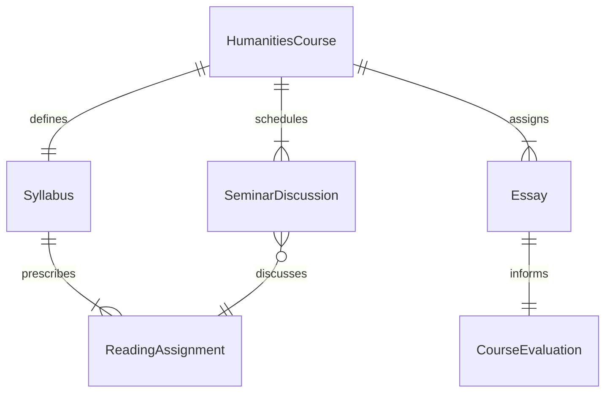
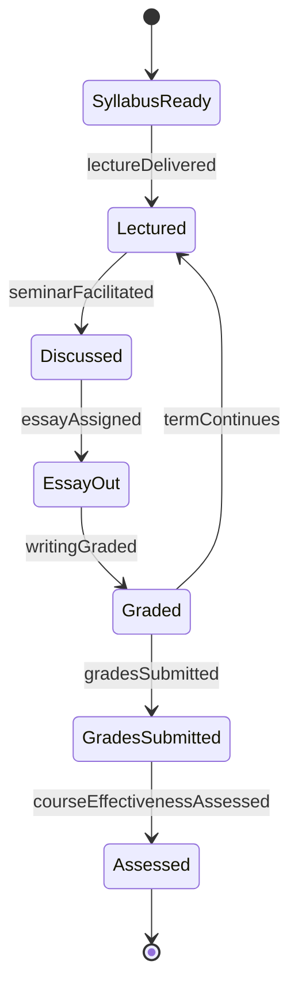
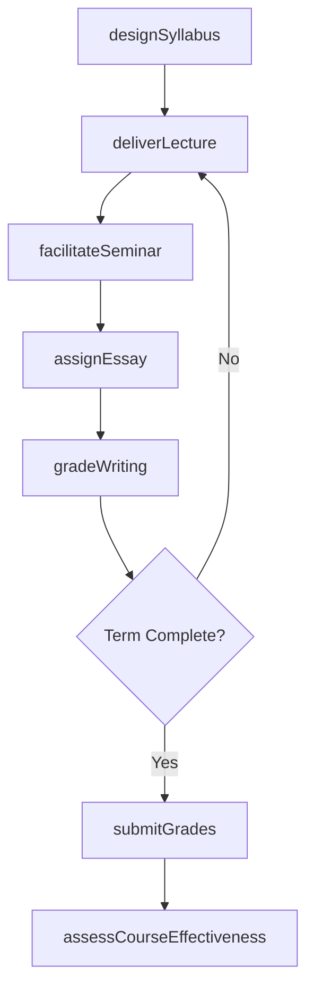
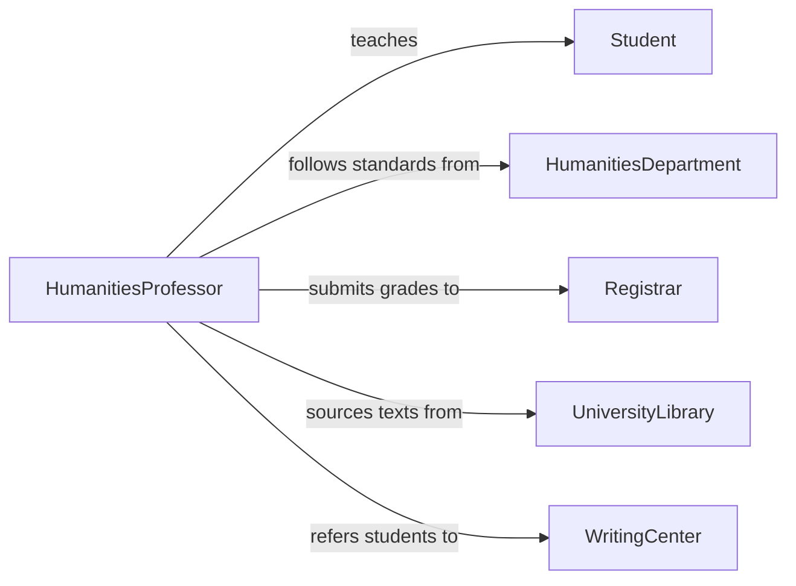

# Teach Humanities Courses College Level

> Business-as-Code definition for teaching humanities courses at the college level. Models curriculum design, seminar facilitation, written assignment management, and student assessment for disciplines such as literature, philosophy, history, and languages.

## Overview

Teaching humanities courses at the college level involves designing reading-intensive curricula, leading seminar discussions, assigning critical essays and research papers, and evaluating student writing and analytical thinking. This definition exposes actions for syllabus creation, seminar facilitation, essay grading, and course outcome analysis, along with events for academic workflow automation.

## Actors

| Actor | Description |
|-------|-------------|
| Student | Undergraduate or graduate learner enrolled in a humanities course |
| HumanitiesDepartment | Governs curriculum standards, course offerings, and faculty oversight |
| Registrar | Manages course scheduling, enrollment, and transcript records |
| UniversityLibrary | Provides access to texts, archives, and digital humanities resources |
| WritingCenter | Supports students with essay drafting, revision, and citation |
| GuestScholar | Visiting academic invited to present on specialized humanities topics |

## Roles

| Role | Description |
|------|-------------|
| HumanitiesProfessor | Designs curriculum and leads instruction in humanities disciplines |
| TeachingAssistant | Supports grading, leads discussion sections, and holds office hours |
| SeminarLeader | Facilitates discussion-based sessions analyzing primary texts |
| WritingEvaluator | Provides detailed feedback on student essays and research papers |

## Entities

| Entity | Description |
|--------|-------------|
| HumanitiesCourse | A course offering in literature, philosophy, history, or languages |
| Syllabus | A document specifying readings, assignments, schedule, and grading criteria |
| ReadingAssignment | A curated selection of primary and secondary texts for analysis |
| Essay | A student-authored analytical or argumentative paper |
| SeminarDiscussion | A structured discussion session centered on assigned texts |
| CourseEvaluation | Student feedback on instructional quality and course design |

## Actions

| Action | Description |
|--------|-------------|
| designSyllabus | Create a humanities course syllabus with readings and assignments |
| deliverLecture | Present contextual and analytical content on humanities topics |
| facilitateSeminar | Lead a text-based discussion encouraging critical analysis |
| assignEssay | Distribute essay prompts with rubrics and deadlines |
| gradeWriting | Evaluate student essays and provide substantive written feedback |
| submitGrades | Record and submit final course grades to the registrar |
| assessCourseEffectiveness | Analyze student evaluations and outcomes to improve future offerings |

## Events

| Event | Description |
|-------|-------------|
| syllabusDesigned | A humanities course syllabus has been finalized |
| lectureDelivered | A lecture on a humanities topic has been completed |
| seminarFacilitated | A discussion-based seminar session has been conducted |
| essayAssigned | Essay prompts have been distributed to students |
| writingGraded | Student essays have been evaluated with feedback |
| gradesSubmitted | Final grades have been recorded with the registrar |
| courseEffectivenessAssessed | Course quality analysis has been completed |

## Searches

| Search | Description |
|--------|-------------|
| findHumanitiesCourses | List courses by discipline, term, instructor, or level |
| getStudentEssays | Retrieve student essays by course, assignment, or grade range |
| getCourseEvaluations | Query student evaluation scores and comments by course or term |
| findReadingLists | Search reading assignments by course, author, or period |

## Entity Relationships



## State Diagram



## Workflow



## Actor Relationships



## Usage

### Calling Actions

```typescript
import { teachHumanitiesCoursesCollegeLevel } from '@headlessly/teach-humanities-courses-college-level'

const humanities = teachHumanitiesCoursesCollegeLevel()

// Design a philosophy syllabus
const syllabus = await humanities.designSyllabus({
  title: 'Ethics and Moral Philosophy',
  department: 'Philosophy',
  term: 'Fall 2026',
  readings: [
    { title: 'Nicomachean Ethics', author: 'Aristotle', weeks: [1, 2, 3] },
    { title: 'Groundwork of the Metaphysics of Morals', author: 'Kant', weeks: [4, 5, 6] },
    { title: 'Utilitarianism', author: 'Mill', weeks: [7, 8] }
  ],
  essayCount: 3
})

// Assign an analytical essay
await humanities.assignEssay({
  courseId: syllabus.courseId,
  title: 'Kantian Duty vs. Utilitarian Consequence',
  prompt: 'Compare and contrast deontological and consequentialist approaches to a contemporary ethical dilemma.',
  wordCount: 2500,
  dueDate: '2026-10-20'
})

// Grade student writing
await humanities.gradeWriting({
  courseId: syllabus.courseId,
  essayId: 'essay-002',
  studentId: 'stu-3301',
  score: 88,
  feedback: 'Strong thesis with well-supported arguments. Strengthen the counterargument section.'
})
```

### Event-Driven Automation

```typescript
// Notify writing center when essays are assigned
humanities.essayAssigned(async ({ courseId, title, dueDate }) => {
  await notify({
    to: 'writing-center',
    message: `Students in course ${courseId} have a new essay "${title}" due ${dueDate}. Expect tutoring demand.`
  })
})

// Trigger course review when evaluations are low
humanities.courseEffectivenessAssessed(async ({ courseId, averageRating }) => {
  if (averageRating < 3.5) {
    await createReviewTicket({
      courseId,
      reason: 'Below-threshold student evaluation scores',
      averageRating
    })
  }
})
```
