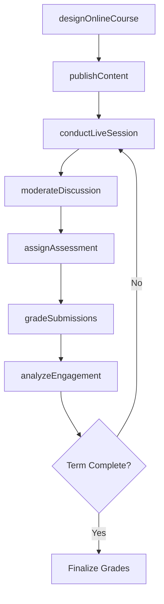
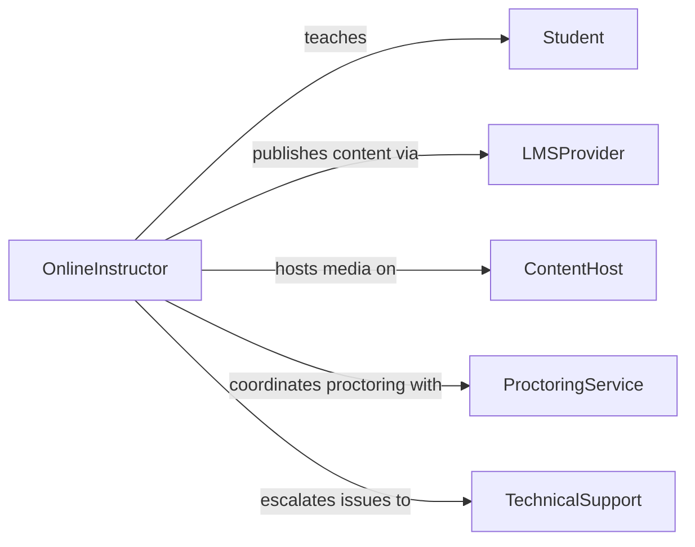

# Teach Online Courses

> Business-as-Code definition for teaching online courses. Models the creation, delivery, and management of digital learning experiences through learning management systems, video conferencing, and asynchronous content platforms.

## Overview

Teaching online courses involves designing digital curricula, creating multimedia content, delivering synchronous and asynchronous instruction, facilitating virtual discussions, and assessing student learning through online submissions and proctored exams. This definition exposes actions for course authoring, content publishing, live session management, and learner analytics tracking.

## Actors

| Actor | Description |
|-------|-------------|
| Student | Remote learner accessing course content through digital platforms |
| LMSProvider | Vendor operating the learning management system infrastructure |
| ContentHost | Platform hosting video lectures, documents, and multimedia assets |
| AccreditationBody | Organization validating online course quality and transferability |
| TechnicalSupport | Help desk resolving platform access and connectivity issues |
| ProctoringService | Vendor providing online exam proctoring and identity verification |

## Roles

| Role | Description |
|------|-------------|
| OnlineInstructor | Designs and delivers course content in digital formats |
| InstructionalDesigner | Develops engaging multimedia content and interactive assessments |
| CourseAdministrator | Manages enrollment, deadlines, and platform configuration |
| LearningAnalyst | Monitors student engagement and performance analytics |

## Entities

| Entity | Description |
|--------|-------------|
| OnlineCourse | A fully digital course with modules, assignments, and assessments |
| CourseModule | A thematic unit containing lessons, readings, and activities |
| LiveSession | A scheduled synchronous class meeting via video conferencing |
| DiscussionForum | An asynchronous space for student dialogue and collaboration |
| OnlineAssessment | A quiz, exam, or assignment submitted through the LMS |
| LearnerAnalytics | Data on student engagement, completion, and performance |

## Actions

| Action | Description |
|--------|-------------|
| designOnlineCourse | Structure the course into modules with learning objectives |
| publishContent | Upload lectures, readings, and multimedia to the LMS |
| conductLiveSession | Host a synchronous class meeting via video conferencing |
| moderateDiscussion | Facilitate and respond to student posts in discussion forums |
| assignAssessment | Create and distribute online quizzes, exams, or assignments |
| gradeSubmissions | Evaluate student work submitted through the LMS |
| analyzeEngagement | Review learner analytics to identify at-risk students |

## Events

| Event | Description |
|-------|-------------|
| onlineCourseDesigned | Course structure and modules have been finalized |
| contentPublished | Learning materials have been uploaded and made available |
| liveSessionConducted | A synchronous class meeting has been completed |
| discussionModerated | Forum posts have been reviewed and instructor responses posted |
| assessmentAssigned | An online assessment has been distributed to students |
| submissionsGraded | Student work has been evaluated and scores published |
| engagementAnalyzed | Learner analytics have been reviewed and action items identified |

## Searches

| Search | Description |
|--------|-------------|
| findOnlineCourses | List online courses by subject, term, or instructor |
| getStudentEngagement | Retrieve login frequency, completion rates, and time-on-task data |
| findSubmissions | Search student submissions by course, assignment, or status |
| getDiscussionActivity | Query forum participation metrics by student or thread |

## Workflow



## Actor Relationships



## Usage

### Calling Actions

```typescript
import { teachOnlineCourses } from '@headlessly/teach-online-courses'

const online = teachOnlineCourses()

// Design an online course
const course = await online.designOnlineCourse({
  title: 'Data Science Fundamentals',
  format: 'hybrid',
  modules: [
    { title: 'Introduction to Python', weeks: 2 },
    { title: 'Statistical Analysis', weeks: 3 },
    { title: 'Machine Learning Basics', weeks: 3 }
  ],
  platform: 'canvas'
})

// Publish a module's content
await online.publishContent({
  courseId: course.id,
  moduleIndex: 0,
  materials: [
    { type: 'video', title: 'Python Setup Walkthrough', url: '/videos/python-setup.mp4' },
    { type: 'reading', title: 'Python Basics', url: '/docs/python-basics.pdf' }
  ]
})

// Analyze student engagement mid-term
const analytics = await online.analyzeEngagement({
  courseId: course.id,
  period: 'weeks-1-4',
  metrics: ['loginFrequency', 'assignmentCompletion', 'forumParticipation']
})
```

### Event-Driven Automation

```typescript
// Alert instructor when student engagement drops
online.engagementAnalyzed(async ({ courseId, atRiskStudents }) => {
  for (const student of atRiskStudents) {
    await notify({
      to: student.email,
      message: 'We noticed you have not logged in recently. Please reach out if you need support.'
    })
  }
})

// Auto-open discussion forums when content is published
online.contentPublished(async ({ courseId, moduleIndex }) => {
  await online.moderateDiscussion({
    courseId,
    moduleIndex,
    action: 'openForum',
    prompt: `Share your initial thoughts on this module's topic`
  })
})
```
