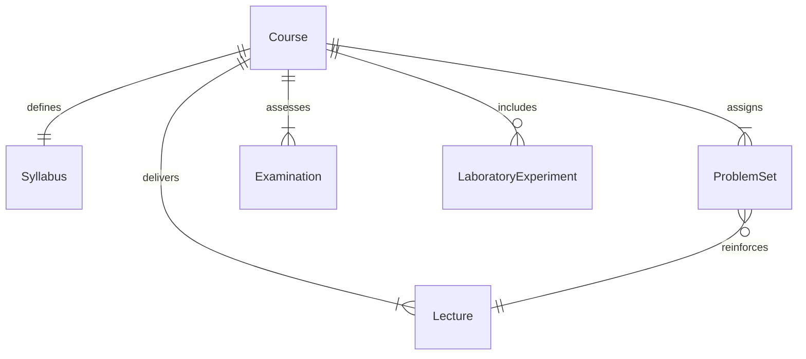
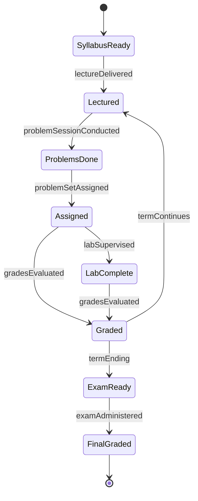
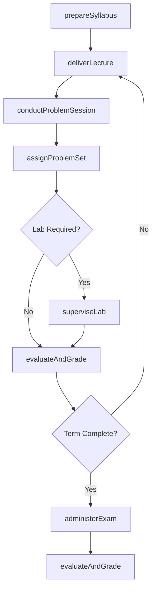
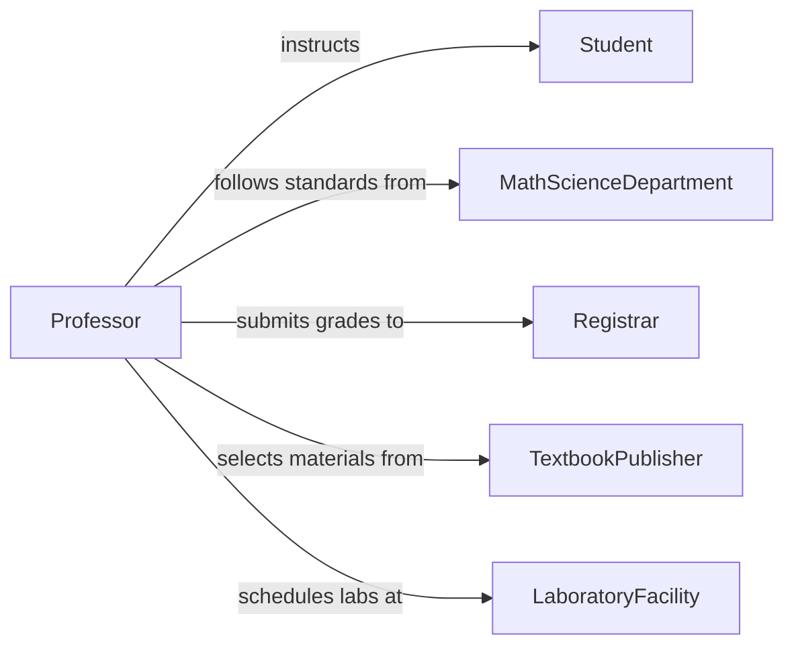

# Teach Physical Science Mathematics Courses

> Business-as-Code definition for teaching physical science or mathematics courses at the college level. Models curriculum design, lecture and problem-session delivery, laboratory instruction, and student assessment for physics, chemistry, mathematics, and related quantitative disciplines.

## Overview

Teaching physical science or mathematics courses at the college level involves preparing rigorous quantitative curricula, delivering lectures with demonstrations and problem-solving sessions, supervising labs where applicable, and assessing student mastery through exams, problem sets, and projects. This definition exposes actions for course planning, instructional delivery, and performance evaluation, along with events for tracking academic progress.

## Actors

| Actor | Description |
|-------|-------------|
| Student | Undergraduate or graduate learner enrolled in a STEM course |
| MathScienceDepartment | Sets curriculum requirements, prerequisites, and course caps |
| Registrar | Manages course scheduling, enrollment, and grade submission |
| TextbookPublisher | Provides course textbooks, solution manuals, and digital platforms |
| LaboratoryFacility | Supplies lab space, instruments, and technical staff for experiments |
| AccreditationBoard | Evaluates program rigor and alignment with professional standards |

## Roles

| Role | Description |
|------|-------------|
| Professor | Designs and delivers course lectures and assessments |
| TeachingAssistant | Leads recitation and problem-solving sessions, assists with grading |
| LabInstructor | Supervises laboratory experiments and demonstrations |
| AcademicTutor | Provides supplemental help in office hours and tutoring centers |

## Entities

| Entity | Description |
|--------|-------------|
| Course | A physical science or mathematics course with defined learning outcomes |
| ProblemSet | A collection of quantitative exercises assigned for practice and grading |
| Lecture | A scheduled session presenting theoretical concepts and derivations |
| Examination | A proctored test assessing conceptual and computational mastery |
| Syllabus | A document outlining topics, schedule, grading policy, and prerequisites |
| LaboratoryExperiment | A hands-on exercise applying theoretical principles to measurement and analysis |

## Actions

| Action | Description |
|--------|-------------|
| prepareSyllabus | Create the course syllabus with topics, schedule, and grading breakdown |
| deliverLecture | Present theoretical concepts, proofs, or derivations to students |
| conductProblemSession | Lead a recitation focused on solving quantitative problems |
| assignProblemSet | Distribute a set of exercises for student practice and evaluation |
| superviseLab | Oversee students performing physical science experiments |
| administerExam | Create, proctor, and collect midterm or final examinations |
| evaluateAndGrade | Score student work and assign course grades |

## Events

| Event | Description |
|-------|-------------|
| syllabusPrepared | The course syllabus has been finalized and published |
| lectureDelivered | A lecture session has been completed |
| problemSessionConducted | A recitation or problem-solving session has been held |
| problemSetAssigned | A problem set has been distributed to students |
| labSupervised | A laboratory session has been completed |
| examAdministered | An examination has been proctored |
| gradesEvaluated | Student work has been scored and grades recorded |

## Searches

| Search | Description |
|--------|-------------|
| findCoursesByDiscipline | List courses by subject area, term, or level |
| getStudentPerformance | Retrieve grades and progress data for a student or course |
| findProblemSets | Search assigned problem sets by course, topic, or due date |
| getExamResults | Query examination scores by course section or student |

## Entity Relationships



## State Diagram



## Workflow



## Actor Relationships



## Usage

### Calling Actions

```typescript
import { teachPhysicalScienceMathematicsCourses } from '@headlessly/teach-physical-science-mathematics-courses'

const courses = teachPhysicalScienceMathematicsCourses()

// Prepare a calculus syllabus
const syllabus = await courses.prepareSyllabus({
  title: 'Calculus II',
  department: 'Mathematics',
  term: 'Fall 2026',
  topics: ['Integration Techniques', 'Series and Sequences', 'Parametric Equations'],
  gradingPolicy: { exams: 50, problemSets: 30, participation: 10, finalProject: 10 }
})

// Assign a problem set
await courses.assignProblemSet({
  courseId: syllabus.courseId,
  title: 'Integration by Parts and Partial Fractions',
  problems: 12,
  dueDate: '2026-09-22',
  pointValue: 50
})

// Administer the midterm exam
await courses.administerExam({
  courseId: syllabus.courseId,
  type: 'midterm',
  duration: 90,
  date: '2026-10-15'
})
```

### Event-Driven Automation

```typescript
// Alert teaching assistants when problem sets are assigned
courses.problemSetAssigned(async ({ courseId, title, dueDate }) => {
  const tas = await getTeachingAssistants(courseId)
  await notifyAll({
    to: tas,
    message: `Problem set "${title}" assigned, due ${dueDate}. Prepare office hours accordingly.`
  })
})

// Auto-flag students at risk after exam grades are posted
courses.gradesEvaluated(async ({ courseId, studentId, score, maxScore }) => {
  if (score / maxScore < 0.5) {
    await createAcademicAlert({
      studentId,
      courseId,
      reason: 'Below 50% on recent assessment'
    })
  }
})
```
