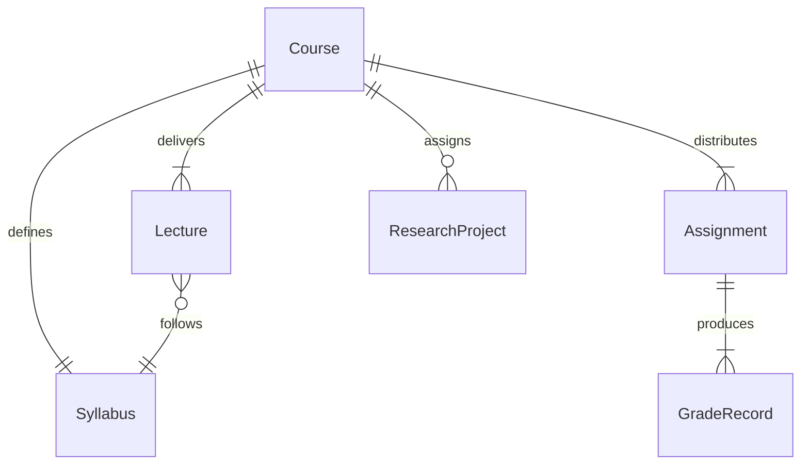
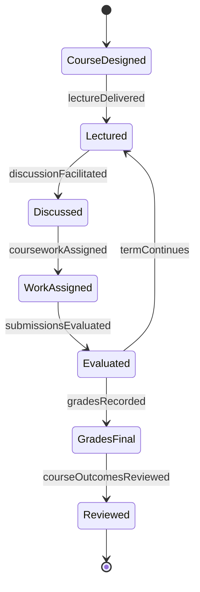
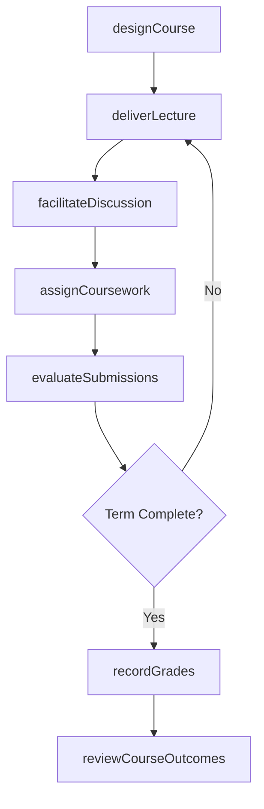
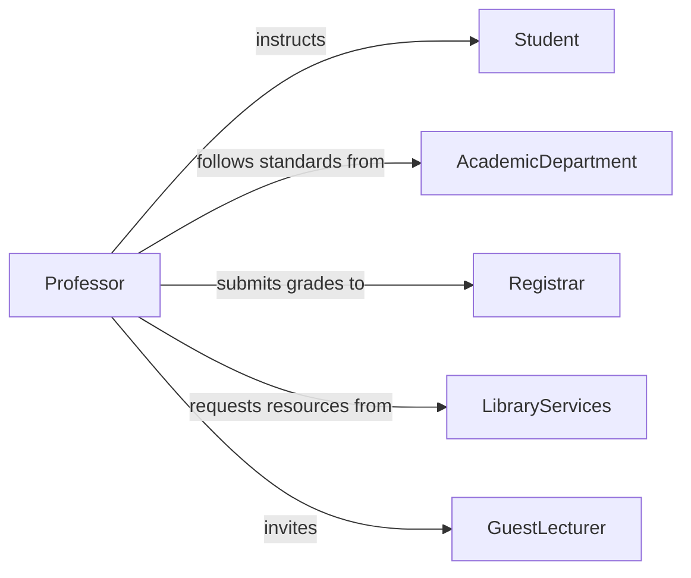

# Teach Social Science Courses College

> Business-as-Code definition for teaching social science courses at the college level. Models course design, lecture delivery, student assessment, and academic program management for disciplines such as sociology, psychology, political science, and economics.

## Overview

Teaching social science courses at the college level involves designing curricula, delivering lectures and seminars, facilitating discussions, assigning research projects, and evaluating student performance within disciplines that study human behavior and society. This definition exposes actions for course preparation, content delivery, and assessment, along with events for enrollment changes and grade finalization.

## Actors

| Actor | Description |
|-------|-------------|
| Student | Enrolled learner taking social science coursework |
| AcademicDepartment | Governs curriculum standards and course offerings for the discipline |
| Registrar | Manages course scheduling, enrollment, and transcript records |
| LibraryServices | Provides research databases, journals, and academic resources |
| AccreditationBody | Sets standards for program quality and learning outcomes |
| GuestLecturer | External expert invited to present on specialized topics |

## Roles

| Role | Description |
|------|-------------|
| Professor | Designs and delivers social science course content |
| TeachingAssistant | Supports instruction by leading discussion sections and grading |
| CourseCoordinator | Manages multi-section course logistics and consistency |
| AcademicAdvisor | Guides students on course selection and degree requirements |

## Entities

| Entity | Description |
|--------|-------------|
| Course | A social science course offering with syllabus and schedule |
| Syllabus | Detailed outline of course objectives, readings, and assignments |
| Lecture | A scheduled instructional session on a specific topic |
| Assignment | Coursework such as essays, research papers, or case studies |
| GradeRecord | A student's earned marks for assignments and final grade |
| ResearchProject | An extended inquiry project requiring primary or secondary research |

## Actions

| Action | Description |
|--------|-------------|
| designCourse | Create or revise a social science course syllabus and materials |
| deliverLecture | Present instructional content on a social science topic |
| facilitateDiscussion | Lead a seminar or discussion section on assigned readings |
| assignCoursework | Distribute assignments, papers, or research projects to students |
| evaluateSubmissions | Grade student work and provide substantive feedback |
| recordGrades | Enter final grades into the academic records system |
| reviewCourseOutcomes | Analyze student performance data to improve future offerings |

## Events

| Event | Description |
|-------|-------------|
| courseDesigned | A course syllabus and materials have been finalized |
| lectureDelivered | An instructional session has been completed |
| discussionFacilitated | A seminar or discussion section has been conducted |
| courseworkAssigned | Assignments have been distributed to enrolled students |
| submissionsEvaluated | Student work has been graded and feedback provided |
| gradesRecorded | Final grades have been entered into the records system |
| courseOutcomesReviewed | End-of-term performance analysis has been completed |

## Searches

| Search | Description |
|--------|-------------|
| findCourses | List social science courses by department, term, or instructor |
| getEnrollment | Retrieve enrollment data for a specific course section |
| getGradeDistribution | Query grade distributions by course, section, or term |
| findStudentSubmissions | Retrieve student assignments filtered by status or score |
| getCourseEvaluations | Retrieve student feedback and course evaluation scores |

## Entity Relationships



## State Diagram



## Workflow



## Actor Relationships



## Usage

### Calling Actions

```typescript
import { teachSocialScienceCoursesCollege } from '@headlessly/teach-social-science-courses-college'

const courses = teachSocialScienceCoursesCollege()

// Design a new sociology course
const course = await courses.designCourse({
  title: 'Introduction to Sociology',
  department: 'Sociology',
  term: 'Fall 2026',
  credits: 3,
  objectives: [
    'Explain foundational sociological theories',
    'Analyze social institutions and inequality',
    'Conduct basic sociological research'
  ]
})

// Assign a research paper
await courses.assignCoursework({
  courseId: course.id,
  type: 'researchPaper',
  title: 'Social Stratification Analysis',
  dueDate: '2026-11-15',
  pointValue: 100
})

// Record final grades
await courses.recordGrades({
  courseId: course.id,
  grades: [
    { studentId: 'stu-1001', grade: 'A' },
    { studentId: 'stu-1002', grade: 'B+' }
  ]
})
```

### Event-Driven Automation

```typescript
// Notify students when coursework is assigned
courses.courseworkAssigned(async ({ courseId, assignmentTitle, dueDate }) => {
  const enrolled = await getEnrolledStudents(courseId)
  await notifyAll({
    to: enrolled,
    message: `New assignment: ${assignmentTitle} due ${dueDate}`
  })
})

// Trigger course improvement review when grades are finalized
courses.gradesRecorded(async ({ courseId, term }) => {
  const distribution = await courses.getGradeDistribution({ courseId, term })
  if (distribution.averageGpa < 2.5) {
    await courses.reviewCourseOutcomes({
      courseId,
      reason: 'Below-target grade distribution',
      distribution
    })
  }
})
```
