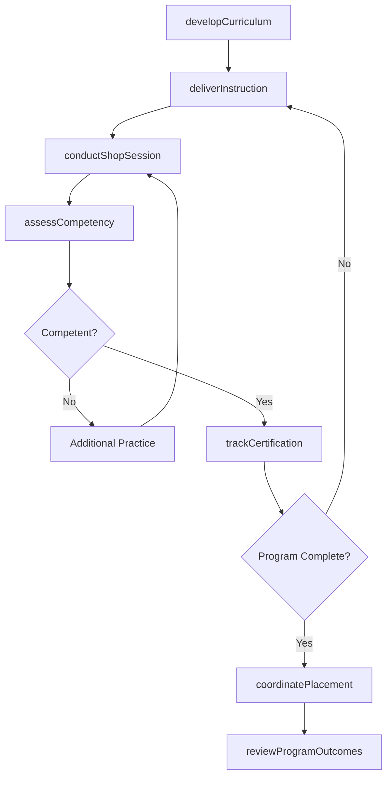
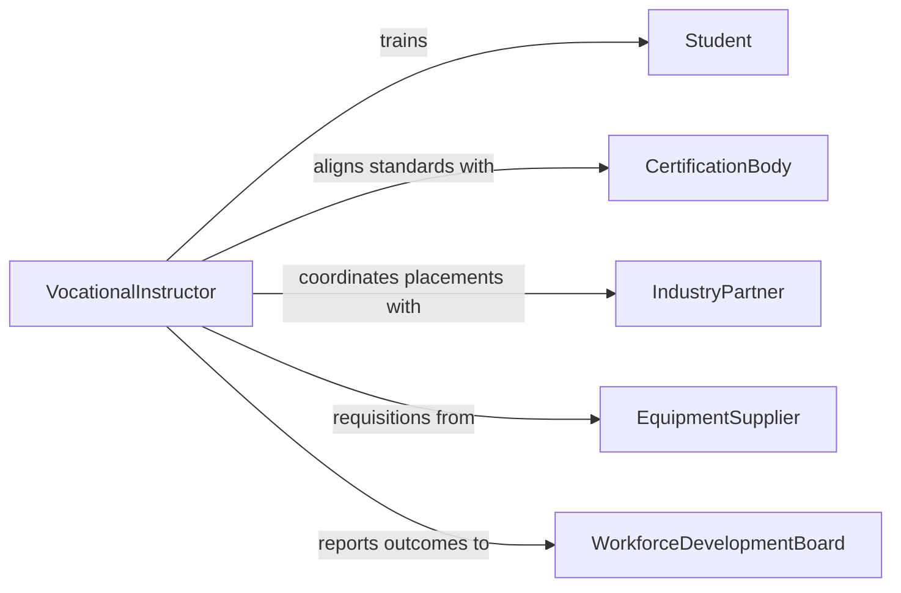

# Teach Vocational Courses

> Business-as-Code definition for teaching vocational courses. Models the design, delivery, and assessment of skills-based training programs in trades and technical fields such as welding, automotive technology, healthcare, and culinary arts.

## Overview

Teaching vocational courses involves developing practical, skills-based curricula, delivering hands-on instruction in workshop or lab environments, demonstrating trade techniques, and assessing student competency through practical exams and portfolio reviews. This definition exposes actions for curriculum development, shop-floor instruction, competency evaluation, and certification tracking.

## Actors

| Actor | Description |
|-------|-------------|
| Student | Learner enrolled in a vocational or technical training program |
| IndustryPartner | Employer or trade organization providing internship and job placement |
| CertificationBody | Agency that issues trade licenses or professional certifications |
| EquipmentSupplier | Vendor providing tools, machinery, and training materials |
| WorkforceDevelopmentBoard | Government or regional body funding vocational training programs |
| ApprenticeshipSponsor | Organization hosting apprentices for on-the-job training |

## Roles

| Role | Description |
|------|-------------|
| VocationalInstructor | Designs curricula and delivers hands-on trade instruction |
| ShopSupervisor | Oversees workshop safety and equipment usage during practical sessions |
| ProgramDirector | Manages vocational program administration and industry partnerships |
| CompetencyAssessor | Evaluates student skill demonstrations and certifies proficiency |

## Entities

| Entity | Description |
|--------|-------------|
| VocationalCourse | A skills-based course with lecture and hands-on components |
| CompetencyStandard | A defined skill or knowledge benchmark students must achieve |
| PracticalExam | A hands-on assessment demonstrating trade skill proficiency |
| SkillPortfolio | A collection of student work samples and competency evidence |
| CertificationRecord | Documentation of a student's earned trade certifications |
| ShopSession | A scheduled hands-on training session in a workshop or lab |

## Actions

| Action | Description |
|--------|-------------|
| developCurriculum | Create a vocational course aligned with industry competency standards |
| deliverInstruction | Present trade concepts through lecture and demonstration |
| conductShopSession | Lead hands-on practice in a workshop or lab environment |
| assessCompetency | Evaluate student skill proficiency through practical exams |
| trackCertification | Record and manage student progress toward trade certifications |
| coordinatePlacement | Arrange internships or apprenticeships with industry partners |
| reviewProgramOutcomes | Analyze completion rates, placement data, and employer feedback |

## Events

| Event | Description |
|-------|-------------|
| curriculumDeveloped | A vocational course curriculum has been finalized |
| instructionDelivered | A lecture or demonstration session has been completed |
| shopSessionConducted | A hands-on workshop session has been completed |
| competencyAssessed | A student's trade skills have been evaluated |
| certificationEarned | A student has achieved a required trade certification |
| placementCoordinated | An internship or apprenticeship has been arranged |
| programOutcomesReviewed | Program effectiveness data has been analyzed |

## Searches

| Search | Description |
|--------|-------------|
| findCoursesByTrade | List vocational courses by trade area, term, or certification path |
| getStudentCompetencies | Retrieve competency assessment records for a student |
| findCertificationStatus | Query student progress toward trade certifications |
| getPlacementRecords | Retrieve internship and job placement data by program or cohort |

## Workflow



## Actor Relationships



## Usage

### Calling Actions

```typescript
import { teachVocationalCourses } from '@headlessly/teach-vocational-courses'

const vocational = teachVocationalCourses()

// Develop an automotive technology curriculum
const course = await vocational.developCurriculum({
  title: 'Automotive Engine Repair',
  tradeArea: 'Automotive Technology',
  term: 'Spring 2026',
  competencies: [
    'Diagnose engine mechanical problems',
    'Perform cylinder head repair',
    'Replace timing components'
  ],
  certificationPath: 'ASE Engine Repair'
})

// Conduct a shop session
await vocational.conductShopSession({
  courseId: course.id,
  week: 6,
  topic: 'Cylinder Head Removal and Inspection',
  equipmentRequired: ['engine hoist', 'torque wrench', 'dial indicator']
})

// Assess student competency
await vocational.assessCompetency({
  courseId: course.id,
  studentId: 'stu-4401',
  competency: 'Perform cylinder head repair',
  result: 'proficient'
})
```

### Event-Driven Automation

```typescript
// Notify certification body when a student earns credentials
vocational.certificationEarned(async ({ studentId, certification }) => {
  await submitCertificationRecord({
    studentId,
    certification,
    dateEarned: new Date().toISOString()
  })
})

// Alert program director when competency pass rates drop
vocational.competencyAssessed(async ({ courseId, competency, result }) => {
  if (result === 'not-proficient') {
    const stats = await vocational.getStudentCompetencies({ courseId, competency })
    if (stats.passRate < 0.6) {
      await escalate({
        to: 'program-director',
        message: `Pass rate for "${competency}" is ${stats.passRate * 100}%`
      })
    }
  }
})
```
