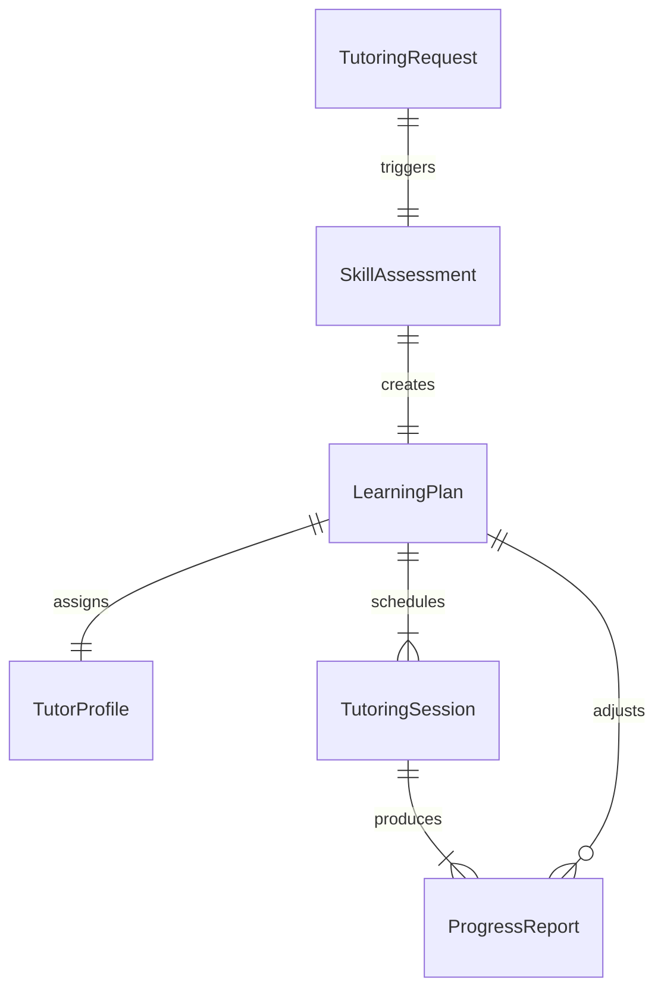
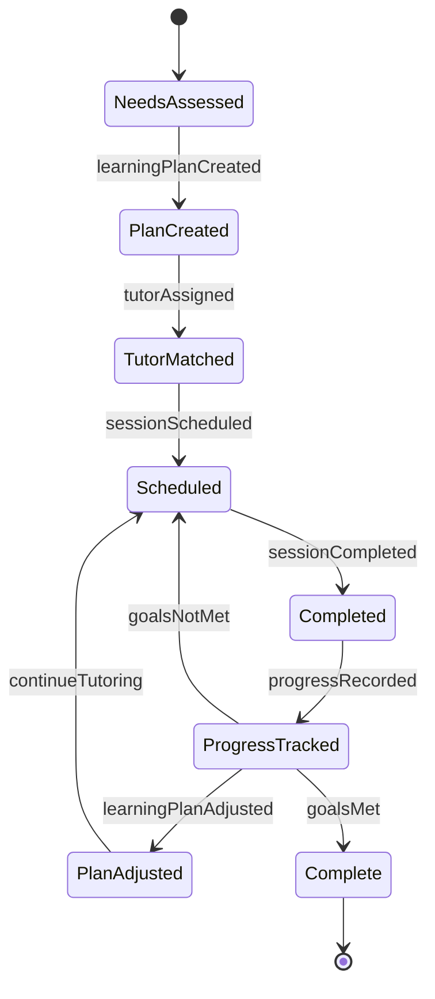
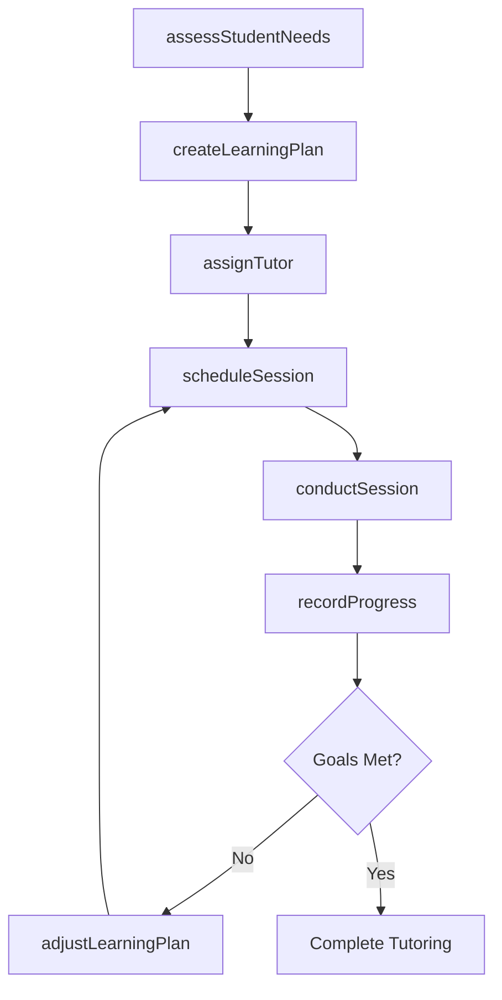
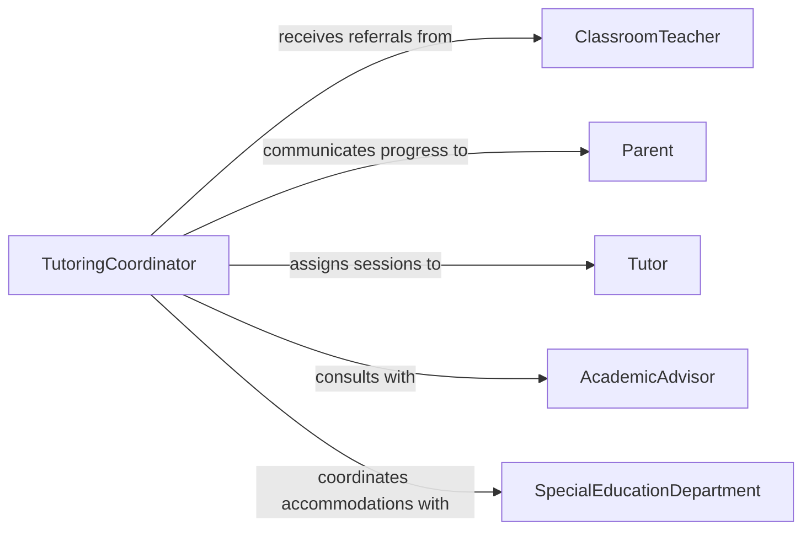

# Tutor Students Who Need Extra

> Business-as-Code definition for tutoring students who need extra assistance. Models the identification, scheduling, delivery, and progress tracking of supplemental academic support.

## Overview

Tutoring students who need extra assistance involves identifying learners who are struggling, matching them with appropriate tutors or support resources, and delivering targeted instruction to close knowledge gaps. This definition exposes actions for needs assessment, session scheduling, and progress monitoring, along with events for automated intervention triggers.

## Actors

| Actor | Description |
|-------|-------------|
| Student | The learner receiving supplemental tutoring support |
| Parent | Guardian who may request or approve tutoring services |
| ClassroomTeacher | Refers students and provides context on academic gaps |
| AcademicAdvisor | Recommends tutoring based on academic performance data |
| SpecialEducationDepartment | Coordinates accommodations for students with learning needs |

## Roles

| Role | Description |
|------|-------------|
| Tutor | Delivers one-on-one or small-group supplemental instruction |
| TutoringCoordinator | Manages tutor assignments, schedules, and program logistics |
| AcademicSupportSpecialist | Assesses student needs and develops individualized learning plans |
| ProgressMonitor | Tracks student improvement and adjusts tutoring strategies |

## Entities

| Entity | Description |
|--------|-------------|
| TutoringRequest | A formal referral or request for supplemental academic support |
| LearningPlan | An individualized plan outlining goals, methods, and milestones |
| TutoringSession | A scheduled meeting between tutor and student |
| ProgressReport | Documentation of student improvement over time |
| SkillAssessment | An evaluation of the student's current knowledge and gaps |
| TutorProfile | Qualifications, availability, and subject expertise of a tutor |

## Actions

| Action | Description |
|--------|-------------|
| assessStudentNeeds | Evaluate a student's academic gaps and learning requirements |
| createLearningPlan | Develop an individualized tutoring plan with goals and milestones |
| assignTutor | Match a qualified tutor to a student based on subject and availability |
| scheduleSession | Book a tutoring session at a mutually available time |
| conductSession | Deliver targeted instruction during a tutoring meeting |
| recordProgress | Document student advancement against learning plan objectives |
| adjustLearningPlan | Modify the tutoring approach based on progress data |

## Events

| Event | Description |
|-------|-------------|
| studentNeedsAssessed | A student's academic gaps have been evaluated |
| learningPlanCreated | An individualized tutoring plan has been established |
| tutorAssigned | A tutor has been matched to a student |
| sessionScheduled | A tutoring session has been booked |
| sessionCompleted | A tutoring session has been delivered |
| progressRecorded | Student advancement has been documented |
| learningPlanAdjusted | The tutoring approach has been modified based on outcomes |

## Searches

| Search | Description |
|--------|-------------|
| findStudentsNeedingSupport | List students flagged for supplemental tutoring based on performance |
| findAvailableTutors | Retrieve tutors by subject expertise, availability, and location |
| getSessionHistory | Retrieve past tutoring sessions for a student or tutor |
| getProgressReports | Retrieve progress data filtered by student, subject, or period |

## Entity Relationships



## State Diagram



## Workflow



## Actor Relationships



## Usage

### Calling Actions

```typescript
import { tutorStudentsWhoNeedExtra } from '@headlessly/tutor-students-who-need-extra'

const tutoring = tutorStudentsWhoNeedExtra()

// Assess a student's academic needs
const assessment = await tutoring.assessStudentNeeds({
  studentId: 'stu-2048',
  subjects: ['algebra', 'geometry'],
  referredBy: 'teacher-jones'
})

// Create an individualized learning plan
const plan = await tutoring.createLearningPlan({
  studentId: assessment.studentId,
  goals: [
    { subject: 'algebra', target: 'Solve linear equations independently' },
    { subject: 'geometry', target: 'Apply area and perimeter formulas' }
  ],
  duration: { weeks: 8 }
})

// Assign a tutor and schedule the first session
await tutoring.assignTutor({ planId: plan.id, tutorId: 'tutor-314' })
await tutoring.scheduleSession({
  planId: plan.id,
  date: '2026-03-10',
  time: '15:00',
  duration: 60
})
```

### Event-Driven Automation

```typescript
// Notify parent when progress is recorded
tutoring.progressRecorded(async ({ studentId, subject, improvement }) => {
  const parent = await getParentContact(studentId)
  await notify({
    to: parent.email,
    message: `Your student showed ${improvement}% improvement in ${subject}`
  })
})

// Auto-adjust plan when goals are not being met
tutoring.sessionCompleted(async ({ planId, sessionResults }) => {
  if (sessionResults.progressScore < 0.4) {
    await tutoring.adjustLearningPlan({
      planId,
      reason: 'Insufficient progress after session',
      adjustments: ['Reduce topic scope', 'Add practice exercises']
    })
  }
})
```
