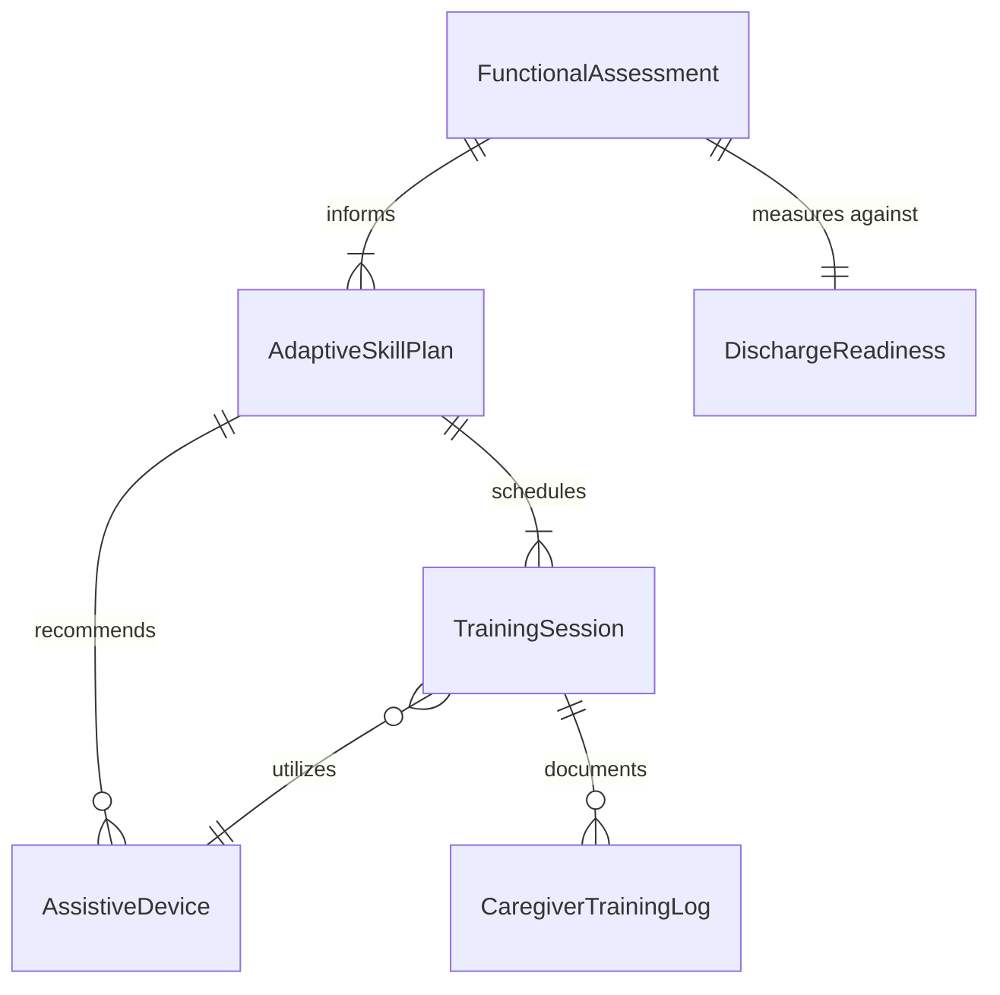
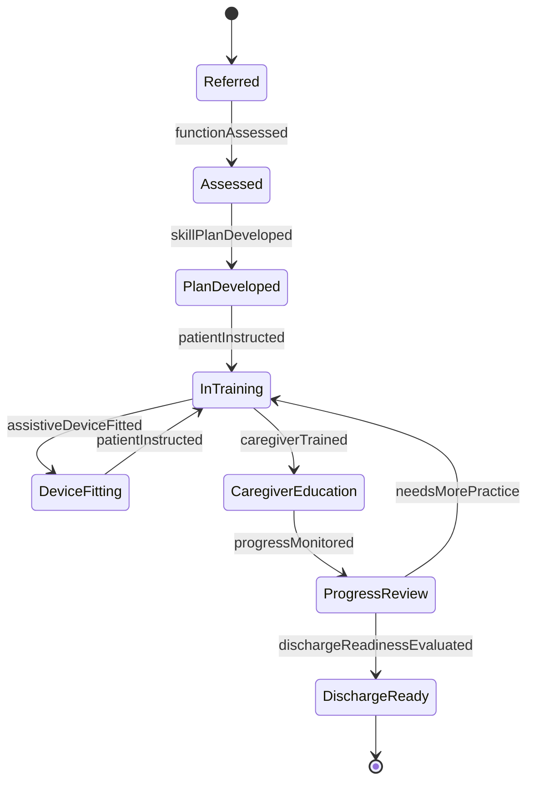
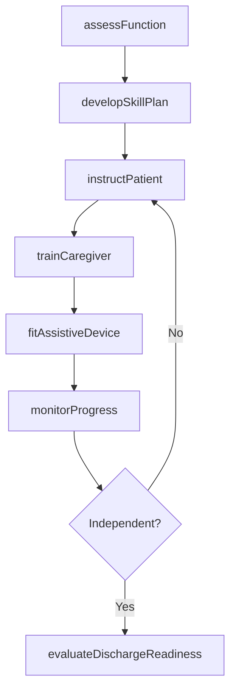
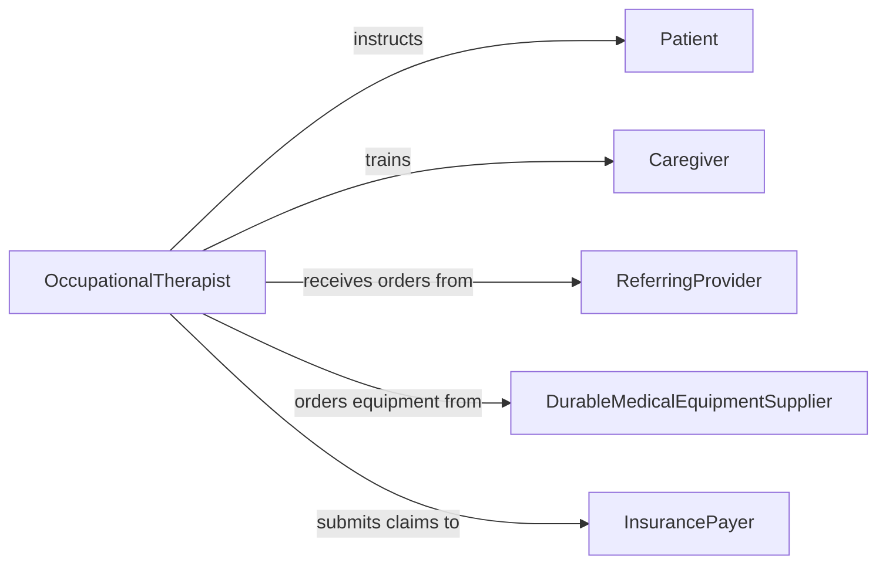

# Teach Basic Living Adaptive Skills

> Business-as-Code definition for teaching basic living or other adaptive skills to patients or caregivers. Models the clinical instruction process for helping individuals with disabilities or functional limitations develop compensatory strategies for independent living.

## Overview

Teaching basic living or other adaptive skills to patients or caregivers focuses on equipping individuals with physical, cognitive, or developmental limitations with strategies to perform essential activities of daily living. This includes instruction in self-feeding, dressing, bathing, mobility, and use of assistive technology. Caregivers are trained alongside patients to ensure consistent reinforcement of techniques in the home environment, maximizing functional independence and quality of life.

## Actors

| Actor | Description |
|-------|-------------|
| Patient | Individual with functional limitations receiving adaptive skill instruction |
| Caregiver | Family member or aide who supports the patient in daily routines |
| ReferringProvider | Physician or specialist who orders adaptive skill training |
| DurableMedicalEquipmentSupplier | Vendor providing assistive devices and adaptive tools |
| InsurancePayer | Health plan or government program covering rehabilitation services |
| RehabilitationFacility | Inpatient or outpatient center where training takes place |

## Roles

| Role | Description |
|------|-------------|
| OccupationalTherapist | Assesses functional deficits and teaches adaptive techniques |
| RehabilitationAide | Assists the therapist and supports patient practice sessions |
| CareCoordinator | Manages referrals, authorizations, and discharge planning |
| AdaptiveEquipmentSpecialist | Recommends and fits assistive devices to patient needs |

## Entities

| Entity | Description |
|--------|-------------|
| FunctionalAssessment | An evaluation of the patient's ability to perform daily activities |
| AdaptiveSkillPlan | A treatment plan specifying skills to teach and methods to use |
| TrainingSession | A scheduled encounter for skill instruction and practice |
| AssistiveDevice | A tool designed to compensate for functional limitations |
| CaregiverTrainingLog | Documentation of skills taught to the patient's caregiver |
| DischargeReadiness | A measure of the patient's preparedness for independent living |

## Actions

| Action | Description |
|--------|-------------|
| assessFunction | Evaluate the patient's current ability to perform daily living tasks |
| developSkillPlan | Create an individualized adaptive skill training plan |
| instructPatient | Teach the patient compensatory techniques for specific tasks |
| trainCaregiver | Educate the caregiver in assisting and reinforcing patient skills |
| fitAssistiveDevice | Select and configure adaptive equipment for the patient |
| monitorProgress | Track improvement in functional independence over sessions |
| evaluateDischargeReadiness | Determine whether the patient is prepared for home independence |

## Events

| Event | Description |
|-------|-------------|
| functionAssessed | A baseline functional evaluation has been completed |
| skillPlanDeveloped | An adaptive skill training plan has been created |
| patientInstructed | A patient has completed a skill instruction session |
| caregiverTrained | A caregiver has received training on support techniques |
| assistiveDeviceFitted | An assistive device has been selected and configured |
| progressMonitored | Functional improvement data has been recorded |
| dischargeReadinessEvaluated | The patient's preparedness for home living has been assessed |

## Searches

| Search | Description |
|--------|-------------|
| findPatients | List patients by diagnosis, functional level, or training status |
| getTrainingSessions | Retrieve scheduled or completed sessions for a patient |
| getAssistiveDevices | Look up devices recommended or fitted for a patient |
| getCaregiverLogs | Retrieve caregiver training documentation by patient |

## Entity Relationships



## State Diagram



## Workflow



## Actor Relationships



## Usage

### Calling Actions

```typescript
import { teachBasicLivingAdaptiveSkills } from '@headlessly/teach-basic-living-adaptive-skills'

const therapy = teachBasicLivingAdaptiveSkills()

// Assess a patient's functional abilities
const assessment = await therapy.assessFunction({
  patientId: 'patient-7823',
  domains: ['self-feeding', 'dressing', 'bathing', 'transfers'],
  tool: 'functional-independence-measure'
})

// Develop an adaptive skill training plan
const plan = await therapy.developSkillPlan({
  patientId: 'patient-7823',
  assessmentId: assessment.id,
  goals: [
    { skill: 'independent-dressing', targetWeeks: 6 },
    { skill: 'adaptive-feeding-with-utensils', targetWeeks: 4 }
  ]
})

// Train the caregiver on support techniques
await therapy.trainCaregiver({
  patientId: 'patient-7823',
  caregiverId: 'caregiver-1102',
  skills: ['transfer-assist-technique', 'adaptive-utensil-setup'],
  sessionDate: '2026-04-10'
})
```

### Event-Driven Automation

```typescript
// Alert care coordinator when discharge readiness is achieved
therapy.dischargeReadinessEvaluated(async ({ patientId, ready }) => {
  if (ready) {
    await notify({
      to: 'care-coordinator',
      message: `Patient ${patientId} is ready for discharge planning`
    })
  }
})

// Order assistive devices when a skill plan is developed
therapy.skillPlanDeveloped(async ({ patientId, goals }) => {
  const deviceNeeds = goals.filter(g => g.requiresDevice)
  for (const need of deviceNeeds) {
    await therapy.fitAssistiveDevice({
      patientId,
      deviceType: need.deviceType,
      priority: 'standard'
    })
  }
})
```
