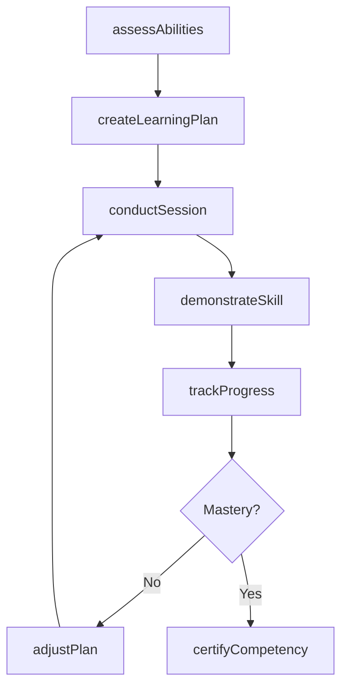
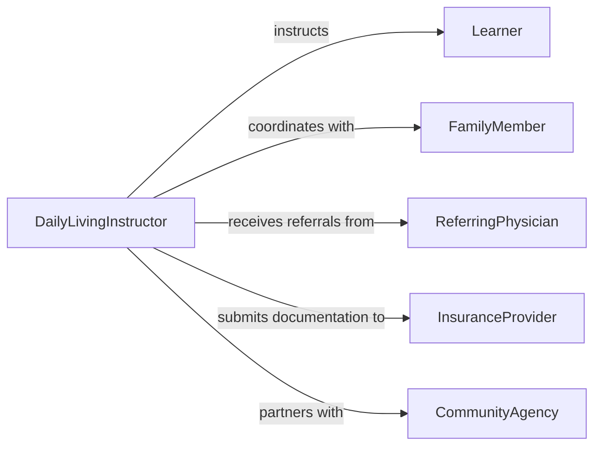

# Teach Daily Living Skills Behaviors

> Business-as-Code definition for teaching daily living skills or behaviors. Models the instructional process of helping individuals develop self-care, household management, and routine behavioral competencies.

## Overview

Teaching daily living skills or behaviors involves instructing individuals in essential self-care routines such as personal hygiene, meal preparation, household management, and time management. This process supports people with developmental disabilities, acquired injuries, or age-related challenges in achieving greater independence. Instructors assess current ability levels, design individualized learning plans, and use demonstration, practice, and reinforcement techniques to build lasting habits.

## Actors

| Actor | Description |
|-------|-------------|
| Learner | Individual receiving instruction in daily living skills |
| FamilyMember | Caregiver or relative who reinforces skills in the home environment |
| ReferringPhysician | Healthcare provider who identifies the need for daily living training |
| InsuranceProvider | Payer organization covering rehabilitation or habilitation services |
| CommunityAgency | Social services organization that refers clients for skill building |

## Roles

| Role | Description |
|------|-------------|
| DailyLivingInstructor | Plans and delivers instruction in self-care and household tasks |
| OccupationalTherapist | Assesses functional abilities and designs adaptive strategies |
| CaseManager | Coordinates services and tracks learner progress across providers |
| BehavioralSpecialist | Addresses behavioral barriers to skill acquisition |

## Entities

| Entity | Description |
|--------|-------------|
| SkillAssessment | An evaluation of the learner's current daily living abilities |
| LearningPlan | An individualized curriculum of skills and target milestones |
| InstructionSession | A scheduled teaching encounter focused on specific skills |
| ProgressRecord | Documentation of skill acquisition and behavioral changes |
| AdaptiveAid | A tool or device that supports independent task completion |
| BehaviorGoal | A specific behavioral outcome the learner is working toward |

## Actions

| Action | Description |
|--------|-------------|
| assessAbilities | Evaluate the learner's current competencies in daily living tasks |
| createLearningPlan | Design an individualized plan with sequenced skill targets |
| conductSession | Deliver instruction using demonstration, prompting, and practice |
| demonstrateSkill | Model a daily living task for the learner to observe and replicate |
| trackProgress | Record skill acquisition milestones and behavioral observations |
| adjustPlan | Modify the learning plan based on progress and emerging needs |
| certifyCompetency | Confirm the learner has achieved independence in a target skill |

## Events

| Event | Description |
|-------|-------------|
| abilitiesAssessed | A baseline evaluation of the learner's skills has been completed |
| learningPlanCreated | An individualized instruction plan has been developed |
| sessionConducted | A teaching session has been completed |
| skillDemonstrated | A daily living task has been modeled for the learner |
| progressTracked | Skill acquisition data has been recorded |
| planAdjusted | The learning plan has been modified based on progress |
| competencyCertified | The learner has achieved independence in a target skill |

## Searches

| Search | Description |
|--------|-------------|
| findLearners | List learners by skill level, diagnosis, or program enrollment |
| getSessions | Retrieve scheduled or completed instruction sessions |
| getProgressRecords | Look up skill acquisition history for a learner |
| getAdaptiveAids | Find recommended tools and devices for specific tasks |

## Workflow



## Actor Relationships



## Usage

### Calling Actions

```typescript
import { teachDailyLivingSkillsBehaviors } from '@headlessly/teach-daily-living-skills-behaviors'

const instruction = teachDailyLivingSkillsBehaviors()

// Assess a new learner's daily living abilities
const assessment = await instruction.assessAbilities({
  learnerId: 'learner-4521',
  domains: ['personal-hygiene', 'meal-preparation', 'household-cleaning', 'money-management'],
  assessmentTool: 'adaptive-behavior-scale'
})

// Create an individualized learning plan
const plan = await instruction.createLearningPlan({
  learnerId: 'learner-4521',
  assessmentId: assessment.id,
  goals: [
    { skill: 'prepare-simple-meals', targetDate: '2026-06-01' },
    { skill: 'manage-laundry-routine', targetDate: '2026-08-01' }
  ]
})

// Track progress after a session
await instruction.trackProgress({
  learnerId: 'learner-4521',
  sessionId: 'session-892',
  skill: 'prepare-simple-meals',
  promptLevel: 'verbal-cue-only',
  completionRate: 0.85
})
```

### Event-Driven Automation

```typescript
// Notify the care team when a learner achieves competency
instruction.competencyCertified(async ({ learnerId, skill }) => {
  await notify({
    to: ['case-manager', 'family-contact'],
    message: `Learner ${learnerId} has achieved independence in ${skill}`
  })
})

// Automatically adjust the plan when progress stalls
instruction.progressTracked(async ({ learnerId, completionRate, sessionCount }) => {
  if (completionRate < 0.4 && sessionCount > 5) {
    await instruction.adjustPlan({
      learnerId,
      reason: 'insufficient-progress',
      action: 'simplify-task-steps'
    })
  }
})
```
