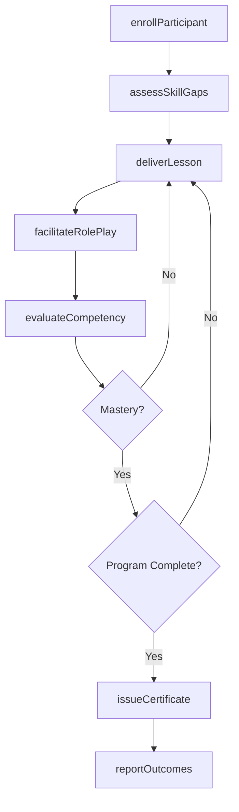
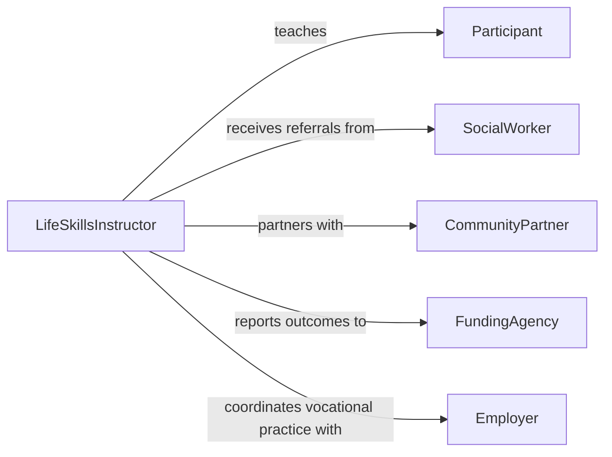

# Teach Life Skills

> Business-as-Code definition for teaching life skills. Models the instructional process of equipping individuals with practical competencies for independent functioning across personal, social, and vocational domains.

## Overview

Teaching life skills encompasses instruction in a broad range of practical competencies including financial literacy, communication, problem-solving, decision-making, and social interaction. This process targets youth, adults in transition, or individuals rebuilding skills after life disruptions such as incarceration, homelessness, or substance recovery. Instructors use experiential learning, role-playing, and structured curricula to build self-sufficiency and confidence in real-world settings.

## Actors

| Actor | Description |
|-------|-------------|
| Participant | Individual enrolled in life skills programming |
| SocialWorker | Professional who identifies and refers individuals needing life skills support |
| CommunityPartner | Local organization providing venues, resources, or co-instruction |
| FundingAgency | Government or philanthropic entity sponsoring life skills programs |
| Employer | Workplace partner offering vocational skill-building opportunities |

## Roles

| Role | Description |
|------|-------------|
| LifeSkillsInstructor | Designs and delivers life skills curricula to participants |
| ProgramDirector | Oversees the life skills program strategy and staffing |
| PeerMentor | Experienced individual who models skills and provides encouragement |
| EvaluationSpecialist | Measures program outcomes and participant progress |

## Entities

| Entity | Description |
|--------|-------------|
| Curriculum | A structured set of lessons covering targeted life skill domains |
| Lesson | A single instructional unit focused on a specific competency |
| ParticipantProfile | Background information, goals, and skill levels for an individual |
| CompetencyRubric | Criteria used to measure mastery of a life skill |
| ProgramCohort | A group of participants progressing through the curriculum together |
| Certificate | A credential issued upon successful completion of a life skills program |

## Actions

| Action | Description |
|--------|-------------|
| enrollParticipant | Register an individual in a life skills program or cohort |
| assessSkillGaps | Identify areas where the participant lacks competency |
| deliverLesson | Conduct instruction on a specific life skill topic |
| facilitateRolePlay | Guide participants through simulated real-world scenarios |
| evaluateCompetency | Measure a participant's mastery against the competency rubric |
| issueCertificate | Award a completion credential after program milestones are met |
| reportOutcomes | Generate program effectiveness reports for funders and stakeholders |

## Events

| Event | Description |
|-------|-------------|
| participantEnrolled | A new individual has been registered in the program |
| skillGapsAssessed | A participant's competency gaps have been identified |
| lessonDelivered | An instructional session has been completed |
| rolePlayFacilitated | A simulated scenario exercise has been conducted |
| competencyEvaluated | A participant's skill mastery has been measured |
| certificateIssued | A completion credential has been awarded |
| outcomesReported | Program performance data has been compiled and shared |

## Searches

| Search | Description |
|--------|-------------|
| findParticipants | List participants by cohort, skill level, or enrollment status |
| getLessons | Retrieve lessons by topic, curriculum, or completion status |
| getCompetencyScores | Look up evaluation results for participants |
| getCohortProgress | Retrieve aggregate progress metrics for a program cohort |

## Workflow



## Actor Relationships



## Usage

### Calling Actions

```typescript
import { teachLifeSkills } from '@headlessly/teach-life-skills'

const program = teachLifeSkills()

// Enroll a new participant
const participant = await program.enrollParticipant({
  name: 'Jordan Rivera',
  cohortId: 'spring-2026',
  referralSource: 'county-social-services',
  targetSkills: ['financial-literacy', 'job-readiness', 'conflict-resolution']
})

// Assess skill gaps
const gaps = await program.assessSkillGaps({
  participantId: participant.id,
  domains: ['budgeting', 'resume-writing', 'interpersonal-communication']
})

// Evaluate competency after a lesson series
const evaluation = await program.evaluateCompetency({
  participantId: participant.id,
  skill: 'financial-literacy',
  rubricId: 'budgeting-rubric-v2',
  evidence: ['completed-budget-worksheet', 'savings-plan-presentation']
})
```

### Event-Driven Automation

```typescript
// Automatically issue certificate when all competencies are met
program.competencyEvaluated(async ({ participantId, skill, mastery }) => {
  if (mastery) {
    const allComplete = await program.getCompetencyScores({
      participantId,
      filter: { mastery: false }
    })
    if (allComplete.length === 0) {
      await program.issueCertificate({ participantId })
    }
  }
})

// Alert social worker when a participant's gaps are assessed
program.skillGapsAssessed(async ({ participantId, gaps }) => {
  if (gaps.length > 4) {
    await notify({
      to: 'assigned-social-worker',
      message: `Participant ${participantId} has significant skill gaps across ${gaps.length} domains`
    })
  }
})
```
