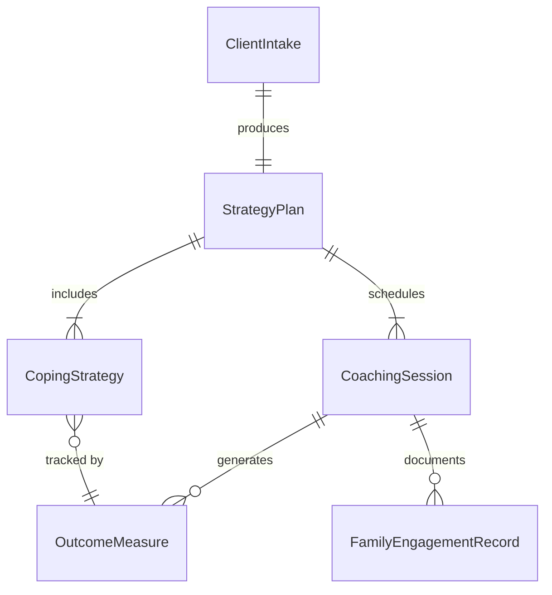
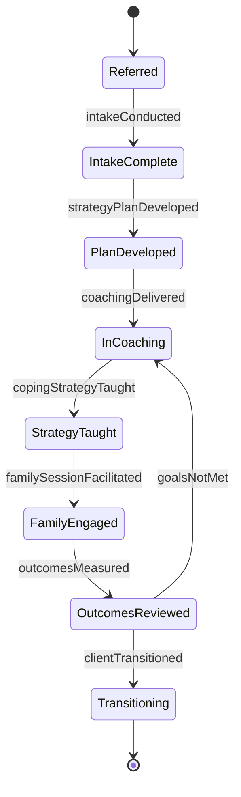
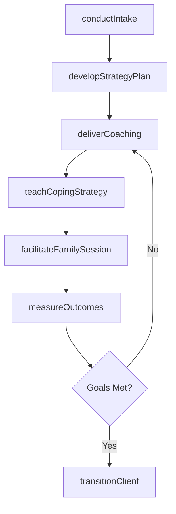
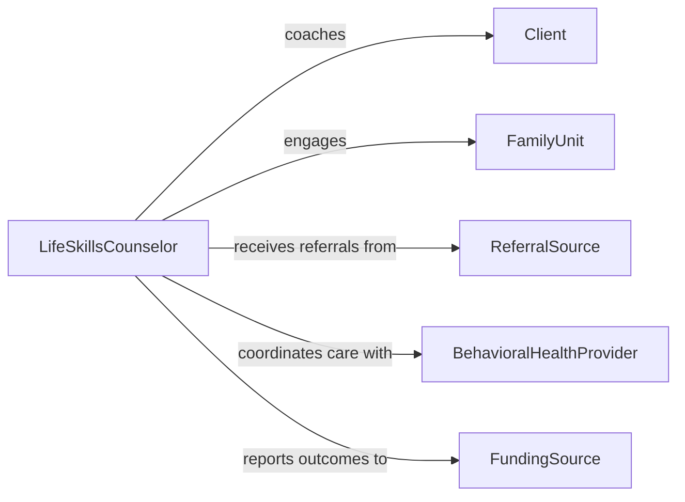

# Teach Life Skills Strategies Clients

> Business-as-Code definition for teaching life skills or strategies to clients or their families. Models the counseling and instructional process of helping clients and their support systems develop coping strategies, self-management techniques, and practical competencies.

## Overview

Teaching life skills or strategies to clients or their families involves providing structured instruction in coping mechanisms, communication techniques, stress management, and practical problem-solving within a therapeutic or social services context. Practitioners work with individuals facing mental health challenges, substance use disorders, family disruptions, or socioeconomic hardship to build resilience and self-efficacy. Family members are engaged as active participants to create a supportive environment that reinforces skill adoption beyond formal sessions.

## Actors

| Actor | Description |
|-------|-------------|
| Client | Individual receiving life skills instruction within a service program |
| FamilyUnit | Household members participating in family-based skill building |
| ReferralSource | Court, school, or agency that refers clients for life skills services |
| BehavioralHealthProvider | Clinician addressing co-occurring mental health needs |
| FundingSource | Grant program or government agency financing the service |

## Roles

| Role | Description |
|------|-------------|
| LifeSkillsCounselor | Delivers individualized skill instruction and coaching to clients |
| FamilyTherapist | Facilitates family sessions and teaches relational strategies |
| IntakeCoordinator | Assesses client needs and determines appropriate service level |
| OutcomeAnalyst | Tracks client progress and program effectiveness metrics |

## Entities

| Entity | Description |
|--------|-------------|
| ClientIntake | An initial assessment documenting the client's needs and history |
| StrategyPlan | A personalized plan of skills and strategies to be taught |
| CoachingSession | A scheduled one-on-one or family instructional encounter |
| CopingStrategy | A specific technique for managing stress, conflict, or adversity |
| FamilyEngagementRecord | Documentation of family participation in skill-building activities |
| OutcomeMeasure | A metric tracking client improvement in targeted skill areas |

## Actions

| Action | Description |
|--------|-------------|
| conductIntake | Perform an initial assessment of client needs and goals |
| developStrategyPlan | Create a tailored plan of life skills and coping strategies |
| deliverCoaching | Provide one-on-one instruction in targeted life skills |
| facilitateFamilySession | Conduct group instruction with the client and family members |
| teachCopingStrategy | Instruct the client in a specific stress management or problem-solving technique |
| measureOutcomes | Evaluate client progress against established goals |
| transitionClient | Prepare the client for program completion and ongoing self-management |

## Events

| Event | Description |
|-------|-------------|
| intakeConducted | A new client assessment has been completed |
| strategyPlanDeveloped | A personalized skill-building plan has been created |
| coachingDelivered | A one-on-one coaching session has been completed |
| familySessionFacilitated | A family skill-building session has taken place |
| copingStrategyTaught | A specific coping technique has been instructed |
| outcomesMeasured | Client progress data has been collected and analyzed |
| clientTransitioned | The client has been prepared for program exit |

## Searches

| Search | Description |
|--------|-------------|
| findClients | List clients by program, referral source, or progress status |
| getCoachingSessions | Retrieve scheduled or completed sessions for a client |
| getStrategyPlans | Look up active strategy plans by client or skill domain |
| getOutcomeMetrics | Retrieve progress measurements for clients or cohorts |

## Entity Relationships



## State Diagram



## Workflow



## Actor Relationships



## Usage

### Calling Actions

```typescript
import { teachLifeSkillsStrategiesClients } from '@headlessly/teach-life-skills-strategies-clients'

const services = teachLifeSkillsStrategiesClients()

// Conduct intake for a new client
const intake = await services.conductIntake({
  clientName: 'Maria Santos',
  referralSource: 'family-court',
  presentingNeeds: ['anger-management', 'co-parenting-communication', 'budgeting'],
  familySize: 4
})

// Develop a personalized strategy plan
const plan = await services.developStrategyPlan({
  clientId: intake.clientId,
  strategies: [
    { skill: 'conflict-de-escalation', sessions: 6 },
    { skill: 'household-budgeting', sessions: 4 },
    { skill: 'co-parenting-communication', sessions: 8 }
  ]
})

// Measure outcomes after a coaching series
const outcomes = await services.measureOutcomes({
  clientId: intake.clientId,
  measures: ['anger-frequency-scale', 'budget-adherence-rate', 'family-satisfaction-score']
})
```

### Event-Driven Automation

```typescript
// Notify referral source when client transitions out of program
services.clientTransitioned(async ({ clientId, referralSource, summary }) => {
  await notify({
    to: referralSource,
    message: `Client ${clientId} has completed life skills programming`,
    attachment: summary
  })
})

// Schedule family session after initial coaching is delivered
services.coachingDelivered(async ({ clientId, sessionNumber }) => {
  if (sessionNumber === 3) {
    await services.facilitateFamilySession({
      clientId,
      topic: 'reinforcing-skills-at-home',
      scheduledDate: 'next-available'
    })
  }
})
```
