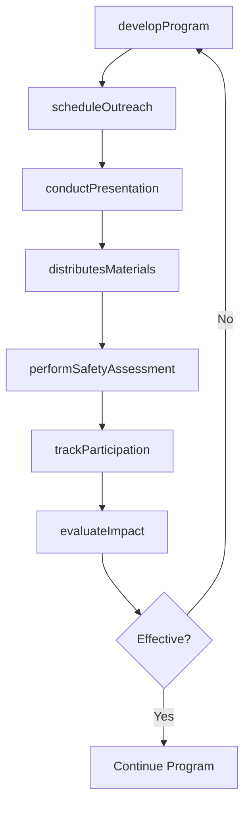
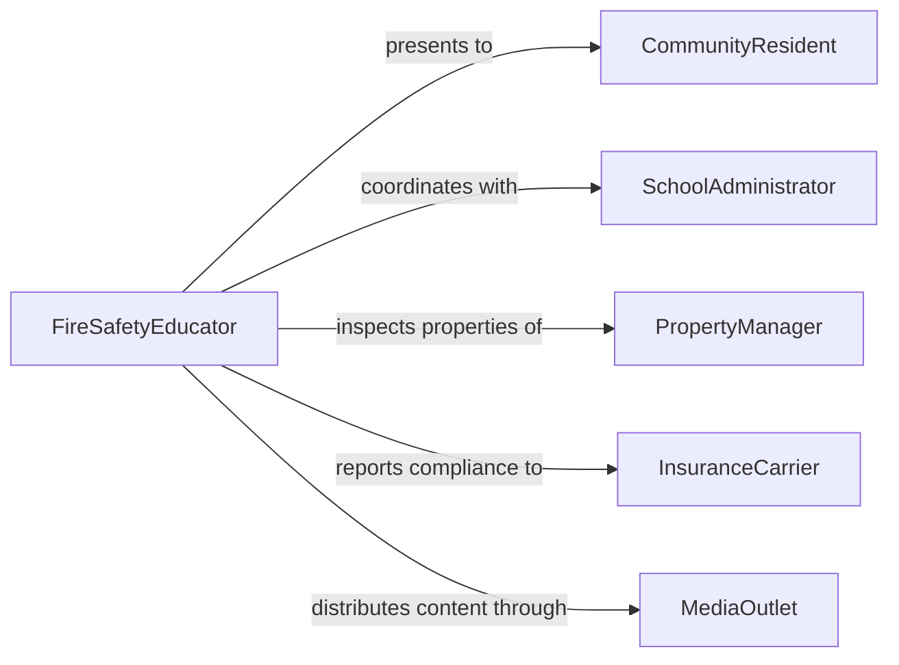

# Educate Public About Fire Safety

> Business-as-Code definition for educating the public about fire safety or prevention. Models the community outreach and instructional process of reducing fire-related injuries and property losses through awareness campaigns and training programs.

## Overview

Educating the public about fire safety or prevention involves developing and delivering community outreach programs that teach fire hazard recognition, evacuation planning, smoke alarm maintenance, and proper use of fire extinguishers. Fire departments, safety agencies, and educational institutions conduct demonstrations, distribute materials, and visit schools, businesses, and residential neighborhoods to build fire-safe behaviors. Effective fire safety education reduces preventable fires, minimizes injuries, and improves emergency response outcomes.

## Actors

| Actor | Description |
|-------|-------------|
| CommunityResident | Member of the public receiving fire safety education |
| SchoolAdministrator | School official who arranges fire safety presentations for students |
| PropertyManager | Building owner or manager responsible for tenant fire safety |
| InsuranceCarrier | Insurer offering premium reductions for fire safety compliance |
| MediaOutlet | News or social media channel used to amplify fire safety messaging |

## Roles

| Role | Description |
|------|-------------|
| FireSafetyEducator | Designs and delivers public fire safety training programs |
| FireCaptain | Oversees community outreach operations and personnel assignments |
| PublicInformationOfficer | Manages fire safety communications and media relations |
| VolunteerCoordinator | Recruits and manages community volunteers for outreach events |

## Entities

| Entity | Description |
|--------|-------------|
| EducationProgram | A structured fire safety curriculum for a target audience |
| OutreachEvent | A scheduled community presentation, demonstration, or fair |
| SafetyMaterial | Printed or digital content such as brochures, posters, and videos |
| EvacuationPlan | A building-specific plan for safe exit during a fire emergency |
| InspectionChecklist | A form used during home or business fire safety assessments |
| IncidentReport | A record of fire events used to inform educational priorities |

## Actions

| Action | Description |
|--------|-------------|
| developProgram | Create a fire safety education curriculum for a specific audience |
| scheduleOutreach | Plan and calendar community presentations and events |
| conductPresentation | Deliver a fire safety talk or demonstration to an audience |
| distributesMaterials | Provide printed or digital fire safety resources to attendees |
| performSafetyAssessment | Inspect a home or business for fire hazards and recommend improvements |
| trackParticipation | Record attendance and engagement at outreach events |
| evaluateImpact | Measure the effectiveness of education efforts on community safety |

## Events

| Event | Description |
|-------|-------------|
| programDeveloped | A fire safety education curriculum has been created |
| outreachScheduled | A community fire safety event has been planned |
| presentationConducted | A fire safety talk or demonstration has been delivered |
| materialsDistributed | Fire safety resources have been provided to the public |
| safetyAssessmentPerformed | A home or business fire hazard inspection has been completed |
| participationTracked | Attendance data for an outreach event has been recorded |
| impactEvaluated | Program effectiveness metrics have been analyzed |

## Searches

| Search | Description |
|--------|-------------|
| findOutreachEvents | List upcoming or past fire safety events by location or audience |
| getParticipationData | Retrieve attendance and engagement statistics for events |
| getSafetyAssessments | Look up inspection results for a property or neighborhood |
| getIncidentTrends | Retrieve fire incident data to identify education priorities |

## Workflow



## Actor Relationships



## Usage

### Calling Actions

```typescript
import { educatePublicAboutFireSafety } from '@headlessly/educate-public-about-fire-safety'

const fireSafety = educatePublicAboutFireSafety()

// Develop a school-focused fire safety program
const program = await fireSafety.developProgram({
  name: 'Fire Safe Schools 2026',
  audience: 'elementary-students',
  topics: ['stop-drop-roll', 'smoke-alarm-sounds', 'evacuation-routes', 'calling-911'],
  format: 'interactive-demonstration'
})

// Schedule outreach events across the district
await fireSafety.scheduleOutreach({
  programId: program.id,
  events: [
    { location: 'Lincoln Elementary', date: '2026-10-07', audience: 350 },
    { location: 'Washington Elementary', date: '2026-10-14', audience: 425 }
  ]
})

// Evaluate program impact at end of fire prevention month
const impact = await fireSafety.evaluateImpact({
  programId: program.id,
  metrics: ['households-with-smoke-alarms', 'evacuation-plan-adoption', 'incident-reduction']
})
```

### Event-Driven Automation

```typescript
// Send follow-up materials after a presentation
fireSafety.presentationConducted(async ({ eventId, attendeeCount, location }) => {
  await fireSafety.distributesMaterials({
    eventId,
    materials: ['home-safety-checklist', 'smoke-alarm-guide'],
    method: 'email-to-registered-attendees'
  })
})

// Flag high-risk properties after safety assessments
fireSafety.safetyAssessmentPerformed(async ({ propertyId, hazards }) => {
  if (hazards.length > 3) {
    await notify({
      to: 'fire-prevention-bureau',
      message: `Property ${propertyId} has ${hazards.length} fire hazards requiring follow-up`
    })
  }
})
```
