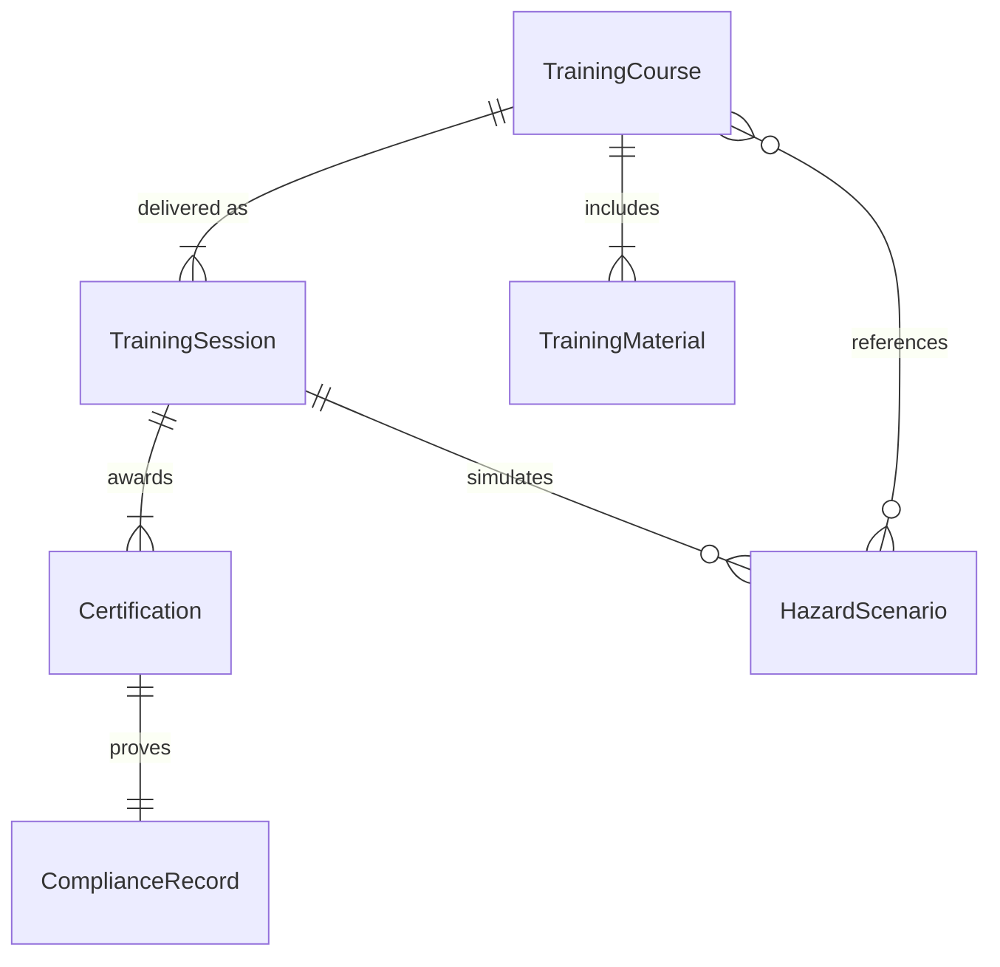
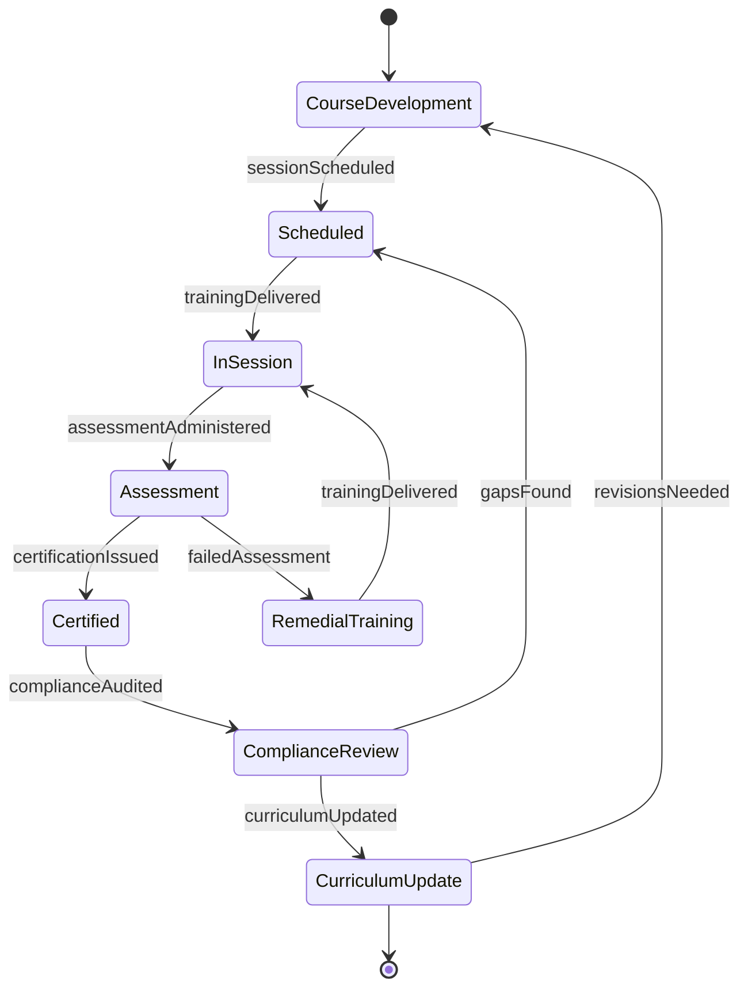
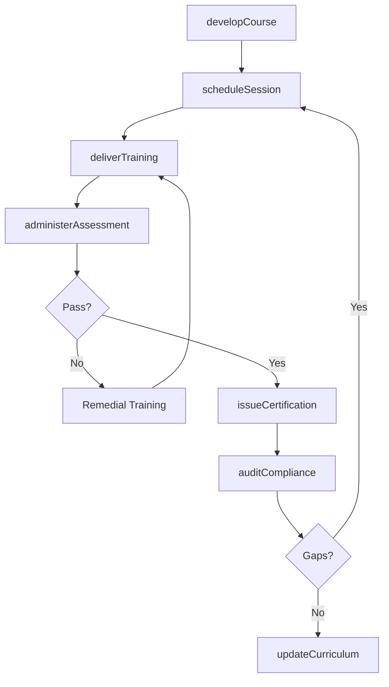
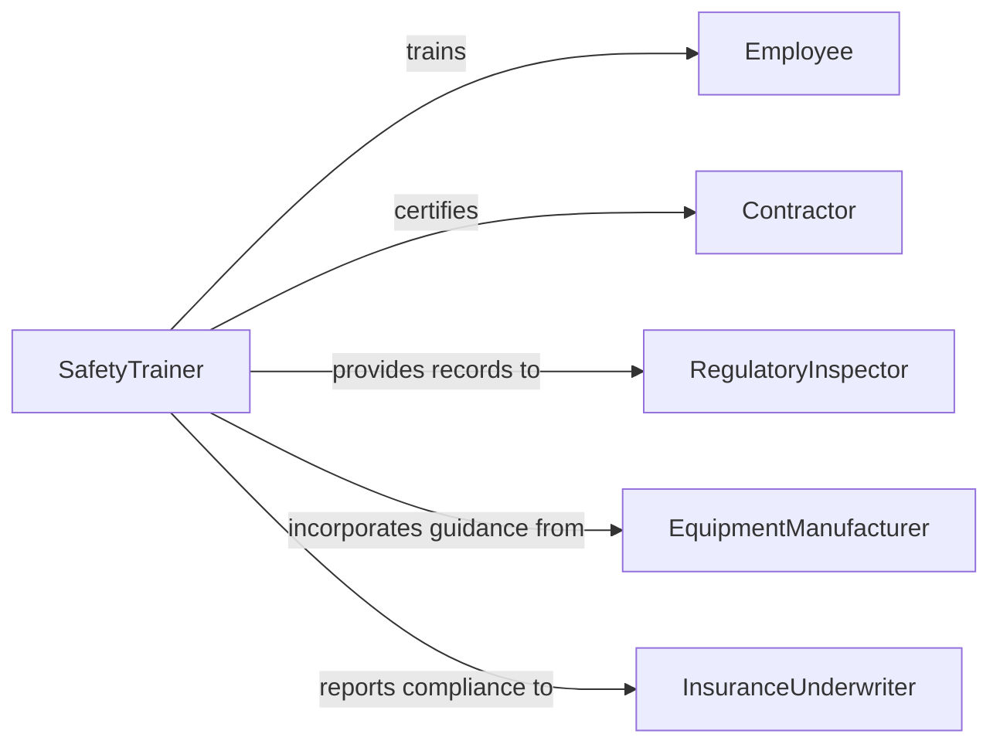

# Provide Safety Training

> Business-as-Code definition for providing safety training. Models the process of designing, delivering, and certifying workplace and operational safety instruction to ensure regulatory compliance and reduce incidents.

## Overview

Providing safety training involves developing and delivering instructional programs that teach employees, contractors, and visitors how to identify hazards, follow safe work practices, use personal protective equipment, and respond to emergencies. Training is typically mandated by OSHA, industry regulations, or organizational policy and covers topics such as lockout/tagout, fall protection, hazardous materials handling, and confined space entry. Effective safety training reduces workplace injuries, lowers workers' compensation costs, and maintains regulatory compliance.

## Actors

| Actor | Description |
|-------|-------------|
| Employee | Worker required to complete safety training for their role |
| Contractor | Third-party worker who must meet site safety requirements |
| RegulatoryInspector | OSHA or industry auditor verifying training compliance |
| EquipmentManufacturer | Vendor providing equipment-specific safety documentation |
| InsuranceUnderwriter | Carrier assessing safety program quality for premium calculation |

## Roles

| Role | Description |
|------|-------------|
| SafetyTrainer | Designs and delivers safety training curricula |
| SafetyManager | Oversees the organization's safety program and compliance |
| TrainingAdministrator | Schedules sessions, tracks completions, and maintains records |
| IncidentInvestigator | Analyzes incidents to identify training gaps and corrective actions |

## Entities

| Entity | Description |
|--------|-------------|
| TrainingCourse | A structured safety curriculum covering specific hazards or procedures |
| TrainingSession | A scheduled delivery of a course to a group of trainees |
| Certification | A credential confirming an individual has completed required training |
| ComplianceRecord | Documentation proving training requirements have been met |
| HazardScenario | A simulated or real-world situation used for hands-on practice |
| TrainingMaterial | Slides, manuals, videos, and other instructional resources |

## Actions

| Action | Description |
|--------|-------------|
| developCourse | Create a safety training curriculum for a specific hazard or regulation |
| scheduleSession | Plan and assign trainees to an upcoming training session |
| deliverTraining | Conduct the safety training session including lecture and hands-on practice |
| administerAssessment | Test trainees on safety knowledge and procedural competency |
| issueCertification | Grant a certification credential upon successful course completion |
| auditCompliance | Verify that all required personnel have current safety training |
| updateCurriculum | Revise training content based on regulatory changes or incident findings |

## Events

| Event | Description |
|-------|-------------|
| courseDeveloped | A new safety training curriculum has been created |
| sessionScheduled | A training session has been planned and trainees assigned |
| trainingDelivered | A safety training session has been completed |
| assessmentAdministered | A trainee competency test has been conducted |
| certificationIssued | A safety certification has been awarded to a trainee |
| complianceAudited | Training compliance records have been reviewed |
| curriculumUpdated | Training content has been revised to reflect new requirements |

## Searches

| Search | Description |
|--------|-------------|
| findCourses | List safety courses by topic, regulation, or department |
| getTraineeStatus | Retrieve training completion and certification status for individuals |
| getComplianceGaps | Identify personnel with expired or missing required training |
| getIncidentCorrelations | Look up incidents linked to training deficiencies |

## Entity Relationships



## State Diagram



## Workflow



## Actor Relationships



## Usage

### Calling Actions

```typescript
import { provideSafetyTraining } from '@headlessly/provide-safety-training'

const safety = provideSafetyTraining()

// Develop a new confined space entry course
const course = await safety.developCourse({
  title: 'Confined Space Entry and Rescue',
  regulation: 'OSHA-29-CFR-1910.146',
  topics: ['hazard-identification', 'atmospheric-testing', 'entry-permits', 'rescue-procedures'],
  duration: { hours: 8 },
  handsOnRequired: true
})

// Schedule a training session
await safety.scheduleSession({
  courseId: course.id,
  date: '2026-04-15',
  location: 'Plant B Training Center',
  trainees: ['emp-4401', 'emp-4402', 'emp-4403', 'contractor-891']
})

// Audit compliance across the facility
const gaps = await safety.auditCompliance({
  facility: 'manufacturing-plant-b',
  regulations: ['OSHA-29-CFR-1910.146', 'OSHA-29-CFR-1910.147'],
  asOfDate: '2026-04-01'
})
```

### Event-Driven Automation

```typescript
// Automatically schedule remedial training on assessment failure
safety.assessmentAdministered(async ({ traineeId, courseId, passed }) => {
  if (!passed) {
    await safety.scheduleSession({
      courseId,
      trainees: [traineeId],
      type: 'remedial',
      deadline: '2-weeks'
    })
  }
})

// Alert safety manager when compliance gaps are found
safety.complianceAudited(async ({ facility, gaps }) => {
  if (gaps.length > 0) {
    await notify({
      to: 'safety-manager',
      message: `${gaps.length} training compliance gaps found at ${facility}`,
      priority: 'high'
    })
  }
})
```
