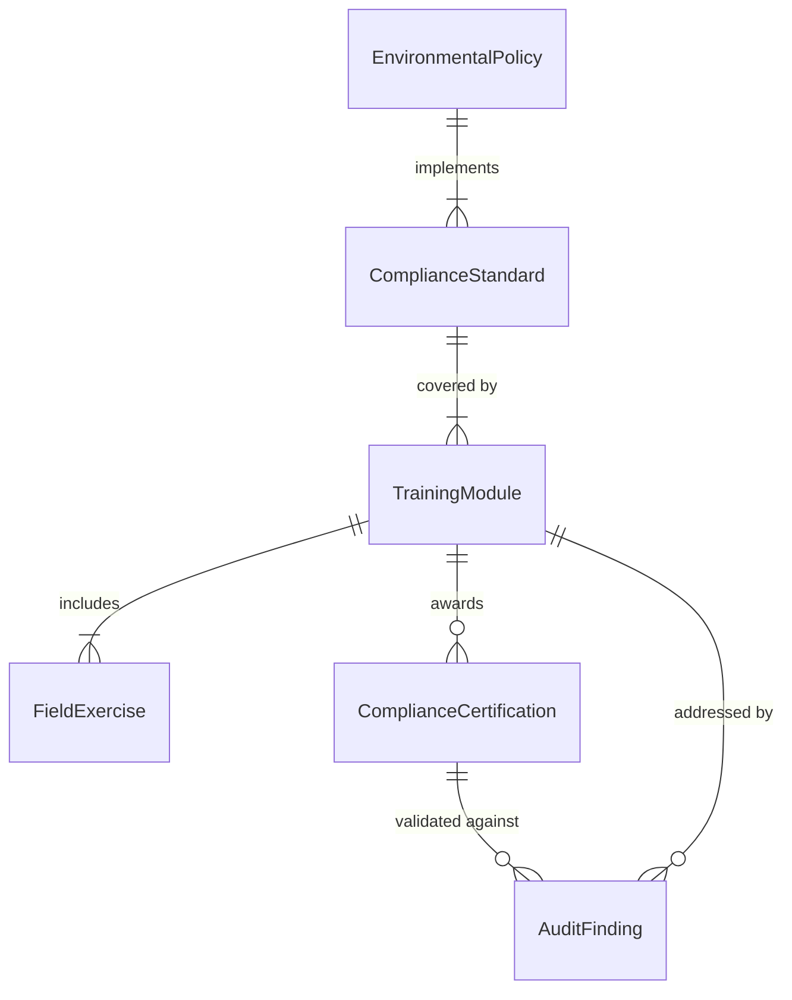
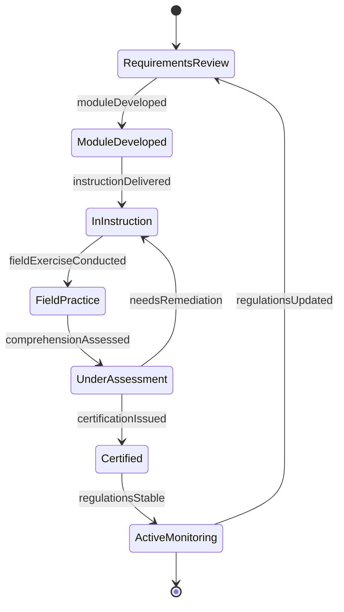
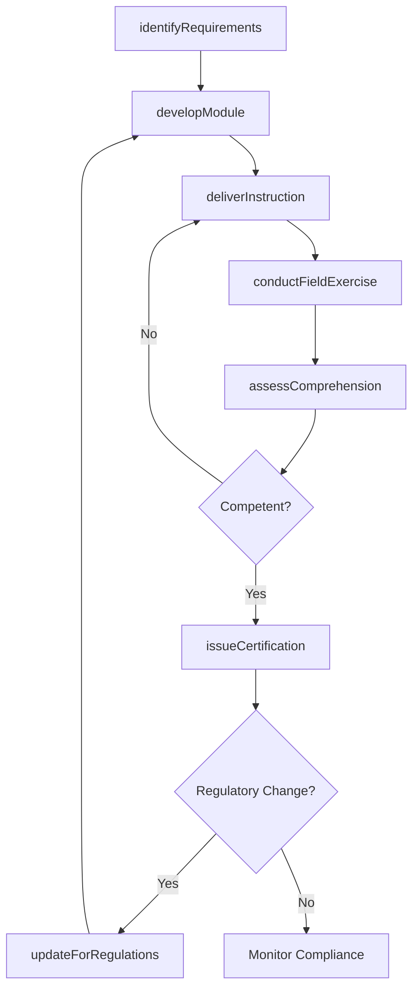
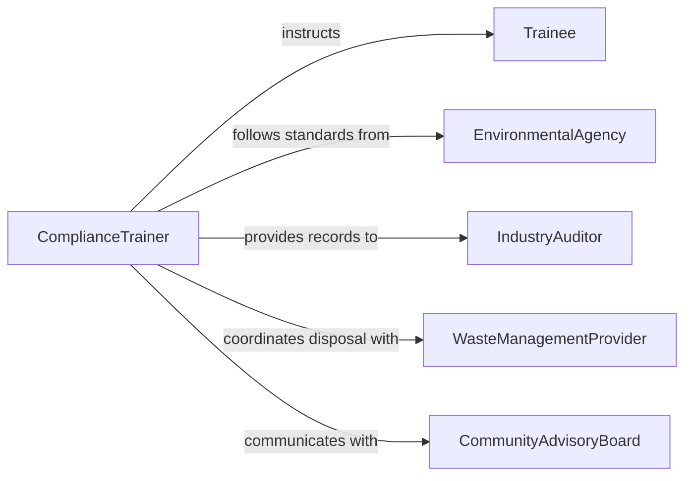

# Teach Safety Standards Environmental Compliance

> Business-as-Code definition for teaching safety standards or environmental compliance methods. Models the instructional process of ensuring personnel understand and adhere to occupational safety regulations and environmental protection requirements.

## Overview

Teaching safety standards or environmental compliance methods involves instructing employees, managers, and contractors in the regulatory frameworks governing workplace safety and environmental stewardship. This includes OSHA standards, EPA regulations, ISO 14001 environmental management systems, and industry-specific requirements for hazardous waste handling, emissions monitoring, and spill prevention. Instruction combines classroom learning with field exercises to ensure personnel can apply compliance methods in their daily operations.

## Actors

| Actor | Description |
|-------|-------------|
| Trainee | Employee or contractor receiving instruction in safety and environmental standards |
| EnvironmentalAgency | Regulatory body such as the EPA that sets compliance requirements |
| IndustryAuditor | Third-party assessor verifying adherence to safety and environmental standards |
| WasteManagementProvider | Vendor handling hazardous waste disposal in accordance with regulations |
| CommunityAdvisoryBoard | Local stakeholder group concerned with environmental impacts |

## Roles

| Role | Description |
|------|-------------|
| ComplianceTrainer | Develops and delivers safety and environmental compliance instruction |
| EnvironmentalManager | Oversees the organization's environmental management system |
| SafetyOfficer | Ensures workplace practices meet occupational safety standards |
| RegulatoryAnalyst | Monitors changes in regulations and updates training requirements |

## Entities

| Entity | Description |
|--------|-------------|
| ComplianceStandard | A specific regulation or standard that must be taught and followed |
| TrainingModule | A unit of instruction covering a particular compliance topic |
| ComplianceCertification | A credential confirming an individual's mastery of compliance methods |
| AuditFinding | A gap or non-conformance identified during a compliance review |
| EnvironmentalPolicy | An organizational policy implementing regulatory requirements |
| FieldExercise | A practical, hands-on exercise simulating compliance scenarios |

## Actions

| Action | Description |
|--------|-------------|
| identifyRequirements | Determine which safety and environmental standards apply to the organization |
| developModule | Create instructional content for a specific compliance topic |
| deliverInstruction | Teach the compliance module to trainees through lecture and exercises |
| conductFieldExercise | Facilitate hands-on practice of compliance procedures in a realistic setting |
| assessComprehension | Test trainee understanding of safety and environmental standards |
| issueCertification | Award a compliance credential upon demonstrated competency |
| updateForRegulations | Revise training materials to reflect new or amended regulations |

## Events

| Event | Description |
|-------|-------------|
| requirementsIdentified | Applicable safety and environmental standards have been determined |
| moduleDeveloped | A compliance training module has been created |
| instructionDelivered | A compliance training session has been completed |
| fieldExerciseConducted | A hands-on compliance exercise has been performed |
| comprehensionAssessed | A trainee's understanding of compliance methods has been tested |
| certificationIssued | A compliance certification has been awarded |
| regulationsUpdated | Training content has been revised for new regulatory requirements |

## Searches

| Search | Description |
|--------|-------------|
| findModules | List training modules by regulation, topic, or department |
| getTraineeCompliance | Retrieve compliance certification status for individuals |
| getAuditFindings | Look up non-conformances linked to training gaps |
| getRegulatoryChanges | Retrieve recent regulatory updates affecting training requirements |

## Entity Relationships



## State Diagram



## Workflow



## Actor Relationships



## Usage

### Calling Actions

```typescript
import { teachSafetyStandardsEnvironmentalCompliance } from '@headlessly/teach-safety-standards-environmental-compliance'

const compliance = teachSafetyStandardsEnvironmentalCompliance()

// Identify applicable regulations for a manufacturing facility
const requirements = await compliance.identifyRequirements({
  facility: 'chemical-plant-east',
  activities: ['hazardous-waste-storage', 'air-emissions', 'stormwater-discharge'],
  frameworks: ['EPA-RCRA', 'OSHA-HAZWOPER', 'ISO-14001']
})

// Develop a hazardous waste handling module
const module = await compliance.developModule({
  title: 'RCRA Hazardous Waste Generator Compliance',
  regulation: 'EPA-40-CFR-262',
  topics: ['waste-characterization', 'container-management', 'manifest-tracking', 'emergency-response'],
  fieldExercise: 'spill-containment-drill'
})

// Assess trainee comprehension
const result = await compliance.assessComprehension({
  traineeId: 'emp-5567',
  moduleId: module.id,
  format: 'written-and-practical',
  passingScore: 80
})
```

### Event-Driven Automation

```typescript
// Alert environmental manager when regulations change
compliance.regulationsUpdated(async ({ regulation, effectiveDate, changes }) => {
  await notify({
    to: 'environmental-manager',
    message: `Regulation ${regulation} updated effective ${effectiveDate}`,
    details: changes
  })
})

// Auto-schedule re-training when audit findings indicate gaps
compliance.comprehensionAssessed(async ({ traineeId, moduleId, passed }) => {
  if (!passed) {
    await compliance.deliverInstruction({
      moduleId,
      trainees: [traineeId],
      type: 'remedial',
      deadline: '30-days'
    })
  }
})
```
