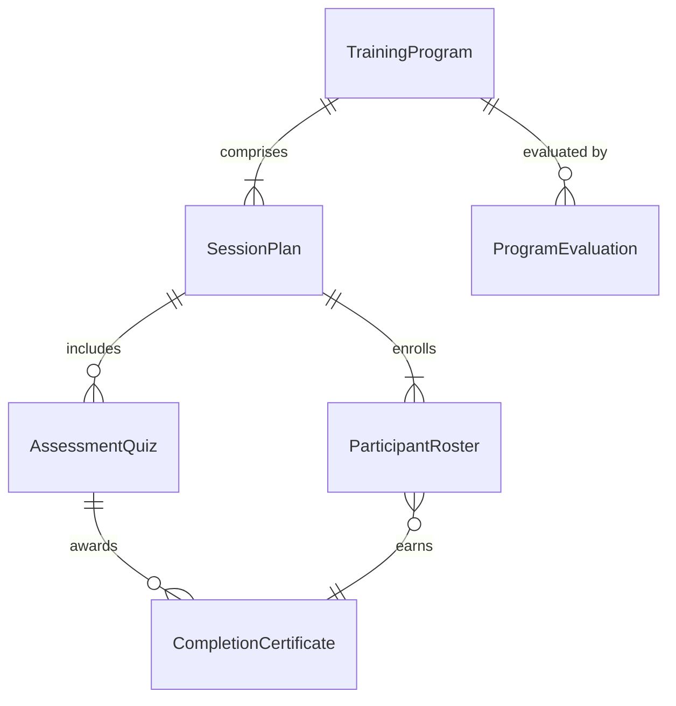
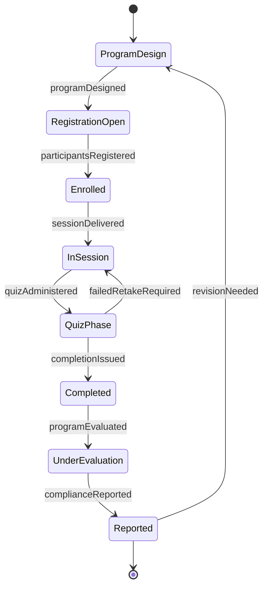
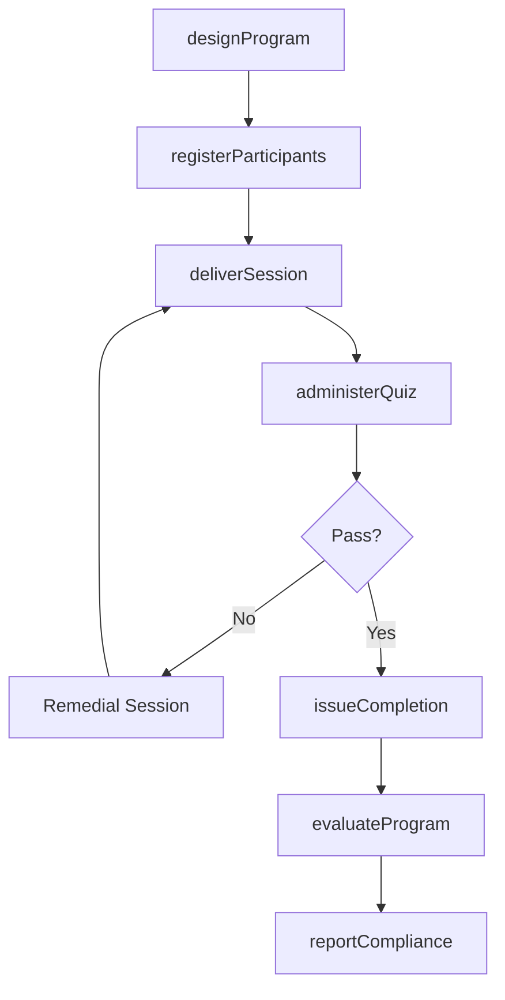
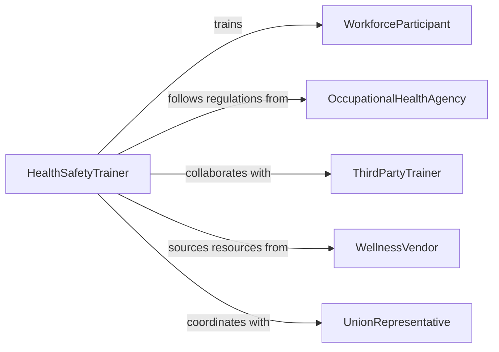

# Conduct Health Safety Training Programs

> Business-as-Code definition for conducting health or safety training programs. Models the design, delivery, and evaluation of organizational training programs that address occupational health risks, workplace wellness, and safety compliance.

## Overview

Conducting health or safety training programs involves planning, developing, and delivering instructional sessions that cover topics such as bloodborne pathogens, ergonomics, respiratory protection, substance abuse awareness, workplace violence prevention, and wellness promotion. These programs serve both regulatory compliance mandates and organizational wellness objectives. Trainers combine didactic instruction with practical demonstrations, emergency drills, and assessments to build knowledge and behavioral readiness among all levels of the workforce.

## Actors

| Actor | Description |
|-------|-------------|
| WorkforceParticipant | Employee or volunteer attending the health and safety training |
| OccupationalHealthAgency | Regulatory authority such as OSHA or NIOSH setting training requirements |
| ThirdPartyTrainer | External consultant delivering specialized health and safety content |
| WellnessVendor | Provider of health screening, wellness tools, or program resources |
| UnionRepresentative | Labor organization representative ensuring worker rights in training |

## Roles

| Role | Description |
|------|-------------|
| HealthSafetyTrainer | Plans and delivers health and safety training programs |
| ProgramCoordinator | Manages scheduling, logistics, and participant registration |
| OccupationalHealthNurse | Provides clinical expertise for health-related training topics |
| ComplianceOfficer | Ensures training programs meet regulatory and organizational requirements |

## Entities

| Entity | Description |
|--------|-------------|
| TrainingProgram | A comprehensive health or safety education initiative with defined objectives |
| SessionPlan | A detailed outline of topics, activities, and timing for a single session |
| ParticipantRoster | A list of individuals registered for or attending a training session |
| AssessmentQuiz | A knowledge check administered during or after training |
| CompletionCertificate | A document confirming an individual has finished required training |
| ProgramEvaluation | A post-training survey measuring participant satisfaction and knowledge gain |

## Actions

| Action | Description |
|--------|-------------|
| designProgram | Create a health or safety training program with learning objectives and materials |
| registerParticipants | Enroll employees in upcoming training sessions |
| deliverSession | Conduct a training session including presentations, demonstrations, and drills |
| administerQuiz | Test participant knowledge retention during or after the session |
| issueCompletion | Provide certificates of completion to participants who meet requirements |
| evaluateProgram | Collect and analyze participant feedback and learning outcomes |
| reportCompliance | Generate compliance reports for regulatory agencies and leadership |

## Events

| Event | Description |
|-------|-------------|
| programDesigned | A health or safety training program has been developed |
| participantsRegistered | Employees have been enrolled in a training session |
| sessionDelivered | A health or safety training session has been completed |
| quizAdministered | A knowledge assessment has been given to participants |
| completionIssued | Certificates of completion have been distributed |
| programEvaluated | Post-training feedback and outcomes have been analyzed |
| complianceReported | Training compliance data has been submitted to stakeholders |

## Searches

| Search | Description |
|--------|-------------|
| findPrograms | List training programs by topic, regulation, or department |
| getParticipantStatus | Retrieve enrollment and completion status for individuals |
| getQuizResults | Look up assessment scores by session or participant |
| getComplianceStatus | Check organizational compliance rates for required training programs |

## Entity Relationships



## State Diagram



## Workflow



## Actor Relationships



## Usage

### Calling Actions

```typescript
import { conductHealthSafetyTrainingPrograms } from '@headlessly/conduct-health-safety-training-programs'

const training = conductHealthSafetyTrainingPrograms()

// Design a bloodborne pathogens training program
const program = await training.designProgram({
  title: 'Annual Bloodborne Pathogens Training',
  regulation: 'OSHA-29-CFR-1910.1030',
  topics: ['exposure-control-plan', 'universal-precautions', 'post-exposure-procedures', 'ppe-selection'],
  format: 'hybrid-classroom-and-online',
  requiredFor: ['clinical-staff', 'maintenance', 'housekeeping']
})

// Register participants for an upcoming session
await training.registerParticipants({
  programId: program.id,
  sessionDate: '2026-03-10',
  participants: ['emp-2201', 'emp-2202', 'emp-2203', 'emp-2204'],
  location: 'Conference Room B'
})

// Report compliance to leadership
const report = await training.reportCompliance({
  programId: program.id,
  period: 'Q1-2026',
  metrics: ['completion-rate', 'average-quiz-score', 'overdue-count']
})
```

### Event-Driven Automation

```typescript
// Auto-issue certificates when quiz is passed
training.quizAdministered(async ({ participantId, programId, score, passingScore }) => {
  if (score >= passingScore) {
    await training.issueCompletion({
      participantId,
      programId,
      certificateType: 'annual-compliance'
    })
  }
})

// Escalate when compliance rate drops below threshold
training.complianceReported(async ({ programId, completionRate }) => {
  if (completionRate < 0.90) {
    await notify({
      to: 'compliance-officer',
      message: `Training program ${programId} has only ${Math.round(completionRate * 100)}% completion rate`,
      priority: 'high'
    })
  }
})
```
