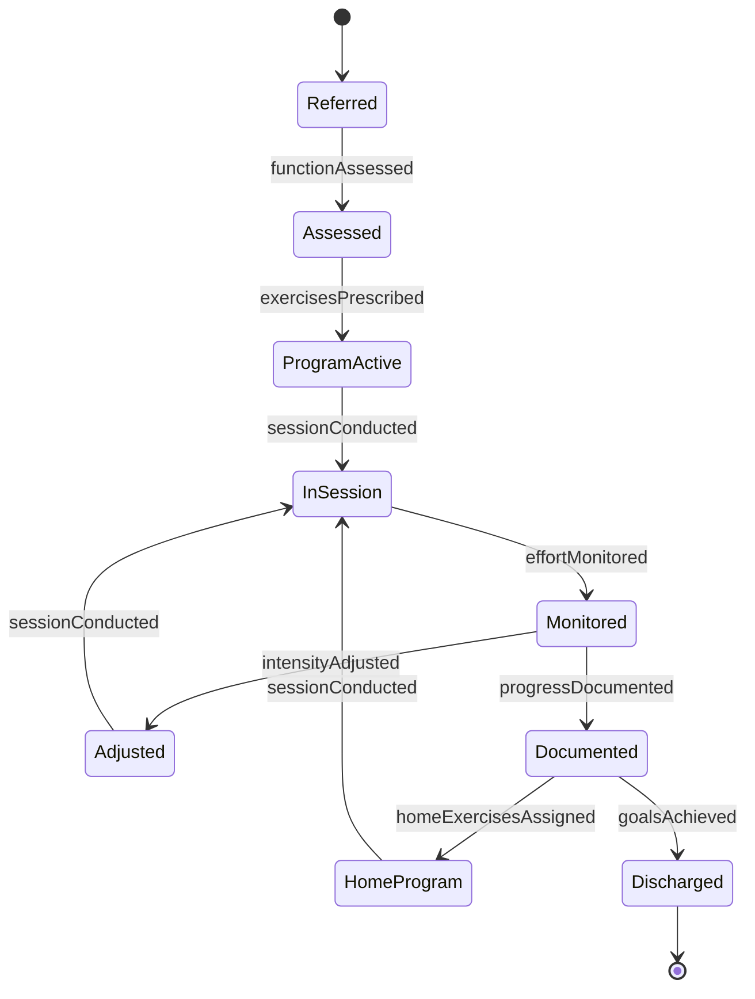

# Engage Patients Exercises Activities

> Business-as-Code definition for engaging patients in therapeutic exercises and activities. Models the workflow of prescribing, guiding, and monitoring patient participation in rehabilitative and wellness exercises.

## Overview

Engaging patients in exercises and activities involves assessing functional capacity, prescribing therapeutic exercise programs, guiding patients through movements, monitoring effort and form, and adjusting intensity based on progress. This definition exposes actions for exercise prescription and session management, events for tracking participation and outcomes, and searches for retrieving patient activity records.

## Actors

| Actor | Description |
|-------|-------------|
| Patient | Participates in prescribed exercises and therapeutic activities |
| ReferringPhysician | Prescribes therapy and sets functional recovery goals |
| FamilyMember | Supports patient with home exercise compliance |
| InsuranceProvider | Authorizes therapy sessions and reviews utilization |
| EquipmentVendor | Supplies therapeutic exercise equipment and aids |
| CareCoordinator | Manages patient transitions between therapy settings |

## Roles

| Role | Description |
|------|-------------|
| Therapist | Designs exercise programs and guides patient participation |
| TherapyAssistant | Supports the therapist during exercise sessions |
| ExercisePhysiologist | Develops evidence-based exercise protocols |
| ProgressReviewer | Evaluates patient outcomes and adjusts treatment plans |

## Entities

| Entity | Description |
|--------|-------------|
| ExerciseProgram | A prescribed set of therapeutic exercises with goals |
| ExerciseSession | A single guided exercise encounter with a patient |
| ActivityLog | A record of exercises performed, repetitions, and intensity |
| FunctionalAssessment | An evaluation of patient mobility and capacity |
| ProgressNote | Clinical documentation of patient response to exercises |
| HomeExercisePlan | A set of exercises for the patient to perform independently |

## Actions

| Action | Description |
|--------|-------------|
| assessFunction | Evaluate a patient's current functional capacity and limitations |
| prescribeExercises | Design a therapeutic exercise program for a patient |
| conductSession | Guide a patient through a scheduled exercise session |
| monitorEffort | Track patient exertion, form, and pain levels during activity |
| adjustIntensity | Modify exercise parameters based on patient response |
| assignHomeExercises | Provide a take-home exercise plan with instructions |
| documentProgress | Record clinical observations and patient outcomes |

## Events

| Event | Description |
|-------|-------------|
| functionAssessed | A patient's functional capacity has been evaluated |
| exercisesPrescribed | A therapeutic exercise program has been created |
| sessionConducted | A guided exercise session has been completed |
| effortMonitored | Patient exertion and form have been tracked |
| intensityAdjusted | Exercise parameters have been modified |
| homeExercisesAssigned | A home exercise plan has been provided |
| progressDocumented | Patient progress notes have been recorded |

## Searches

| Search | Description |
|--------|-------------|
| findExercisePrograms | List exercise programs by patient, condition, or therapist |
| getSessionHistory | Retrieve exercise session records for a patient |
| getActivityLogs | Query activity details by date, exercise type, or intensity |
| getProgressNotes | Find progress documentation by patient or date range |

## Entity Relationships


## State Diagram



## Workflow


## Actor Relationships


## Usage

### Calling Actions

```typescript
import { engagePatientsExercisesActivities } from '@headlessly/engage-patients-exercises-activities'

const therapy = engagePatientsExercisesActivities()

// Assess patient functional capacity
const assessment = await therapy.assessFunction({
  patientId: 'PT-2024-0562',
  condition: 'Post-Total Knee Replacement',
  measures: ['range-of-motion', 'weight-bearing-tolerance', 'gait-analysis']
})

// Prescribe an exercise program
const program = await therapy.prescribeExercises({
  patientId: 'PT-2024-0562',
  exercises: [
    { name: 'Quad Sets', sets: 3, reps: 10, frequency: 'daily' },
    { name: 'Straight Leg Raises', sets: 3, reps: 10, frequency: 'daily' },
    { name: 'Heel Slides', sets: 2, reps: 15, frequency: 'daily' }
  ],
  goals: ['120-degrees-flexion', 'independent-ambulation'],
  duration: '6-weeks'
})

// Document progress after a session
await therapy.documentProgress({
  patientId: 'PT-2024-0562',
  sessionId: 'SES-0034',
  notes: 'Patient achieved 95 degrees flexion. Tolerated all exercises without pain increase.',
  metrics: { flexion: 95, painLevel: 3 }
})
```

### Event-Driven Automation

```typescript
// Notify physician when functional goals are met
therapy.progressDocumented(async ({ patientId, metrics, goals }) => {
  const goalsAchieved = goals.every(g => g.status === 'met')
  if (goalsAchieved) {
    await notify({
      to: 'referring-physician',
      message: `Patient ${patientId} has achieved all functional goals - discharge evaluation recommended`
    })
  }
})

// Alert therapist when patient misses home exercises
therapy.homeExercisesAssigned(async ({ patientId, planId, complianceRate }) => {
  if (complianceRate < 0.5) {
    await notify({
      to: 'therapist',
      message: `Patient ${patientId} home exercise compliance is below 50% - follow-up needed`
    })
  }
})
```
