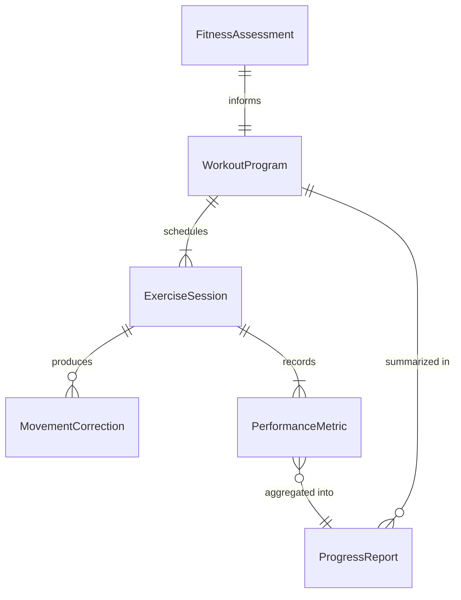
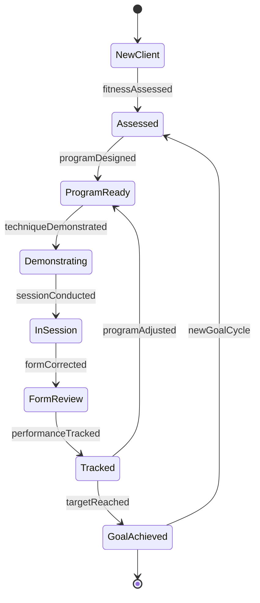
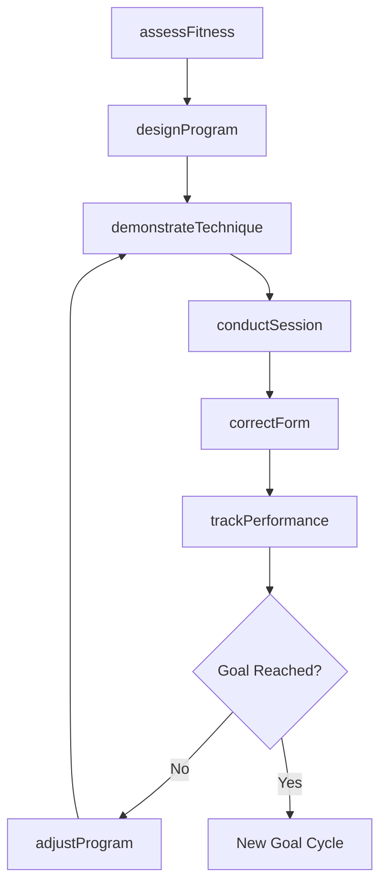
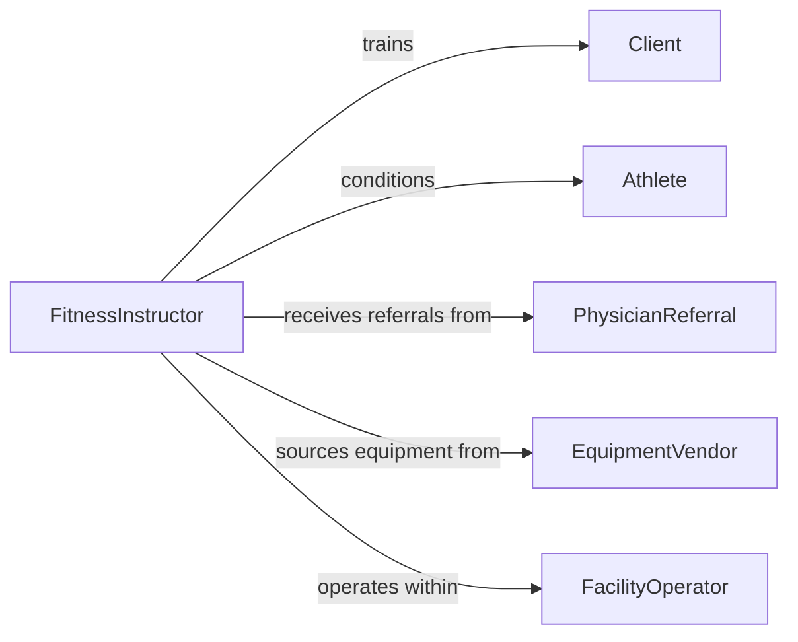

# Teach Exercise Fitness Techniques

> Business-as-Code definition for teaching exercise or fitness techniques. Models the instructional process of guiding individuals through proper movement patterns, workout programming, and physical conditioning to improve health and performance.

## Overview

Teaching exercise or fitness techniques involves instructing individuals or groups in proper form, breathing, progression, and safety for physical activities including strength training, cardiovascular conditioning, flexibility, and sport-specific drills. Instructors assess client fitness levels, design personalized workout programs, demonstrate movements, provide real-time corrections, and track performance improvements. This process supports outcomes ranging from general wellness and weight management to rehabilitation and competitive athletic preparation.

## Actors

| Actor | Description |
|-------|-------------|
| Client | Individual seeking fitness instruction for personal health or performance goals |
| Athlete | Competitive sports participant requiring sport-specific conditioning |
| PhysicianReferral | Healthcare provider recommending exercise as part of a treatment plan |
| EquipmentVendor | Supplier of fitness equipment and training tools |
| FacilityOperator | Gym, studio, or wellness center where training takes place |

## Roles

| Role | Description |
|------|-------------|
| FitnessInstructor | Designs programs and teaches exercise techniques to clients |
| PersonalTrainer | Provides one-on-one coaching and customized workout plans |
| GroupFitnessLeader | Leads structured group exercise classes |
| ExercisePhysiologist | Applies scientific principles to fitness programming and assessment |

## Entities

| Entity | Description |
|--------|-------------|
| FitnessAssessment | An evaluation of the client's current physical capabilities and health status |
| WorkoutProgram | A structured plan of exercises, sets, reps, and progression schedules |
| ExerciseSession | A scheduled training encounter between instructor and client |
| MovementCorrection | A form adjustment or technique modification provided during training |
| PerformanceMetric | A tracked measure such as max lift, mile time, or body composition |
| ProgressReport | A summary of client improvements over a defined training period |

## Actions

| Action | Description |
|--------|-------------|
| assessFitness | Evaluate the client's baseline strength, endurance, flexibility, and health |
| designProgram | Create a customized workout plan aligned with the client's goals |
| demonstrateTechnique | Model proper exercise form and breathing patterns |
| conductSession | Lead the client through a scheduled workout session |
| correctForm | Provide real-time adjustments to the client's movement execution |
| trackPerformance | Record workout data and measure progress against targets |
| adjustProgram | Modify the training plan based on progress, plateaus, or injuries |

## Events

| Event | Description |
|-------|-------------|
| fitnessAssessed | A client's baseline physical capabilities have been evaluated |
| programDesigned | A customized workout program has been created |
| techniqueDemonstrated | An exercise movement has been modeled for the client |
| sessionConducted | A training session has been completed |
| formCorrected | A technique adjustment has been provided during training |
| performanceTracked | Workout metrics have been recorded |
| programAdjusted | The training plan has been modified based on client progress |

## Searches

| Search | Description |
|--------|-------------|
| findClients | List clients by fitness level, goal type, or training status |
| getSessions | Retrieve scheduled or completed training sessions |
| getPerformanceHistory | Look up tracked metrics and progress trends for a client |
| getExerciseLibrary | Browse available exercises by muscle group, equipment, or difficulty |

## Entity Relationships



## State Diagram



## Workflow



## Actor Relationships



## Usage

### Calling Actions

```typescript
import { teachExerciseFitnessTechniques } from '@headlessly/teach-exercise-fitness-techniques'

const fitness = teachExerciseFitnessTechniques()

// Assess a new client's fitness level
const assessment = await fitness.assessFitness({
  clientId: 'client-3301',
  tests: ['body-composition', 'one-rep-max-squat', 'mile-run', 'sit-and-reach'],
  healthClearance: 'physician-approved'
})

// Design a personalized strength training program
const program = await fitness.designProgram({
  clientId: 'client-3301',
  assessmentId: assessment.id,
  goal: 'muscle-hypertrophy',
  frequency: '4-days-per-week',
  duration: { weeks: 12 },
  exercises: ['barbell-squat', 'bench-press', 'deadlift', 'overhead-press']
})

// Track performance after a training block
const metrics = await fitness.trackPerformance({
  clientId: 'client-3301',
  programId: program.id,
  week: 4,
  data: { squatMax: 275, benchMax: 205, mileTime: '7:45' }
})
```

### Event-Driven Automation

```typescript
// Adjust program when performance plateaus
fitness.performanceTracked(async ({ clientId, programId, trend }) => {
  if (trend === 'plateau' && trend.durationWeeks >= 3) {
    await fitness.adjustProgram({
      clientId,
      programId,
      modification: 'deload-week-then-progressive-overload'
    })
  }
})

// Notify client when fitness assessment shows improvement
fitness.fitnessAssessed(async ({ clientId, comparison }) => {
  if (comparison.improvement > 10) {
    await notify({
      to: clientId,
      message: `Great progress! Your fitness score improved by ${comparison.improvement}%`
    })
  }
})
```
