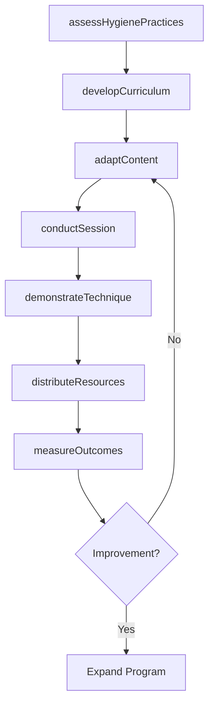
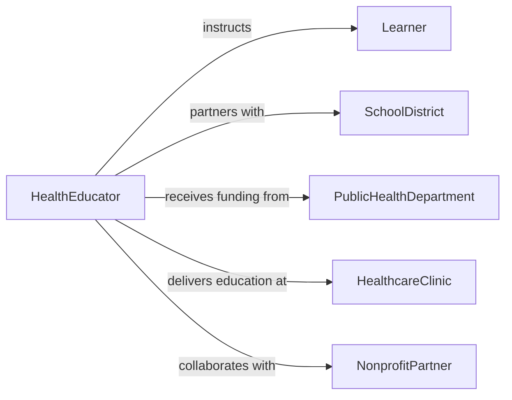

# Teach Health Hygiene Practices

> Business-as-Code definition for teaching health or hygiene practices. Models the educational process of instructing individuals and communities in personal hygiene, infection prevention, sanitation, and health maintenance behaviors.

## Overview

Teaching health or hygiene practices involves educating individuals, families, and community groups in personal hygiene routines, handwashing techniques, oral health care, food safety, sanitation, and disease prevention. This instruction is delivered in healthcare settings, schools, workplaces, and community outreach programs by public health educators, nurses, and community health workers. Effective hygiene education reduces the spread of communicable diseases, improves individual health outcomes, and promotes community-wide wellness.

## Actors

| Actor | Description |
|-------|-------------|
| Learner | Individual or group receiving hygiene and health education |
| SchoolDistrict | Educational institution incorporating health education into curricula |
| PublicHealthDepartment | Government agency funding and directing community health initiatives |
| HealthcareClinic | Medical facility where patient hygiene education is delivered |
| NonprofitPartner | Community-based organization supporting health outreach programs |

## Roles

| Role | Description |
|------|-------------|
| HealthEducator | Develops and delivers hygiene and health instruction programs |
| CommunityHealthWorker | Conducts door-to-door and group health education in underserved areas |
| SchoolNurse | Provides hygiene instruction and health screening in school settings |
| ProgramEvaluator | Measures the impact of health education programs on community outcomes |

## Entities

| Entity | Description |
|--------|-------------|
| HealthCurriculum | A structured set of lessons covering hygiene and health topics |
| InstructionSession | A scheduled educational encounter with learners |
| EducationalMaterial | Printed guides, posters, videos, and handouts used during instruction |
| HygieneAssessment | An evaluation of current hygiene practices in a target population |
| OutcomeIndicator | A measurable health metric tracked to evaluate program effectiveness |
| CommunityOutreachPlan | A strategy for reaching target populations with health education |

## Actions

| Action | Description |
|--------|-------------|
| assessHygienePractices | Evaluate current hygiene behaviors in a target population |
| developCurriculum | Create a health and hygiene education program for a specific audience |
| conductSession | Deliver an instructional session on hygiene topics |
| demonstrateTechnique | Model proper handwashing, oral care, or sanitation procedures |
| distributeResources | Provide hygiene kits, educational materials, or supplies to learners |
| measureOutcomes | Track changes in hygiene behaviors and health indicators |
| adaptContent | Modify educational materials for cultural, linguistic, or age-appropriate delivery |

## Events

| Event | Description |
|-------|-------------|
| hygienePracticesAssessed | A baseline evaluation of hygiene behaviors has been completed |
| curriculumDeveloped | A health and hygiene education program has been created |
| sessionConducted | A hygiene education session has been delivered |
| techniqueDemonstrated | A proper hygiene technique has been modeled for learners |
| resourcesDistributed | Hygiene supplies and educational materials have been provided |
| outcomesMeasured | Changes in hygiene behaviors and health metrics have been tracked |
| contentAdapted | Educational materials have been modified for a specific audience |

## Searches

| Search | Description |
|--------|-------------|
| findSessions | List education sessions by location, audience, or topic |
| getOutcomeData | Retrieve health outcome metrics for a program or population |
| getLearnerParticipation | Look up attendance and engagement records for learners |
| getCurriculumLibrary | Browse available hygiene education curricula by topic or audience |

## Workflow



## Actor Relationships



## Usage

### Calling Actions

```typescript
import { teachHealthHygienePractices } from '@headlessly/teach-health-hygiene-practices'

const hygiene = teachHealthHygienePractices()

// Assess hygiene practices in a target community
const assessment = await hygiene.assessHygienePractices({
  population: 'elementary-school-district-12',
  practices: ['handwashing-frequency', 'oral-care-routine', 'food-handling'],
  sampleSize: 500
})

// Develop a culturally adapted curriculum
const curriculum = await hygiene.developCurriculum({
  title: 'Healthy Hands, Healthy Lives',
  audience: 'grades-k-5',
  topics: ['handwashing', 'cough-etiquette', 'dental-hygiene', 'safe-food-preparation'],
  languages: ['en', 'es'],
  duration: { sessions: 6, minutesPerSession: 45 }
})

// Measure outcomes after the program
const outcomes = await hygiene.measureOutcomes({
  curriculumId: curriculum.id,
  indicators: ['handwashing-compliance-rate', 'absenteeism-reduction', 'cavity-rate-change'],
  comparisonPeriod: 'pre-post-6-months'
})
```

### Event-Driven Automation

```typescript
// Distribute hygiene kits after a session
hygiene.sessionConducted(async ({ sessionId, attendees, topic }) => {
  if (topic === 'handwashing') {
    await hygiene.distributeResources({
      sessionId,
      items: ['hand-sanitizer', 'soap-bar', 'hygiene-poster'],
      recipients: attendees
    })
  }
})

// Alert program evaluator when outcomes show no improvement
hygiene.outcomesMeasured(async ({ curriculumId, indicators }) => {
  const declining = indicators.filter(i => i.trend === 'no-change' || i.trend === 'declining')
  if (declining.length > 0) {
    await notify({
      to: 'program-evaluator',
      message: `Curriculum ${curriculumId} shows no improvement in: ${declining.map(d => d.name).join(', ')}`
    })
  }
})
```
