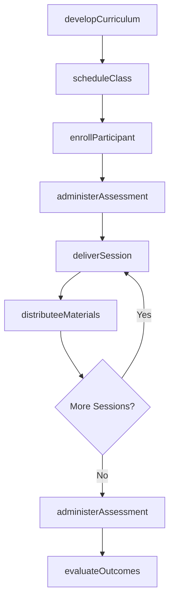
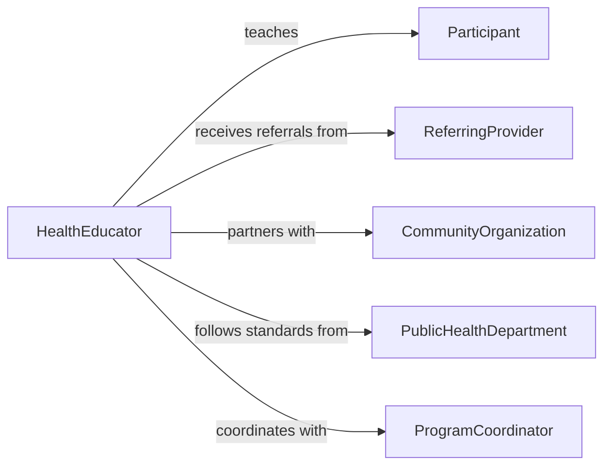

# Teach Health Management Classes

> Business-as-Code definition for teaching health management classes. Models the design, scheduling, delivery, and evaluation of group health education programs covering disease prevention, chronic condition management, and wellness topics.

## Overview

Teaching health management classes involves developing curricula for group health education, scheduling and delivering classes to diverse populations, distributing educational materials, and measuring participant outcomes. This definition exposes actions for class creation and delivery, events for tracking enrollment and completion, and searches for retrieving program and participant data.

## Actors

| Actor | Description |
|-------|-------------|
| Participant | Enrolls in and attends health management classes |
| ReferringProvider | Refers patients to health education programs |
| CommunityOrganization | Partners to host classes and recruit participants |
| PublicHealthDepartment | Sets health education standards and funding requirements |
| InsuranceProvider | Covers health education as a preventive benefit |
| MaterialPublisher | Supplies textbooks, handouts, and multimedia content |

## Roles

| Role | Description |
|------|-------------|
| HealthEducator | Designs and delivers health management curricula |
| ProgramCoordinator | Manages class scheduling, enrollment, and logistics |
| SubjectMatterExpert | Provides clinical expertise on specific health topics |
| OutcomeEvaluator | Measures participant knowledge gains and behavior changes |

## Entities

| Entity | Description |
|--------|-------------|
| ClassCurriculum | A structured set of lessons for a health management topic |
| ClassSession | A scheduled meeting of a health management class |
| Enrollment | A participant's registration for a class series |
| AssessmentQuiz | A knowledge check administered before or after instruction |
| ParticipantOutcome | Measured health or knowledge improvements for a participant |
| EducationMaterial | Handouts, slides, and resources distributed to participants |

## Actions

| Action | Description |
|--------|-------------|
| developCurriculum | Create a health management curriculum for a specific topic |
| scheduleClass | Set dates, times, and locations for class sessions |
| enrollParticipant | Register a participant for a class series |
| deliverSession | Conduct a class session with instruction and activities |
| administerAssessment | Give a pre- or post-class knowledge assessment |
| distributeeMaterials | Provide educational resources to participants |
| evaluateOutcomes | Measure participant knowledge gains and health improvements |

## Events

| Event | Description |
|-------|-------------|
| curriculumDeveloped | A new health management curriculum has been finalized |
| classScheduled | A class session has been added to the calendar |
| participantEnrolled | A participant has registered for a class series |
| sessionDelivered | A class session has been conducted |
| assessmentCompleted | A participant has completed a knowledge assessment |
| materialsDistributed | Educational resources have been provided to participants |
| outcomesEvaluated | Program outcomes have been measured and documented |

## Searches

| Search | Description |
|--------|-------------|
| findClasses | List classes by topic, date, location, or availability |
| getEnrollments | Retrieve enrollments by participant, class, or status |
| getAssessmentResults | Query pre- and post-test scores by class or participant |
| getOutcomes | Find outcome data by program, cohort, or metric |

## Workflow



## Actor Relationships



## Usage

### Calling Actions

```typescript
import { teachHealthManagementClasses } from '@headlessly/teach-health-management-classes'

const healthEd = teachHealthManagementClasses()

// Develop a diabetes self-management curriculum
const curriculum = await healthEd.developCurriculum({
  topic: 'Diabetes Self-Management',
  sessions: 6,
  objectives: ['blood-glucose-monitoring', 'nutrition-planning', 'medication-adherence', 'foot-care'],
  targetAudience: 'Adults with Type 2 Diabetes'
})

// Schedule a class series
const classSession = await healthEd.scheduleClass({
  curriculumId: curriculum.id,
  startDate: '2026-03-01',
  frequency: 'weekly',
  time: '18:00',
  location: 'Community Health Center - Room 204',
  maxEnrollment: 20
})

// Evaluate program outcomes
const outcomes = await healthEd.evaluateOutcomes({
  classId: classSession.id,
  metrics: ['knowledge-score-improvement', 'hba1c-reduction', 'self-efficacy-rating'],
  period: 'post-6-months'
})
```

### Event-Driven Automation

```typescript
// Notify referring provider when their patient completes the class series
healthEd.outcomesEvaluated(async ({ participantId, classId, metrics }) => {
  const enrollment = await healthEd.getEnrollments({ participantId, classId })
  if (enrollment.referringProviderId) {
    await notify({
      to: enrollment.referringProviderId,
      message: `Patient ${participantId} completed health management class with ${metrics.knowledgeImprovement}% knowledge improvement`
    })
  }
})

// Waitlist management when class is full
healthEd.participantEnrolled(async ({ classId, currentEnrollment, maxEnrollment }) => {
  if (currentEnrollment >= maxEnrollment) {
    await healthEd.scheduleClass({
      curriculumId: classId,
      note: 'Additional section opened due to demand'
    })
  }
})
```
