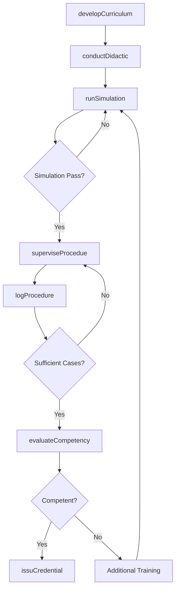
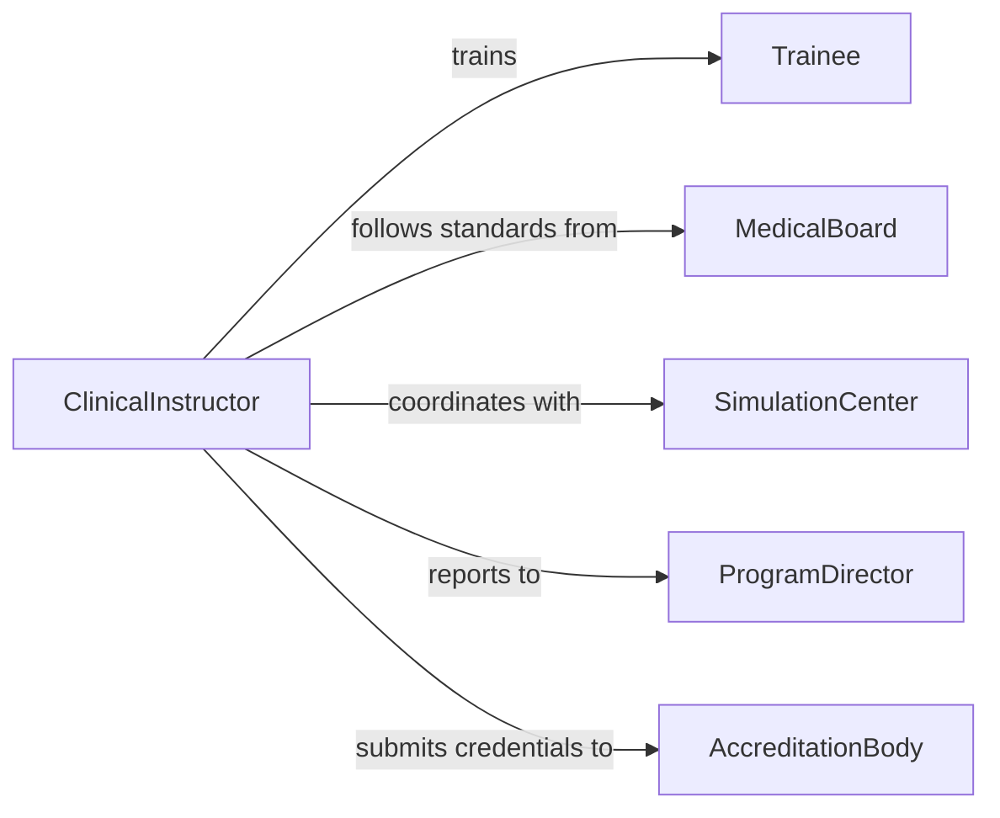

# Teach Medical Procedures Healthcare Personnel

> Business-as-Code definition for teaching medical procedures to healthcare personnel. Models the clinical education lifecycle from curriculum development through supervised practice and credentialing.

## Overview

Teaching medical procedures to healthcare personnel involves developing clinical training curricula, conducting didactic and hands-on instruction, supervising procedural practice, and evaluating competency for credentialing purposes. This definition exposes actions for training delivery and skills verification, events for tracking certification progress, and searches for retrieving credentialing records.

## Actors

| Actor | Description |
|-------|-------------|
| Trainee | Healthcare professional learning new procedures |
| MedicalBoard | Sets procedural competency standards and requirements |
| HospitalAdministration | Approves training programs and allocates resources |
| SimulationCenter | Provides simulation labs and anatomical models |
| DeviceManufacturer | Supplies medical devices and procedural equipment |
| AccreditationBody | Certifies training programs and validates credentials |

## Roles

| Role | Description |
|------|-------------|
| ClinicalInstructor | Delivers procedural training and supervises practice |
| ProgramDirector | Oversees the medical education program and curricula |
| SkillsAssessor | Evaluates trainee competency using standardized criteria |
| SimulationSpecialist | Designs and facilitates simulation-based training scenarios |

## Entities

| Entity | Description |
|--------|-------------|
| Curriculum | A structured program of procedural training modules |
| ProcedureModule | A unit of instruction for a specific medical procedure |
| SimulationScenario | A practice scenario using mannequins or virtual simulators |
| CompetencyEvaluation | A formal assessment of procedural proficiency |
| CredentialRecord | Documentation of achieved procedural certifications |
| TrainingLog | A record of supervised procedural attempts and outcomes |

## Actions

| Action | Description |
|--------|-------------|
| developCurriculum | Create a structured procedural training program |
| conductDidactic | Deliver classroom-based instruction on procedural theory |
| runSimulation | Facilitate a simulation-based practice session |
| superviseProcedue | Observe and guide a trainee performing a procedure on a patient |
| evaluateCompetency | Assess a trainee against standardized procedural criteria |
| issuCredential | Grant formal certification for a demonstrated procedure |
| logProcedure | Record a supervised procedural attempt and its outcome |

## Events

| Event | Description |
|-------|-------------|
| curriculumDeveloped | A new procedural training curriculum has been created |
| didacticCompleted | A classroom instruction session has been delivered |
| simulationCompleted | A simulation practice session has been finished |
| procedureSupervised | A supervised procedural attempt has been completed |
| competencyPassed | A trainee has met competency standards for a procedure |
| competencyNotMet | A trainee did not meet competency standards |
| credentialIssued | A procedural certification has been granted |

## Searches

| Search | Description |
|--------|-------------|
| findTrainees | List trainees by program, procedure, or competency status |
| getTrainingLogs | Retrieve procedural attempt logs for a trainee |
| getCompetencyResults | Query evaluation results by procedure or trainee |
| getCredentials | Find credentials by trainee, procedure, or expiration date |

## Workflow



## Actor Relationships



## Usage

### Calling Actions

```typescript
import { teachMedicalProceduresHealthcarePersonnel } from '@headlessly/teach-medical-procedures-healthcare-personnel'

const medEd = teachMedicalProceduresHealthcarePersonnel()

// Create a curriculum for central line insertion
const curriculum = await medEd.developCurriculum({
  procedure: 'Central Venous Catheter Insertion',
  targetAudience: 'PGY-1 Residents',
  modules: ['anatomy-review', 'sterile-technique', 'ultrasound-guidance', 'complication-management'],
  requiredCases: 5
})

// Run a simulation session
await medEd.runSimulation({
  curriculumId: curriculum.id,
  traineeId: 'RES-2024-0189',
  scenario: 'ultrasound-guided-subclavian',
  simulatorType: 'high-fidelity-mannequin'
})

// Evaluate competency after sufficient supervised cases
const evaluation = await medEd.evaluateCompetency({
  traineeId: 'RES-2024-0189',
  procedure: 'Central Venous Catheter Insertion',
  assessorId: 'ATT-0034',
  criteria: ['sterile-technique', 'anatomical-knowledge', 'complication-recognition', 'patient-communication']
})
```

### Event-Driven Automation

```typescript
// Issue credential when competency is achieved
medEd.competencyPassed(async ({ traineeId, procedure }) => {
  await medEd.issuCredential({
    traineeId,
    procedure,
    validFor: '24-months'
  })
})

// Require additional simulation when competency is not met
medEd.competencyNotMet(async ({ traineeId, procedure, deficiencies }) => {
  await notify({
    to: 'program-director',
    message: `${traineeId} requires additional training in ${procedure}: ${deficiencies.join(', ')}`
  })
})
```
