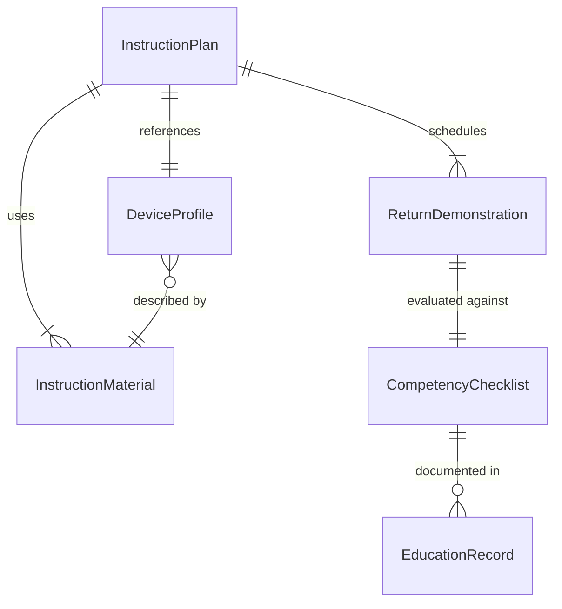
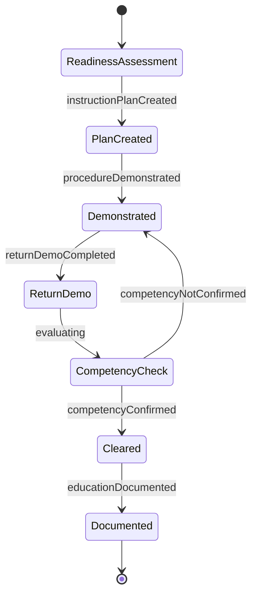
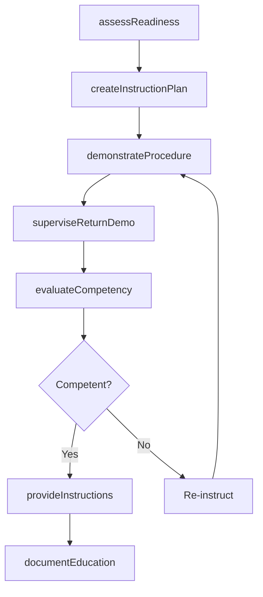
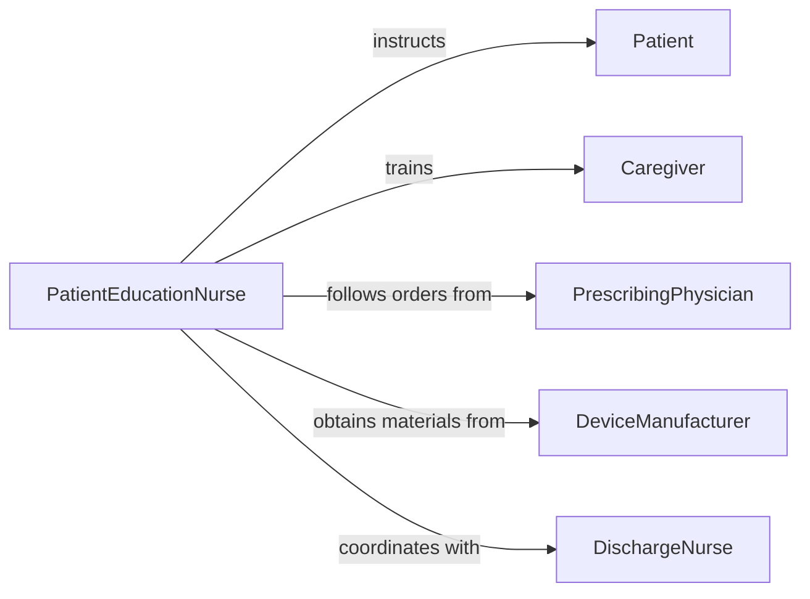

# Teach Medical Procedures Medical Equipment

> Business-as-Code definition for teaching medical procedures and equipment use to patients. Models the patient education process for self-administered treatments such as injections, blood glucose monitoring, wound care, and home medical device operation.

## Overview

Teaching medical procedures and equipment use to patients involves assessing patient readiness, providing step-by-step instruction on self-care techniques, demonstrating proper device operation, supervising return demonstrations, and ensuring safe independent use before discharge. This definition exposes actions for patient instruction and competency evaluation, events for tracking education milestones, and searches for retrieving instruction records and device information.

## Actors

| Actor | Description |
|-------|-------------|
| Patient | Learns to perform medical procedures or operate equipment at home |
| Caregiver | Learns alongside the patient to provide backup support |
| PrescribingPhysician | Orders the procedure or equipment and sets care parameters |
| DeviceManufacturer | Provides device manuals, training materials, and technical support |
| Pharmacist | Educates on medication-related procedures and supplies |
| InsuranceProvider | Approves coverage for equipment and patient education sessions |

## Roles

| Role | Description |
|------|-------------|
| PatientEducationNurse | Delivers hands-on instruction to patients on procedures and devices |
| ClinicalSpecialist | Provides expert-level training on complex medical devices |
| DischargeNurse | Verifies patient competency before sending them home |
| DocumentationSpecialist | Maintains patient education records and consent forms |

## Entities

| Entity | Description |
|--------|-------------|
| InstructionPlan | A step-by-step education plan for a procedure or device |
| ReturnDemonstration | A supervised patient attempt at performing a procedure |
| DeviceProfile | Specifications and operating instructions for medical equipment |
| CompetencyChecklist | A list of skills the patient must demonstrate independently |
| InstructionMaterial | Patient-facing guides, diagrams, and videos |
| EducationRecord | Documentation of all instruction sessions and outcomes |

## Actions

| Action | Description |
|--------|-------------|
| assessReadiness | Evaluate patient cognitive and physical ability to learn |
| createInstructionPlan | Design a personalized education plan for a procedure or device |
| demonstrateProcedure | Show the patient how to perform a procedure step by step |
| superviseReturnDemo | Observe the patient performing the procedure independently |
| evaluateCompetency | Formally assess whether the patient can safely self-manage |
| provideInstructions | Distribute written and visual reference materials |
| documentEducation | Record all instruction delivered and patient understanding |

## Events

| Event | Description |
|-------|-------------|
| readinessAssessed | Patient learning readiness has been evaluated |
| instructionPlanCreated | A patient-specific education plan has been developed |
| procedureDemonstrated | A procedure has been demonstrated to the patient |
| returnDemoCompleted | A patient has performed a return demonstration |
| competencyConfirmed | A patient has been cleared for independent self-management |
| competencyNotConfirmed | A patient requires additional instruction |
| educationDocumented | Patient education has been recorded in the medical record |

## Searches

| Search | Description |
|--------|-------------|
| findInstructionPlans | List instruction plans by patient, procedure, or device |
| getReturnDemos | Retrieve return demonstration records for a patient |
| getDeviceProfiles | Query device specifications by type, manufacturer, or model |
| getEducationRecords | Find education documentation by patient, date, or instructor |

## Entity Relationships



## State Diagram



## Workflow



## Actor Relationships



## Usage

### Calling Actions

```typescript
import { teachMedicalProceduresMedicalEquipment } from '@headlessly/teach-medical-procedures-medical-equipment'

const patientEd = teachMedicalProceduresMedicalEquipment()

// Assess patient readiness for insulin self-injection
const readiness = await patientEd.assessReadiness({
  patientId: 'PT-2024-0891',
  procedure: 'Subcutaneous Insulin Injection',
  factors: ['visual-acuity', 'manual-dexterity', 'cognitive-status', 'motivation']
})

// Demonstrate the procedure
await patientEd.demonstrateProcedure({
  patientId: 'PT-2024-0891',
  procedure: 'Subcutaneous Insulin Injection',
  steps: ['hand-hygiene', 'dose-preparation', 'site-selection', 'injection-technique', 'sharps-disposal'],
  deviceModel: 'FlexPen-Insulin-Pen'
})

// Supervise a return demonstration
const demo = await patientEd.superviseReturnDemo({
  patientId: 'PT-2024-0891',
  procedure: 'Subcutaneous Insulin Injection',
  assessorId: 'RN-EDU-0023',
  stepsCompleted: ['hand-hygiene', 'dose-preparation', 'site-selection', 'injection-technique', 'sharps-disposal'],
  errors: []
})
```

### Event-Driven Automation

```typescript
// Clear patient for discharge when competency is confirmed
patientEd.competencyConfirmed(async ({ patientId, procedure }) => {
  await notify({
    to: 'discharge-nurse',
    message: `Patient ${patientId} has demonstrated competency in ${procedure} - cleared for home management`
  })
})

// Arrange additional instruction when competency is not confirmed
patientEd.competencyNotConfirmed(async ({ patientId, procedure, deficiencies }) => {
  await patientEd.createInstructionPlan({
    patientId,
    procedure,
    focusAreas: deficiencies,
    note: 'Remediation plan following unsuccessful return demonstration'
  })
})
```
