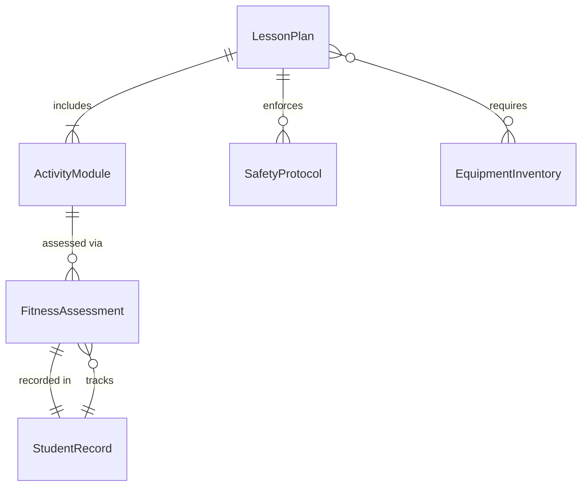
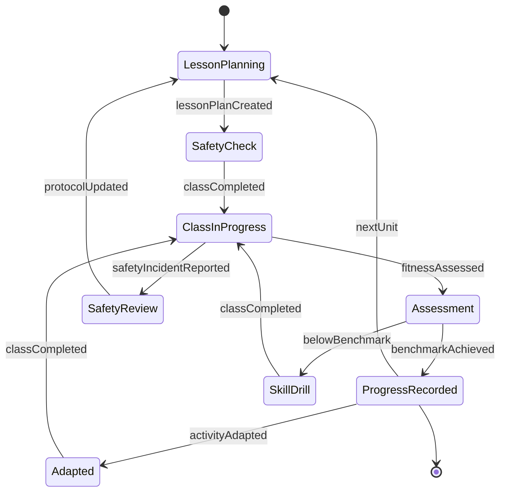
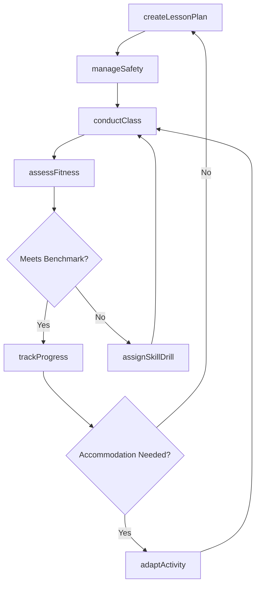
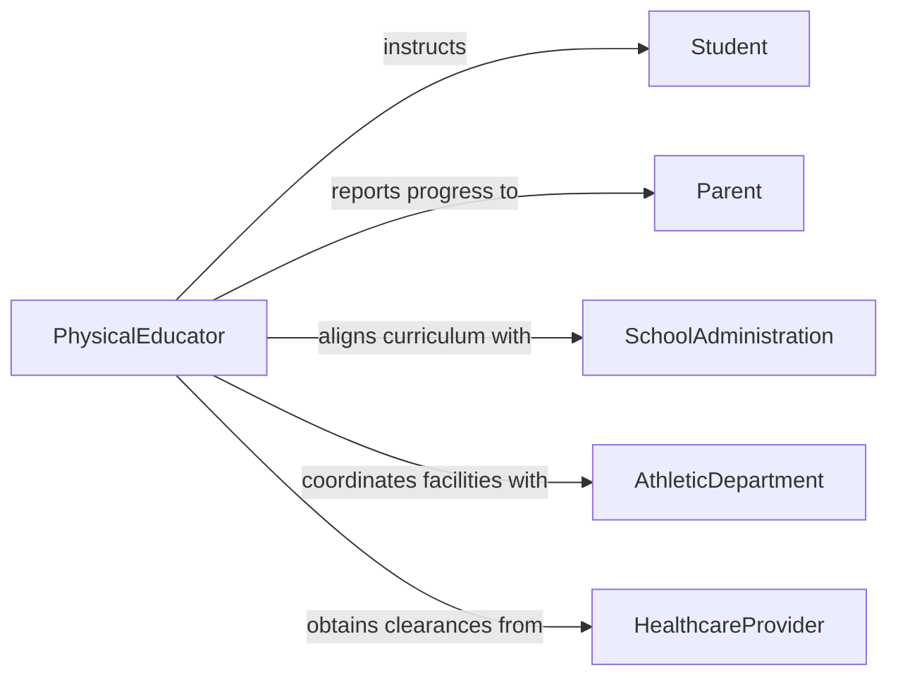

# Teach Physical Education

> Business-as-Code definition for physical education instruction. Models the planning, delivery, and assessment of physical fitness curricula across schools, recreation programs, and athletic training facilities.

## Overview

Teaching physical education involves designing age-appropriate fitness curricula, instructing students in sports and movement skills, monitoring physical development, and promoting lifelong healthy habits. This definition exposes actions for lesson planning and delivery, events for tracking student progress, and searches for retrieving fitness assessment data.

## Actors

| Actor | Description |
|-------|-------------|
| Student | Participates in physical education classes and activities |
| Parent | Receives progress reports and provides health disclosures |
| SchoolAdministration | Sets curriculum standards and schedules |
| AthleticDepartment | Coordinates sports programs and facility access |
| HealthcareProvider | Provides medical clearances and accommodation guidance |
| EquipmentSupplier | Supplies sports equipment and fitness apparatus |

## Roles

| Role | Description |
|------|-------------|
| PhysicalEducator | Plans and delivers physical education instruction |
| FitnessCoordinator | Designs fitness assessment protocols and tracks benchmarks |
| AthleticTrainer | Provides injury prevention guidance and conditioning programs |
| CurriculumSpecialist | Develops standards-aligned physical education curricula |

## Entities

| Entity | Description |
|--------|-------------|
| LessonPlan | A structured plan for a physical education session |
| FitnessAssessment | A standardized evaluation of student physical fitness |
| ActivityModule | A unit of instruction focused on a specific sport or skill |
| StudentRecord | A student's physical education performance history |
| SafetyProtocol | Guidelines for safe participation in physical activities |
| EquipmentInventory | Available sports and fitness equipment for instruction |

## Actions

| Action | Description |
|--------|-------------|
| createLessonPlan | Design a physical education lesson with objectives and activities |
| conductClass | Deliver instruction and lead students through physical activities |
| assessFitness | Administer standardized fitness tests and record results |
| adaptActivity | Modify activities for students with physical limitations |
| trackProgress | Record student performance against fitness benchmarks |
| manageSafety | Enforce safety protocols and inspect equipment before use |
| assignSkillDrill | Assign targeted drills to improve specific movement skills |

## Events

| Event | Description |
|-------|-------------|
| lessonPlanCreated | A new physical education lesson plan has been finalized |
| classCompleted | A physical education session has been delivered |
| fitnessAssessed | A student fitness assessment has been recorded |
| activityAdapted | An activity has been modified for accessibility |
| progressUpdated | Student performance records have been updated |
| safetyIncidentReported | A safety concern or injury has been documented |
| benchmarkAchieved | A student has met or exceeded a fitness benchmark |

## Searches

| Search | Description |
|--------|-------------|
| findLessonPlans | List lesson plans by grade level, activity type, or date |
| getStudentProgress | Retrieve fitness assessment history for a student |
| getFitnessResults | Query assessment results by class, grade, or benchmark |
| getEquipmentAvailability | Check available equipment for planned activities |

## Entity Relationships



## State Diagram



## Workflow



## Actor Relationships



## Usage

### Calling Actions

```typescript
import { teachPhysicalEducation } from '@headlessly/teach-physical-education'

const pe = teachPhysicalEducation()

// Create a lesson plan for middle school basketball
const lesson = await pe.createLessonPlan({
  title: 'Basketball Fundamentals - Dribbling and Passing',
  gradeLevel: '6-8',
  duration: 45,
  objectives: ['Demonstrate proper dribbling form', 'Execute chest and bounce passes'],
  equipment: ['basketballs', 'cones', 'pinnies']
})

// Assess student fitness
const assessment = await pe.assessFitness({
  studentId: 'STU-2024-0847',
  testType: 'FITNESSGRAM',
  metrics: {
    pacerLaps: 42,
    curlUps: 35,
    pushUps: 18,
    flexibilityReach: 8.5
  }
})

// Track progress against benchmarks
await pe.trackProgress({
  studentId: 'STU-2024-0847',
  assessmentId: assessment.id,
  period: 'Q2'
})
```

### Event-Driven Automation

```typescript
// Notify parents when a student achieves a fitness benchmark
pe.benchmarkAchieved(async ({ studentId, benchmark, score }) => {
  await notify({
    to: `parent-of-${studentId}`,
    message: `Your student achieved the ${benchmark} benchmark with a score of ${score}`
  })
})

// Alert administration on safety incidents
pe.safetyIncidentReported(async ({ classId, incident, severity }) => {
  if (severity === 'high') {
    await notify({
      to: 'school-administration',
      message: `Safety incident reported in PE class ${classId}: ${incident}`
    })
  }
})
```
