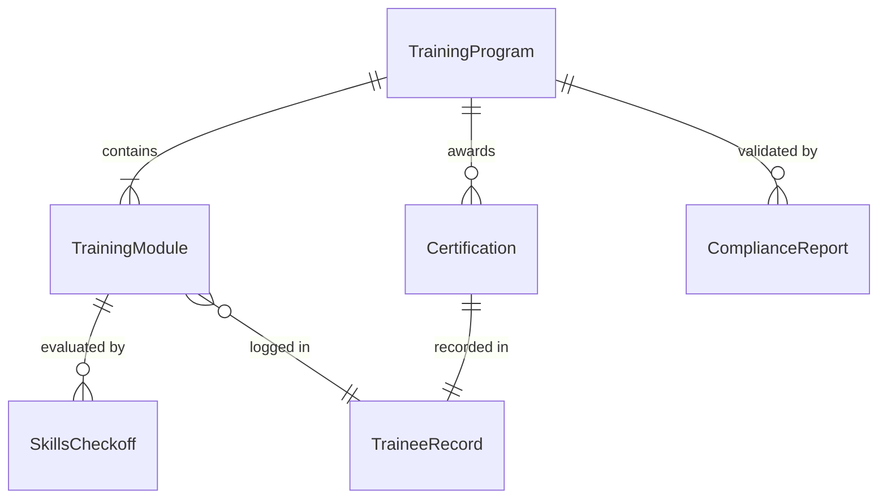
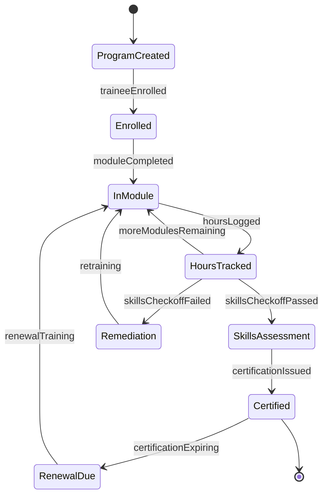
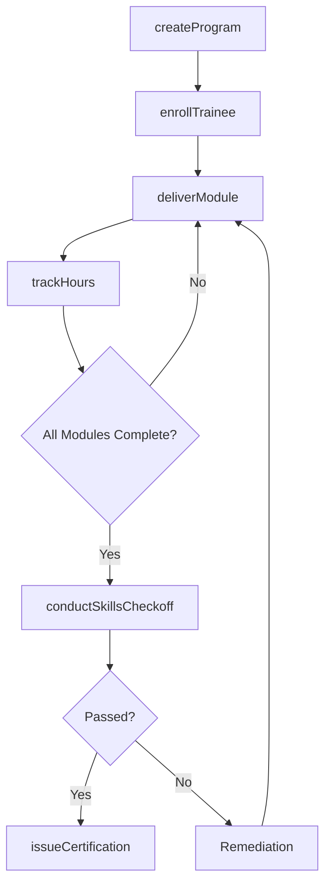
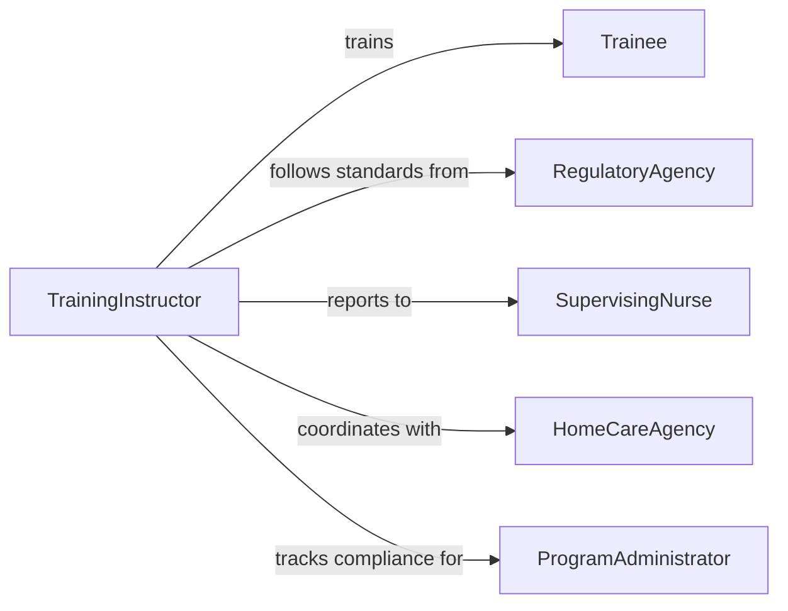

# Train Caregivers Non-medical Personnel

> Business-as-Code definition for training caregivers and non-medical personnel. Models the onboarding, skills training, and certification of home health aides, personal care assistants, and other non-clinical staff in patient care techniques.

## Overview

Training caregivers and non-medical personnel involves developing competency-based training programs, delivering instruction on daily living assistance, safety protocols, and basic health monitoring, and certifying readiness for unsupervised patient care. This definition exposes actions for training program management and skills evaluation, events for tracking certification status, and searches for retrieving trainee records.

## Actors

| Actor | Description |
|-------|-------------|
| Trainee | Non-medical personnel receiving care training |
| PatientFamily | Provides context on patient needs and preferences |
| RegulatoryAgency | Sets minimum training hour and competency requirements |
| HomeCareAgency | Employs trained caregivers and manages assignments |
| SupervisingNurse | Oversees caregiver performance and validates competency |
| TrainingVendor | Provides specialized training modules and certification exams |

## Roles

| Role | Description |
|------|-------------|
| TrainingInstructor | Delivers caregiver training curriculum and evaluates skills |
| ProgramAdministrator | Manages training schedules, enrollment, and compliance records |
| CompetencyAssessor | Evaluates trainees through practical skills demonstrations |
| QualityCoordinator | Monitors training program effectiveness and regulatory compliance |

## Entities

| Entity | Description |
|--------|-------------|
| TrainingProgram | A structured curriculum for caregiver certification |
| TrainingModule | A self-contained unit of instruction on a specific care topic |
| SkillsCheckoff | A checklist of hands-on competencies a trainee must demonstrate |
| Certification | A formal credential issued upon successful program completion |
| TraineeRecord | A trainee's complete training history and credential status |
| ComplianceReport | Documentation of program adherence to regulatory standards |

## Actions

| Action | Description |
|--------|-------------|
| createProgram | Design a caregiver training program with required modules |
| enrollTrainee | Register a non-medical staff member for training |
| deliverModule | Conduct instruction on a specific care topic |
| conductSkillsCheckoff | Evaluate a trainee's hands-on performance of care tasks |
| issueCertification | Grant a credential upon successful program completion |
| trackHours | Record training hours toward regulatory requirements |
| renewCertification | Process certification renewal with continuing education credits |

## Events

| Event | Description |
|-------|-------------|
| programCreated | A new caregiver training program has been established |
| traineeEnrolled | A non-medical staff member has been registered for training |
| moduleCompleted | A trainee has finished a training module |
| skillsCheckoffPassed | A trainee has demonstrated competency in a care skill |
| skillsCheckoffFailed | A trainee did not meet competency standards |
| certificationIssued | A caregiver certification has been granted |
| certificationExpiring | A certification is approaching its renewal date |

## Searches

| Search | Description |
|--------|-------------|
| findTrainees | List trainees by program, status, or completion date |
| getCertifications | Retrieve certifications by trainee, type, or expiration |
| getTrainingHours | Query accumulated training hours by trainee or module |
| getComplianceStatus | Check program compliance against regulatory requirements |

## Entity Relationships



## State Diagram



## Workflow



## Actor Relationships



## Usage

### Calling Actions

```typescript
import { trainCaregiversNonMedicalPersonnel } from '@headlessly/train-caregivers-non-medical-personnel'

const training = trainCaregiversNonMedicalPersonnel()

// Create a home health aide training program
const program = await training.createProgram({
  name: 'Home Health Aide Certification',
  modules: ['personal-care', 'infection-control', 'nutrition-hydration', 'mobility-transfers', 'emergency-response', 'documentation'],
  requiredHours: 75,
  regulatoryStandard: 'State HHA Requirements'
})

// Enroll a trainee
await training.enrollTrainee({
  programId: program.id,
  traineeId: 'AIDE-2024-0198',
  startDate: '2026-02-10',
  employerId: 'Home Care Solutions Inc.'
})

// Conduct a skills checkoff
const result = await training.conductSkillsCheckoff({
  traineeId: 'AIDE-2024-0198',
  skills: ['safe-patient-transfer', 'vital-signs-measurement', 'proper-hand-hygiene'],
  assessorId: 'RN-SUPV-0012',
  outcome: 'pass'
})
```

### Event-Driven Automation

```typescript
// Notify employer when certification is issued
training.certificationIssued(async ({ traineeId, certification }) => {
  await notify({
    to: certification.employerId,
    message: `${traineeId} has completed ${certification.name} and is cleared for patient assignments`
  })
})

// Alert on upcoming certification expirations
training.certificationExpiring(async ({ traineeId, certification, daysRemaining }) => {
  if (daysRemaining <= 30) {
    await notify({
      to: traineeId,
      message: `Your ${certification.name} expires in ${daysRemaining} days - complete continuing education to renew`
    })
  }
})
```
