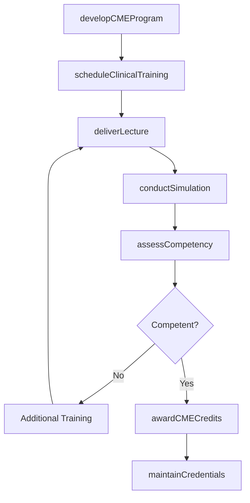
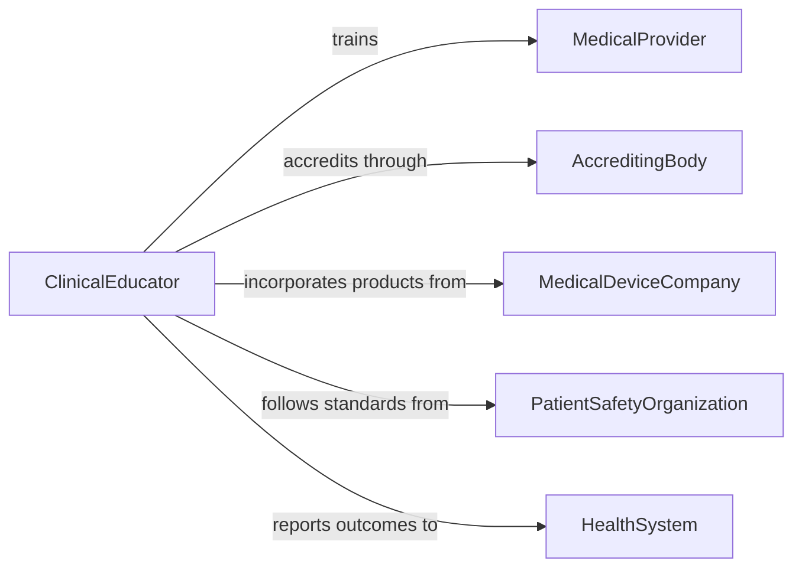

# Train Medical Providers

> Business-as-Code definition for training medical providers. Models the continuing education and clinical skills development process for physicians, nurses, and allied health professionals to maintain competency and adopt evidence-based practices.

## Overview

Training medical providers involves designing and delivering continuing medical education (CME), clinical skills workshops, simulation exercises, and competency assessments for physicians, nurses, pharmacists, and allied health professionals. This process ensures providers remain current with evidence-based protocols, new treatment modalities, regulatory requirements, and technological advances. Training may occur through grand rounds, simulation labs, online modules, and supervised clinical practice, with outcomes tracked through credentialing and quality metrics.

## Actors

| Actor | Description |
|-------|-------------|
| MedicalProvider | Physician, nurse, or allied health professional receiving training |
| AccreditingBody | Organization such as ACCME that certifies CME programs |
| MedicalDeviceCompany | Manufacturer providing product-specific clinical training |
| PatientSafetyOrganization | Entity establishing clinical practice standards and safety protocols |
| HealthSystem | Hospital or clinic system sponsoring provider education |

## Roles

| Role | Description |
|------|-------------|
| ClinicalEducator | Designs and delivers clinical training curricula for medical staff |
| SimulationDirector | Manages simulation lab operations and scenario development |
| CredentialingSpecialist | Tracks provider certifications and CME credit requirements |
| MedicalDirector | Provides clinical oversight and approves training content |

## Entities

| Entity | Description |
|--------|-------------|
| CMEProgram | A continuing medical education course accredited for credit hours |
| SimulationScenario | A clinical situation recreated for hands-on practice in a lab setting |
| CompetencyAssessment | An evaluation of a provider's clinical knowledge and procedural skill |
| CMECredit | A unit of continuing education credit earned by a provider |
| CredentialRecord | Documentation of a provider's certifications, licenses, and training history |
| ClinicalProtocol | A standardized procedure or treatment guideline being taught |

## Actions

| Action | Description |
|--------|-------------|
| developCMEProgram | Create an accredited continuing education course for medical providers |
| scheduleClinicalTraining | Plan and assign providers to training sessions or rotations |
| deliverLecture | Present didactic instruction on clinical topics |
| conductSimulation | Facilitate a hands-on clinical scenario in a simulation lab |
| assessCompetency | Evaluate a provider's clinical knowledge and procedural proficiency |
| awardCMECredits | Grant continuing education credits upon course completion |
| maintainCredentials | Update and track provider certification and licensure records |

## Events

| Event | Description |
|-------|-------------|
| cmeProgramDeveloped | A new continuing education course has been created and accredited |
| clinicalTrainingScheduled | A provider training session has been planned |
| lectureDelivered | A didactic clinical presentation has been completed |
| simulationConducted | A hands-on clinical scenario has been performed |
| competencyAssessed | A provider's clinical proficiency has been evaluated |
| cmeCreditsAwarded | Continuing education credits have been granted to a provider |
| credentialsMaintained | A provider's certification records have been updated |

## Searches

| Search | Description |
|--------|-------------|
| findCMEPrograms | List available courses by specialty, accreditation, or schedule |
| getProviderCredentials | Retrieve certification and CME credit status for a provider |
| getCompetencyResults | Look up assessment outcomes by provider or clinical topic |
| getExpiringCertifications | Identify providers with certifications approaching renewal deadlines |

## Workflow



## Actor Relationships



## Usage

### Calling Actions

```typescript
import { trainMedicalProviders } from '@headlessly/train-medical-providers'

const medTraining = trainMedicalProviders()

// Develop a CME program for emergency medicine providers
const program = await medTraining.developCMEProgram({
  title: 'Advanced Trauma Life Support Update 2026',
  specialty: 'emergency-medicine',
  accreditor: 'ACCME',
  credits: 16,
  topics: ['hemorrhage-control', 'airway-management', 'chest-trauma', 'tbi-protocols']
})

// Schedule a simulation session
await medTraining.scheduleClinicalTraining({
  programId: program.id,
  type: 'simulation',
  date: '2026-05-20',
  providers: ['dr-chen', 'dr-patel', 'rn-martinez'],
  location: 'Simulation Center Building A'
})

// Assess competency after the training
const assessment = await medTraining.assessCompetency({
  providerId: 'dr-chen',
  programId: program.id,
  format: 'observed-structured-clinical-exam',
  passingThreshold: 85
})
```

### Event-Driven Automation

```typescript
// Auto-notify providers when certifications are expiring
medTraining.credentialsMaintained(async ({ providerId, expiringCerts }) => {
  for (const cert of expiringCerts) {
    if (cert.daysUntilExpiry <= 90) {
      await notify({
        to: providerId,
        message: `Your ${cert.name} certification expires on ${cert.expiryDate}. Please complete renewal requirements.`
      })
    }
  }
})

// Award credits automatically upon competency confirmation
medTraining.competencyAssessed(async ({ providerId, programId, passed }) => {
  if (passed) {
    await medTraining.awardCMECredits({
      providerId,
      programId,
      creditType: 'category-1'
    })
  }
})
```
