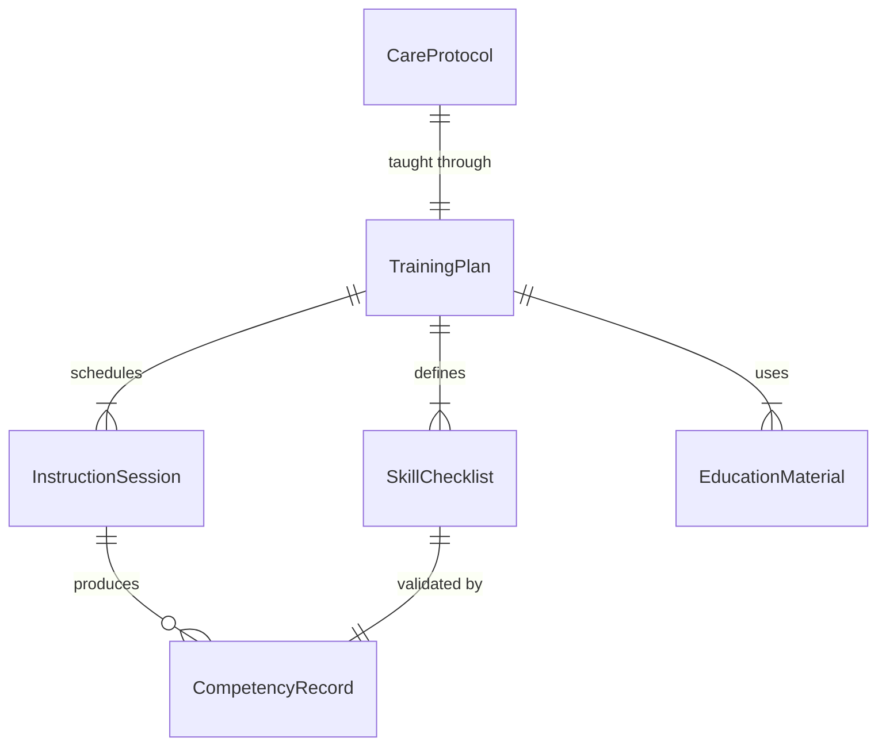
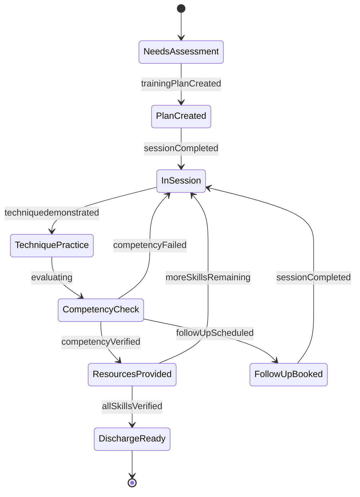
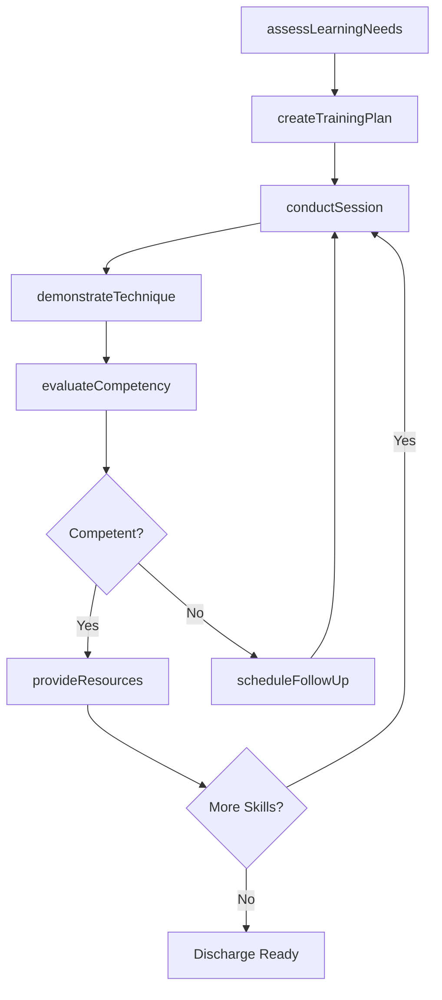
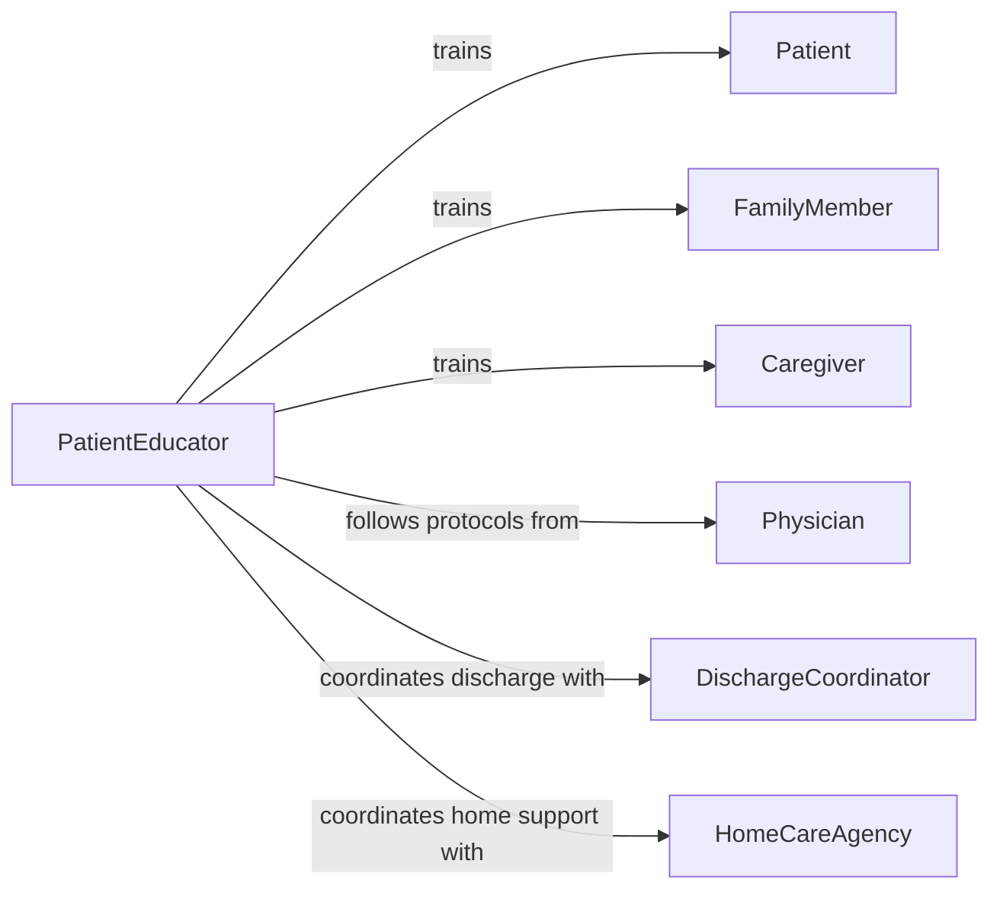

# Train Patients Family Members Caregivers

> Business-as-Code definition for training patients, family members, and caregivers. Models the education lifecycle for managing disabilities and chronic illnesses at home, from assessment through competency verification.

## Overview

Training patients, family members, and caregivers involves assessing individual learning needs, developing personalized education plans, demonstrating care techniques, and verifying competency in managing conditions outside clinical settings. This definition exposes actions for education delivery and skills assessment, events for tracking learner progress, and searches for retrieving training records and materials.

## Actors

| Actor | Description |
|-------|-------------|
| Patient | Receives training on self-management of their condition |
| FamilyMember | Learns care techniques to support the patient at home |
| Caregiver | Professional or informal caregiver receiving specialized training |
| Physician | Prescribes care protocols and approves training plans |
| InsuranceProvider | Authorizes coverage for patient education services |
| HomeCareAgency | Coordinates ongoing support and follow-up training |

## Roles

| Role | Description |
|------|-------------|
| PatientEducator | Develops and delivers condition-specific training programs |
| ClinicalNurseSpecialist | Teaches complex medical care techniques to non-professionals |
| RehabilitationTherapist | Trains patients and caregivers in adaptive techniques |
| DischargeCoordinator | Ensures training completion before patient discharge |

## Entities

| Entity | Description |
|--------|-------------|
| TrainingPlan | A structured education program tailored to a patient's condition |
| SkillChecklist | A list of competencies a learner must demonstrate |
| InstructionSession | A scheduled training encounter with defined objectives |
| CompetencyRecord | Documentation of a learner's demonstrated proficiency |
| EducationMaterial | Handouts, videos, or guides supporting the training |
| CareProtocol | The clinical procedures being taught for home management |

## Actions

| Action | Description |
|--------|-------------|
| assessLearningNeeds | Evaluate the learner's baseline knowledge and ability |
| createTrainingPlan | Design a personalized education plan for a condition |
| conductSession | Deliver an instruction session with demonstration and practice |
| demonstrateTechnique | Show proper execution of a care procedure |
| evaluateCompetency | Test the learner's ability to perform a technique independently |
| provideResources | Distribute educational materials and reference guides |
| scheduleFollowUp | Arrange a follow-up session to reinforce skills |

## Events

| Event | Description |
|-------|-------------|
| learningNeedsAssessed | A learner's baseline knowledge has been evaluated |
| trainingPlanCreated | A personalized education plan has been finalized |
| sessionCompleted | An instruction session has been delivered |
| techniquedemonstrated | A care technique has been demonstrated to the learner |
| competencyVerified | A learner has demonstrated proficiency in a skill |
| competencyFailed | A learner did not meet competency requirements |
| followUpScheduled | A follow-up reinforcement session has been booked |

## Searches

| Search | Description |
|--------|-------------|
| findTrainingPlans | List training plans by patient, condition, or status |
| getCompetencyRecords | Retrieve competency results for a learner |
| getSessions | Query instruction sessions by date, educator, or patient |
| getEducationMaterials | Find materials by condition, language, or format |

## Entity Relationships



## State Diagram



## Workflow



## Actor Relationships



## Usage

### Calling Actions

```typescript
import { trainPatientsFamilyMembersCaregivers } from '@headlessly/train-patients-family-members-caregivers'

const training = trainPatientsFamilyMembersCaregivers()

// Assess a caregiver's learning needs
const needs = await training.assessLearningNeeds({
  learnerId: 'CG-2024-0312',
  role: 'family-member',
  patientCondition: 'Type 2 Diabetes',
  priorExperience: 'none'
})

// Create a training plan
const plan = await training.createTrainingPlan({
  learnerId: needs.learnerId,
  condition: 'Type 2 Diabetes',
  skills: ['blood-glucose-monitoring', 'insulin-injection', 'dietary-management'],
  targetCompletionDate: '2026-03-15'
})

// Evaluate competency on a specific skill
const result = await training.evaluateCompetency({
  learnerId: 'CG-2024-0312',
  skill: 'blood-glucose-monitoring',
  assessorId: 'RN-0045',
  outcome: 'pass'
})
```

### Event-Driven Automation

```typescript
// Flag patients for discharge readiness when all competencies pass
training.competencyVerified(async ({ learnerId, skill, planId }) => {
  const plan = await training.findTrainingPlans({ id: planId })
  const allVerified = plan.skills.every(s => s.status === 'verified')
  if (allVerified) {
    await notify({
      to: 'discharge-coordinator',
      message: `All competencies verified for learner ${learnerId} - ready for discharge`
    })
  }
})

// Escalate repeated competency failures
training.competencyFailed(async ({ learnerId, skill, attemptCount }) => {
  if (attemptCount >= 3) {
    await notify({
      to: 'clinical-nurse-specialist',
      message: `Learner ${learnerId} has failed ${skill} competency ${attemptCount} times - reassessment needed`
    })
  }
})
```
