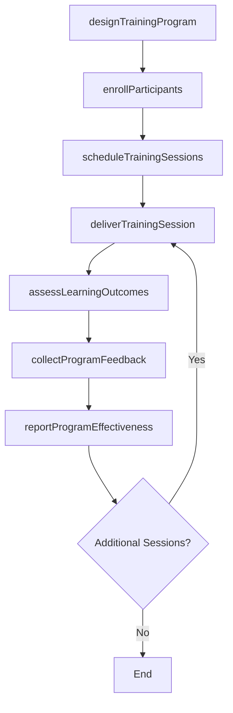
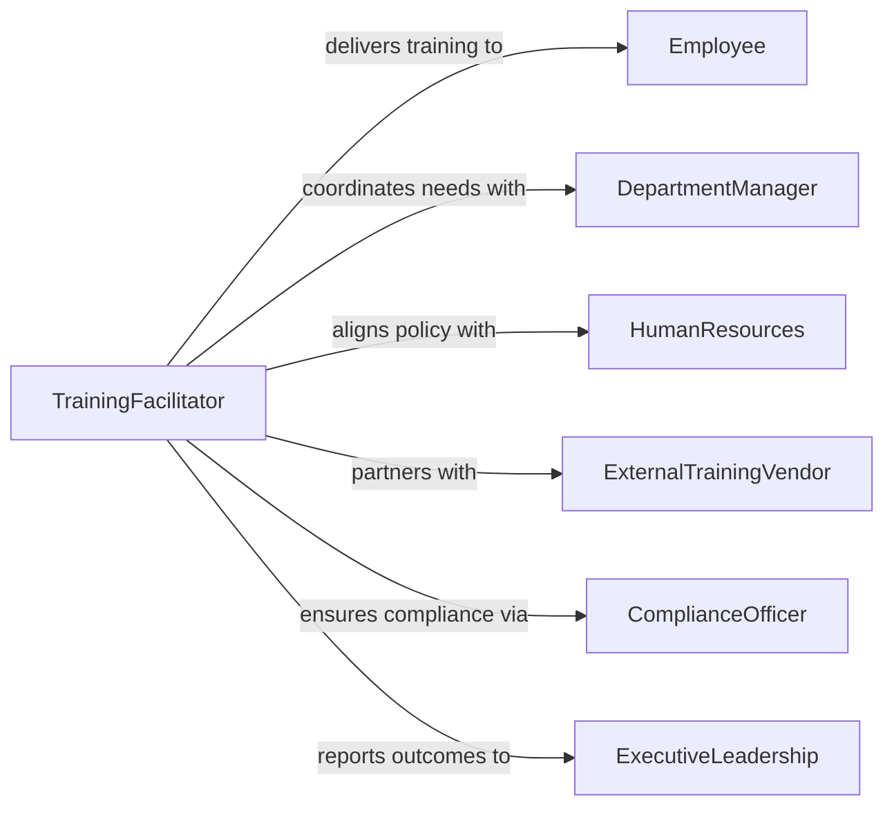

# Conduct Employee Training Programs

> Business-as-Code definition for conducting employee training programs. Models the complete lifecycle of planning, designing, delivering, and evaluating structured training programs across an organization.

## Overview

Conducting employee training programs involves planning and executing structured learning initiatives that develop workforce capabilities, support onboarding, maintain compliance, and advance professional skills. This definition exposes actions for designing program curricula, enrolling participants, delivering training through multiple formats, assessing learning outcomes, and reporting program effectiveness to stakeholders.

## Actors

| Actor | Description |
|-------|-------------|
| Employee | Individual participating in a training program |
| DepartmentManager | Identifies team training needs and nominates participants |
| HumanResources | Oversees training policy, budgets, and organizational learning strategy |
| ExternalTrainingVendor | Third-party provider delivering specialized training content or facilitation |
| ComplianceOfficer | Ensures training programs meet regulatory and legal requirements |
| ExecutiveLeadership | Approves training budgets and reviews program effectiveness reports |

## Roles

| Role | Description |
|------|-------------|
| TrainingFacilitator | Designs and delivers training sessions across the organization |
| ProgramManager | Oversees the planning, logistics, and execution of training programs |
| InstructionalDesigner | Develops curricula, learning objectives, and training materials |
| LearningAnalyst | Evaluates program effectiveness through metrics and participant feedback |

## Entities

| Entity | Description |
|--------|-------------|
| TrainingProgram | A structured initiative with defined objectives, curriculum, and schedule |
| ProgramModule | An individual instructional unit within a larger training program |
| EnrollmentRecord | Documentation of an employee's registration in a training program |
| LearningObjective | A measurable goal defining what participants should achieve |
| SessionSchedule | A calendar of training events with dates, locations, and facilitators |
| ProgramEvaluation | An assessment of training effectiveness based on outcomes and feedback |

## Actions

| Action | Description |
|--------|-------------|
| designTrainingProgram | Create a program with learning objectives, modules, and delivery format |
| enrollParticipants | Register employees for a training program and confirm attendance |
| scheduleTrainingSessions | Plan session dates, locations, facilitators, and resource requirements |
| deliverTrainingSession | Conduct a training session using the prepared curriculum and materials |
| assessLearningOutcomes | Evaluate participant knowledge and skill acquisition after training |
| collectProgramFeedback | Gather participant and stakeholder input on program quality |
| reportProgramEffectiveness | Compile metrics and analysis on training program outcomes |

## Events

| Event | Description |
|-------|-------------|
| trainingProgramDesigned | A new training program has been created with objectives and curriculum |
| participantsEnrolled | Employees have been registered for a training program |
| trainingSessionsScheduled | Session dates and logistics have been confirmed |
| trainingSessionDelivered | A training session has been completed |
| learningOutcomesAssessed | Participant knowledge and skills have been evaluated |
| programFeedbackCollected | Input on program quality has been gathered from participants |
| programEffectivenessReported | Training program metrics and analysis have been compiled |

## Searches

| Search | Description |
|--------|-------------|
| findTrainingPrograms | List programs by topic, status, department, or delivery format |
| getEnrollments | Retrieve enrollment records by employee, program, or status |
| getLearningOutcomes | Look up assessment results by participant, program, or date |
| getProgramMetrics | Retrieve effectiveness reports by program, period, or department |

## Workflow



## Actor Relationships



## Usage

### Calling Actions

```typescript
import { conductEmployeeTrainingPrograms } from '@headlessly/conduct-employee-training-programs'

const training = conductEmployeeTrainingPrograms()

// Design a new training program
const program = await training.designTrainingProgram({
  name: 'Q2 Leadership Development Program',
  objectives: ['strategic-thinking', 'team-management', 'conflict-resolution'],
  modules: [
    { title: 'Leading Through Change', format: 'workshop', duration: { hours: 4 } },
    { title: 'Performance Coaching', format: 'seminar', duration: { hours: 3 } },
    { title: 'Decision Making Under Pressure', format: 'simulation', duration: { hours: 2 } }
  ],
  targetAudience: 'mid-level-managers'
})

// Enroll participants and schedule sessions
await training.enrollParticipants({
  programId: program.id,
  employeeIds: ['emp-201', 'emp-202', 'emp-203', 'emp-204'],
  enrollmentDeadline: '2026-03-15'
})

await training.scheduleTrainingSessions({
  programId: program.id,
  sessions: [
    { moduleIndex: 0, date: '2026-04-05', location: 'Conference Room A' },
    { moduleIndex: 1, date: '2026-04-12', location: 'Virtual' },
    { moduleIndex: 2, date: '2026-04-19', location: 'Simulation Lab' }
  ]
})
```

### Event-Driven Automation

```typescript
// Generate effectiveness report after all sessions complete
training.learningOutcomesAssessed(async ({ programId, sessionCount, totalSessions }) => {
  if (sessionCount === totalSessions) {
    await training.collectProgramFeedback({ programId })
    await training.reportProgramEffectiveness({ programId })
  }
})

// Notify managers when their team members complete training
training.trainingSessionDelivered(async ({ programId, participantIds }) => {
  for (const participantId of participantIds) {
    const manager = await getManagerFor(participantId)
    await notify({
      to: manager.id,
      message: `${participantId} has completed a training session in program ${programId}`
    })
  }
})
```
