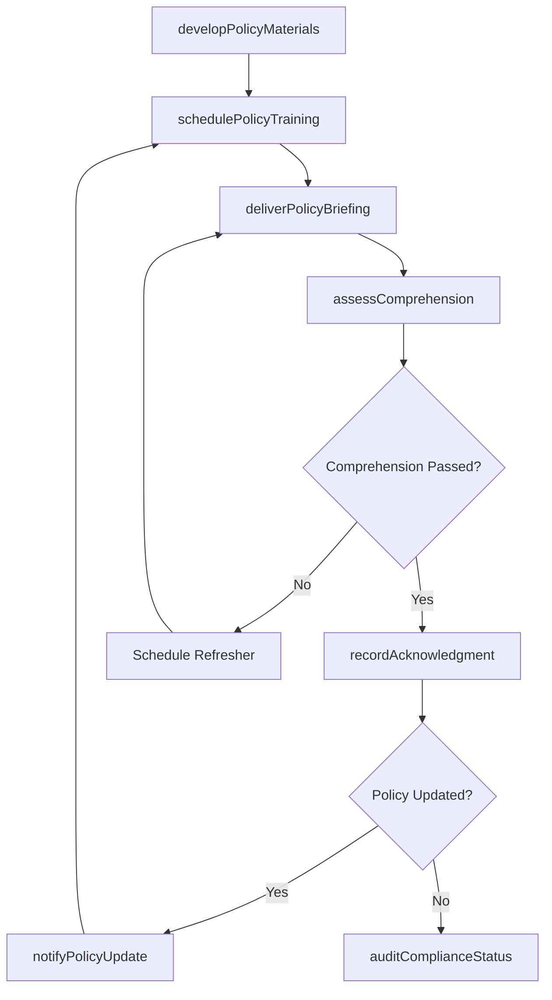
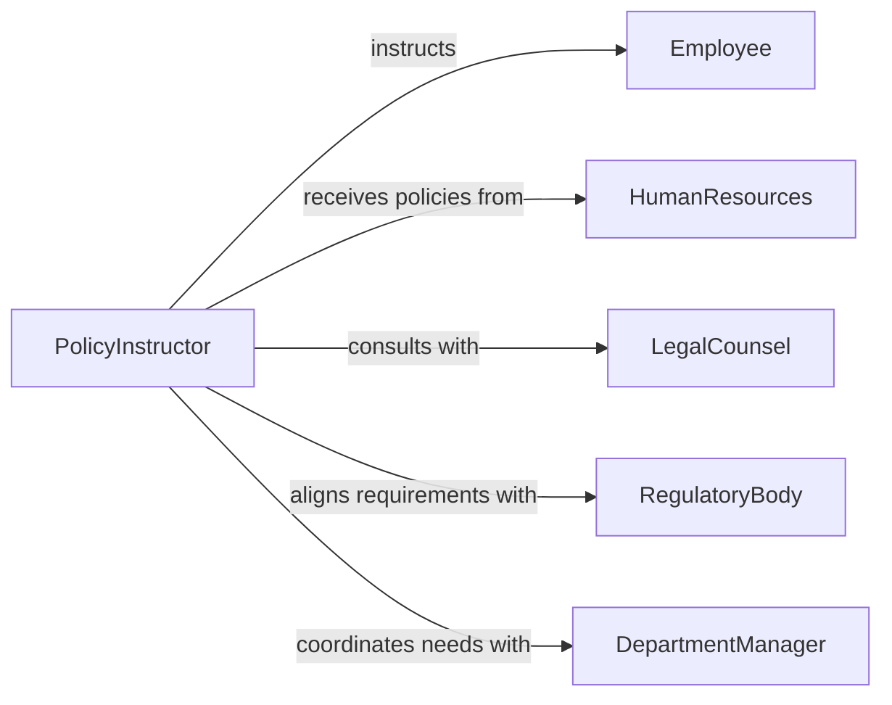

# Instruct Staff Work Policies Procedures

> Business-as-Code definition for instructing staff in work policies or procedures. Models the process of communicating organizational policies, delivering procedural training, verifying staff comprehension, and maintaining compliance acknowledgment records.

## Overview

Instructing staff in work policies or procedures involves ensuring that employees understand and can follow the rules, guidelines, and standard operating methods that govern their work. This definition exposes actions for developing policy instruction materials, scheduling orientation and refresher sessions, delivering policy briefings, testing staff comprehension, and tracking acknowledgment records to maintain regulatory and organizational compliance.

## Actors

| Actor | Description |
|-------|-------------|
| Employee | Staff member receiving instruction on policies and procedures |
| HumanResources | Department responsible for policy development and compliance tracking |
| LegalCounsel | Provides guidance on regulatory requirements affecting workplace policies |
| RegulatoryBody | External authority establishing mandatory workplace compliance standards |
| DepartmentManager | Identifies department-specific policy training needs and nominates participants |

## Roles

| Role | Description |
|------|-------------|
| PolicyInstructor | Delivers training sessions on organizational policies and procedures |
| ComplianceCoordinator | Tracks policy acknowledgment records and identifies training gaps |
| PolicyDeveloper | Authors and maintains policy documentation and instructional materials |
| TrainingScheduler | Manages session logistics, enrollment, and calendar coordination |

## Entities

| Entity | Description |
|--------|-------------|
| PolicyDocument | An authoritative statement of organizational rules or guidelines |
| ProcedureManual | A step-by-step guide for executing a specific work process |
| TrainingSession | A scheduled event for delivering policy or procedure instruction |
| AcknowledgmentRecord | Documentation that an employee has received and understood a policy |
| ComprehensionAssessment | A quiz or evaluation testing staff understanding of policies |
| PolicyUpdate | A revision to an existing policy requiring staff notification and retraining |

## Actions

| Action | Description |
|--------|-------------|
| developPolicyMaterials | Create instructional content from policy documents and procedure manuals |
| schedulePolicyTraining | Plan a session for policy instruction with participants and timing |
| deliverPolicyBriefing | Conduct a training session covering organizational policies or procedures |
| assessComprehension | Test staff understanding of policies through quizzes or assessments |
| recordAcknowledgment | Document that an employee has received and understood a policy |
| notifyPolicyUpdate | Inform affected staff when a policy has been revised |
| auditComplianceStatus | Review acknowledgment records to identify staff with outstanding requirements |

## Events

| Event | Description |
|-------|-------------|
| policyMaterialsDeveloped | Instructional content for a policy has been created or updated |
| policyTrainingScheduled | A policy instruction session has been planned and confirmed |
| policyBriefingDelivered | A policy or procedure training session has been completed |
| comprehensionAssessed | Staff understanding of policies has been evaluated |
| acknowledgmentRecorded | An employee has formally acknowledged receipt of a policy |
| policyUpdateNotified | Staff have been informed of a revision to an existing policy |
| complianceAuditCompleted | Review of policy acknowledgment status has been finished |

## Searches

| Search | Description |
|--------|-------------|
| findPolicySessions | List scheduled or completed policy training sessions by date or department |
| getAcknowledgments | Retrieve acknowledgment records by employee, policy, or status |
| findComplianceGaps | Identify employees missing required policy acknowledgments |
| getPolicyUpdates | List recent policy revisions and their retraining requirements |

## Workflow



## Actor Relationships



## Usage

### Calling Actions

```typescript
import { instructStaffWorkPoliciesProcedures } from '@headlessly/instruct-staff-work-policies-procedures'

const policies = instructStaffWorkPoliciesProcedures()

// Develop training materials for a new policy
const materials = await policies.developPolicyMaterials({
  policyId: 'POL-2026-018',
  title: 'Remote Work and Flexible Schedule Policy',
  sections: ['eligibility', 'expectations', 'equipment-guidelines', 'security-requirements']
})

// Schedule training for affected departments
const session = await policies.schedulePolicyTraining({
  materialId: materials.id,
  departments: ['engineering', 'marketing', 'operations'],
  scheduledDate: '2026-03-20',
  format: 'virtual-webinar'
})

// Audit compliance status
const audit = await policies.auditComplianceStatus({
  policyId: 'POL-2026-018',
  scope: 'organization-wide'
})
```

### Event-Driven Automation

```typescript
// Auto-schedule retraining when a policy is updated
policies.policyUpdateNotified(async ({ policyId, affectedDepartments }) => {
  await policies.schedulePolicyTraining({
    policyId,
    departments: affectedDepartments,
    scheduledDate: nextBusinessDay(),
    format: 'mandatory-briefing'
  })
})

// Escalate when comprehension assessment fails
policies.comprehensionAssessed(async ({ employeeId, passed, policyId }) => {
  if (!passed) {
    await notify({
      to: 'hr-compliance',
      message: `Employee ${employeeId} did not pass comprehension assessment for policy ${policyId}`
    })
  }
})
```
