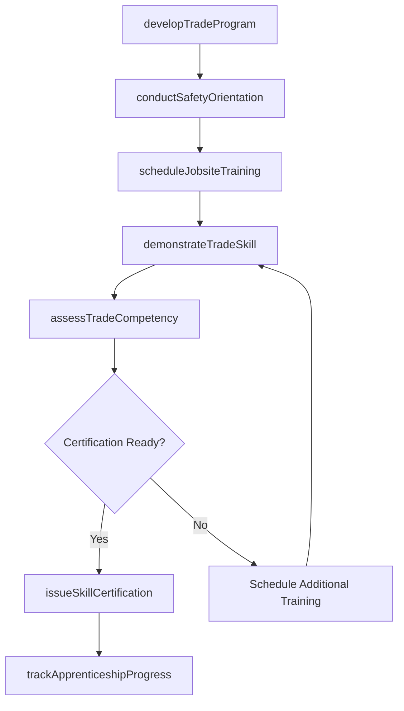
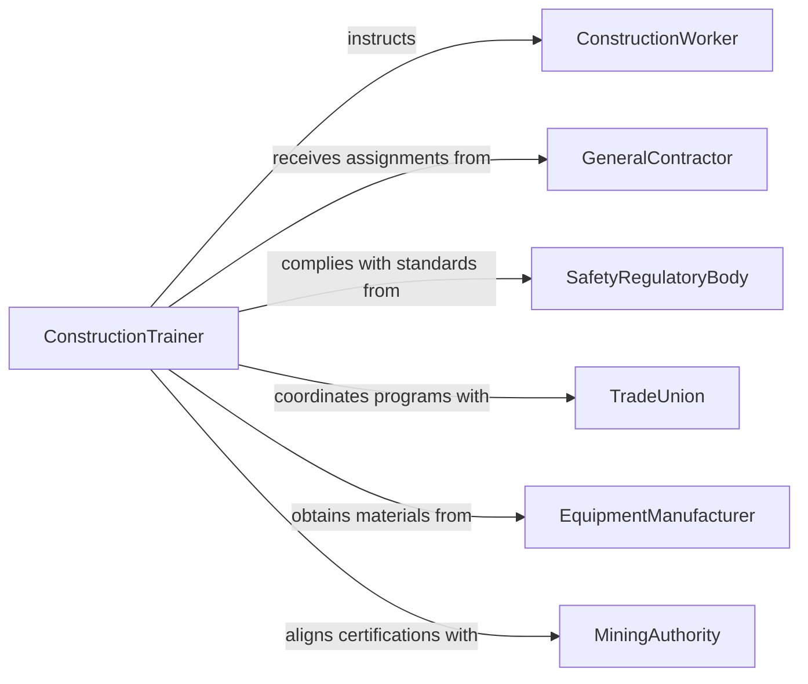

# Train Construction Extraction Personnel

> Business-as-Code definition for training construction or extraction personnel. Models the lifecycle of developing trade-specific instruction programs, delivering on-site safety and skills training, and certifying workers for construction and extraction operations.

## Overview

Training construction or extraction personnel involves instructing workers on building trades, heavy equipment operation, excavation methods, mining procedures, and related safety protocols. This definition exposes actions for creating trade-specific curricula, scheduling jobsite training sessions, conducting safety orientations, demonstrating construction and extraction techniques, and issuing the certifications required to operate on regulated worksites.

## Actors

| Actor | Description |
|-------|-------------|
| ConstructionWorker | Individual receiving training on building trades or extraction methods |
| GeneralContractor | Organization managing construction projects and requesting worker training |
| SafetyRegulatoryBody | Government agency overseeing workplace safety standards such as OSHA |
| TradeUnion | Labor organization establishing apprenticeship and journeyman training standards |
| EquipmentManufacturer | Supplier providing equipment-specific training materials and certifications |
| MiningAuthority | Regulatory agency governing extraction operations and worker certifications |

## Roles

| Role | Description |
|------|-------------|
| ConstructionTrainer | Delivers hands-on instruction in building trades and extraction techniques |
| SafetyOfficer | Ensures training meets regulatory safety requirements and conducts orientations |
| ApprenticeshipCoordinator | Manages structured training programs for trade skill development |
| SiteTrainingManager | Oversees all training activities for a construction or extraction site |

## Entities

| Entity | Description |
|--------|-------------|
| TradeTrainingProgram | A structured curriculum for a specific construction or extraction discipline |
| SafetyOrientation | A mandatory session covering site hazards, PPE, and emergency procedures |
| SkillCertification | A credential confirming competency in a specific trade or equipment operation |
| TrainingRecord | Documentation of completed training hours and assessment results |
| ApprenticeshipPlan | A multi-phase training schedule progressing from basic to advanced skills |
| HazardAssessment | Evaluation of site-specific risks used to tailor safety training content |

## Actions

| Action | Description |
|--------|-------------|
| developTradeProgram | Create a training curriculum for a specific construction or extraction trade |
| conductSafetyOrientation | Deliver mandatory site safety training covering hazards and protocols |
| scheduleJobsiteTraining | Plan on-site training sessions with dates, locations, and participants |
| demonstrateTradeSkill | Perform hands-on demonstration of construction or extraction techniques |
| assessTradeCompetency | Evaluate worker proficiency through practical skill assessments |
| issueSkillCertification | Grant trade or equipment certification upon successful training completion |
| trackApprenticeshipProgress | Monitor advancement through multi-phase apprenticeship milestones |

## Events

| Event | Description |
|-------|-------------|
| tradeProgramDeveloped | A new trade-specific training curriculum has been created |
| safetyOrientationCompleted | Mandatory site safety training has been delivered to workers |
| jobsiteTrainingScheduled | An on-site training session has been planned and confirmed |
| tradeSkillDemonstrated | A construction or extraction technique demonstration has been completed |
| tradeCompetencyAssessed | Worker skill proficiency has been evaluated and scored |
| skillCertificationIssued | A trade or equipment certification has been granted |
| apprenticeshipMilestoneReached | A worker has advanced to the next phase of their apprenticeship |

## Searches

| Search | Description |
|--------|-------------|
| findTradePrograms | List training programs by trade, certification type, or skill level |
| getTrainingRecords | Retrieve completed training records by worker, site, or date range |
| getCertifications | Look up active certifications by worker, trade, or expiration date |
| findComplianceGaps | Identify workers or sites missing required safety or trade certifications |
| getApprenticeshipStatus | Check progression status for workers in multi-phase training plans |

## Workflow



## Actor Relationships



## Usage

### Calling Actions

```typescript
import { trainConstructionExtractionPersonnel } from '@headlessly/train-construction-extraction-personnel'

const construction = trainConstructionExtractionPersonnel()

// Develop a trade training program
const program = await construction.developTradeProgram({
  trade: 'structural-steel-erection',
  modules: ['rigging-fundamentals', 'crane-signal-communication', 'bolt-up-procedures'],
  safetyRequirements: ['fall-protection', 'osha-10-hour']
})

// Conduct mandatory safety orientation
await construction.conductSafetyOrientation({
  siteId: 'site-highland-towers',
  participantIds: ['wkr-301', 'wkr-302', 'wkr-303'],
  hazards: ['elevated-work', 'heavy-loads', 'confined-spaces']
})

// Assess competency and issue certification
const assessment = await construction.assessTradeCompetency({
  workerId: 'wkr-301',
  programId: program.id,
  evaluationCriteria: ['safety-compliance', 'technique-accuracy', 'load-calculation']
})
```

### Event-Driven Automation

```typescript
// Auto-issue certification when competency is confirmed
construction.tradeCompetencyAssessed(async ({ workerId, passed, programId }) => {
  if (passed) {
    await construction.issueSkillCertification({
      workerId,
      programId,
      type: 'structural-steel-journeyman',
      validUntil: '2028-03-15'
    })
  }
})

// Notify site manager when safety orientation is completed
construction.safetyOrientationCompleted(async ({ siteId, participantCount }) => {
  await notify({
    to: `site-manager-${siteId}`,
    message: `Safety orientation completed for ${participantCount} workers`
  })
})
```
