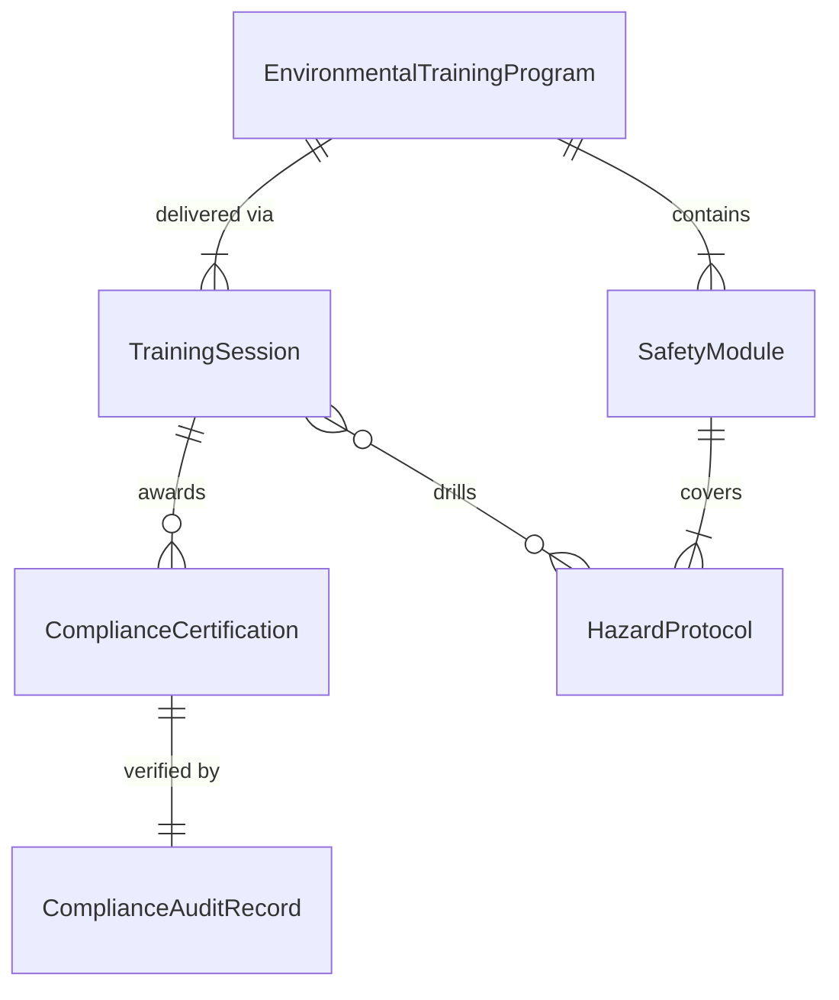
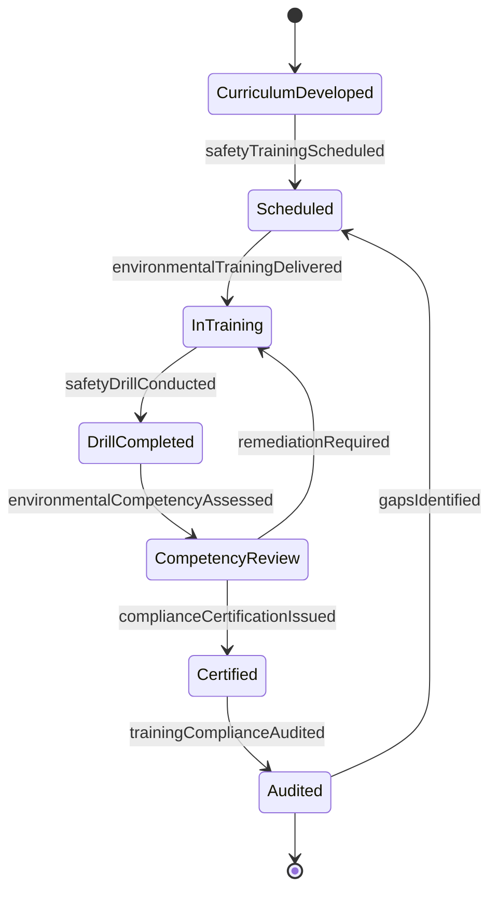
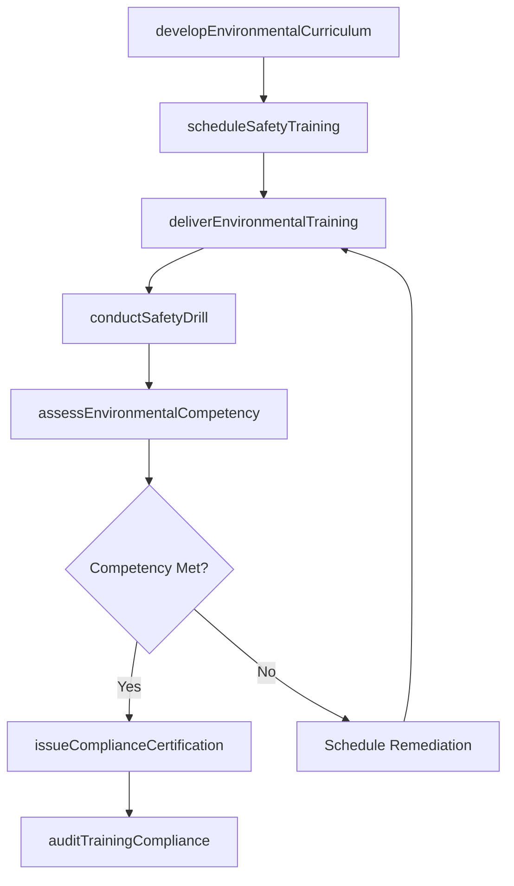
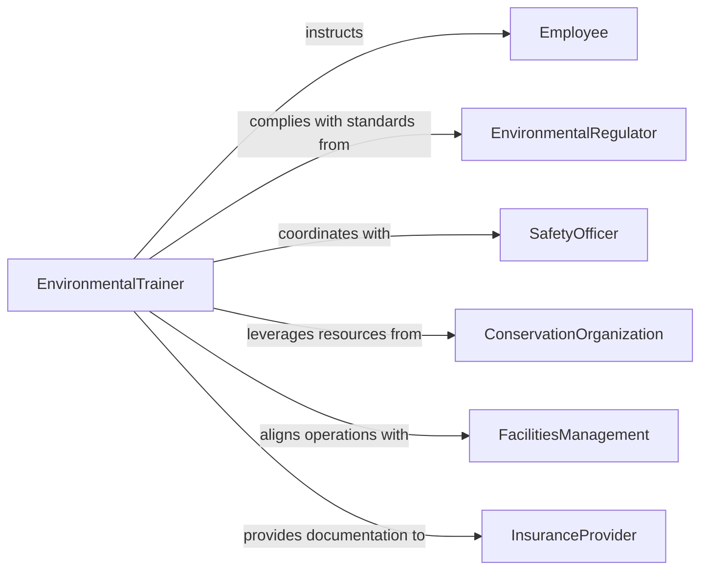

# Train Employees Environmental Awareness Conservation

> Business-as-Code definition for training employees on environmental awareness, conservation, or safety topics. Models the lifecycle of developing environmental and safety curricula, delivering compliance training, and certifying personnel on conservation and workplace safety standards.

## Overview

Training employees on environmental awareness, conservation, or safety topics involves educating personnel on environmental regulations, sustainable practices, hazardous material handling, waste management, and workplace safety protocols. This definition exposes actions for developing environmental training content, scheduling compliance sessions, conducting hands-on safety drills, issuing environmental certifications, and auditing training records to maintain regulatory compliance.

## Actors

| Actor | Description |
|-------|-------------|
| Employee | Individual receiving training on environmental or safety topics |
| EnvironmentalRegulator | Government agency establishing environmental compliance requirements |
| SafetyOfficer | Internal authority responsible for workplace safety standards and enforcement |
| ConservationOrganization | External group providing resources and expertise on sustainability practices |
| FacilitiesManagement | Department managing building operations and environmental impact |
| InsuranceProvider | Underwriter requiring evidence of safety training for coverage terms |

## Roles

| Role | Description |
|------|-------------|
| EnvironmentalTrainer | Develops and delivers training on environmental and conservation topics |
| SafetyInstructor | Conducts workplace safety training including drills and hazard protocols |
| ComplianceCoordinator | Tracks regulatory training requirements and maintains completion records |
| SustainabilityOfficer | Oversees organizational environmental strategy and training alignment |

## Entities

| Entity | Description |
|--------|-------------|
| EnvironmentalTrainingProgram | A structured curriculum covering environmental awareness and conservation topics |
| SafetyModule | An instructional unit focused on a specific workplace safety procedure |
| ComplianceCertification | A credential confirming completion of mandatory environmental or safety training |
| TrainingSession | A scheduled event for delivering environmental or safety instruction |
| HazardProtocol | A documented procedure for handling environmental hazards or emergencies |
| ComplianceAuditRecord | Documentation of an organization's environmental training compliance status |

## Actions

| Action | Description |
|--------|-------------|
| developEnvironmentalCurriculum | Create training content on environmental regulations, conservation, and sustainability |
| scheduleSafetyTraining | Plan training sessions with participants, dates, and location requirements |
| deliverEnvironmentalTraining | Conduct instruction on environmental awareness and conservation practices |
| conductSafetyDrill | Facilitate a practical exercise simulating an environmental or safety emergency |
| assessEnvironmentalCompetency | Evaluate employee understanding of environmental and safety protocols |
| issueComplianceCertification | Grant certification upon successful completion of required training |
| auditTrainingCompliance | Review training records against regulatory requirements for completeness |

## Events

| Event | Description |
|-------|-------------|
| environmentalCurriculumDeveloped | Training content for environmental topics has been created or updated |
| safetyTrainingScheduled | An environmental or safety training session has been planned |
| environmentalTrainingDelivered | Environmental awareness instruction has been completed |
| safetyDrillConducted | A practical safety or emergency drill has been executed |
| environmentalCompetencyAssessed | Employee understanding of environmental protocols has been evaluated |
| complianceCertificationIssued | An environmental or safety certification has been granted |
| trainingComplianceAudited | Organizational training records have been reviewed for regulatory compliance |

## Searches

| Search | Description |
|--------|-------------|
| findTrainingPrograms | List environmental or safety training programs by topic, status, or regulation |
| getCertifications | Retrieve compliance certifications by employee, type, or expiration date |
| findComplianceGaps | Identify employees or departments missing required environmental training |
| getAuditRecords | Look up training compliance audit results by department or date range |

## Entity Relationships



## State Diagram



## Workflow



## Actor Relationships



## Usage

### Calling Actions

```typescript
import { trainEmployeesEnvironmentalAwarenessConservation } from '@headlessly/train-employees-environmental-awareness-conservation'

const envTraining = trainEmployeesEnvironmentalAwarenessConservation()

// Develop environmental training curriculum
const program = await envTraining.developEnvironmentalCurriculum({
  title: 'Annual Environmental Compliance Training',
  topics: ['waste-management', 'hazardous-material-handling', 'spill-response', 'energy-conservation'],
  regulations: ['epa-rcra', 'osha-hazcom', 'state-environmental-code']
})

// Schedule and deliver training
const session = await envTraining.scheduleSafetyTraining({
  programId: program.id,
  participantIds: ['emp-601', 'emp-602', 'emp-603'],
  scheduledDate: '2026-04-15',
  location: 'Environmental Training Center'
})

// Conduct a safety drill
await envTraining.conductSafetyDrill({
  sessionId: session.id,
  drillType: 'chemical-spill-response',
  scenario: 'laboratory-spill-containment'
})
```

### Event-Driven Automation

```typescript
// Auto-certify employees after passing competency assessment
envTraining.environmentalCompetencyAssessed(async ({ employeeId, passed, programId }) => {
  if (passed) {
    await envTraining.issueComplianceCertification({
      employeeId,
      programId,
      type: 'environmental-compliance',
      validUntil: '2027-04-15'
    })
  }
})

// Alert compliance team when audit finds gaps
envTraining.trainingComplianceAudited(async ({ departmentId, gapsFound, regulations }) => {
  if (gapsFound > 0) {
    await notify({
      to: 'compliance-team',
      message: `Department ${departmentId} has ${gapsFound} outstanding environmental training requirements for ${regulations.join(', ')}`
    })
  }
})
```
