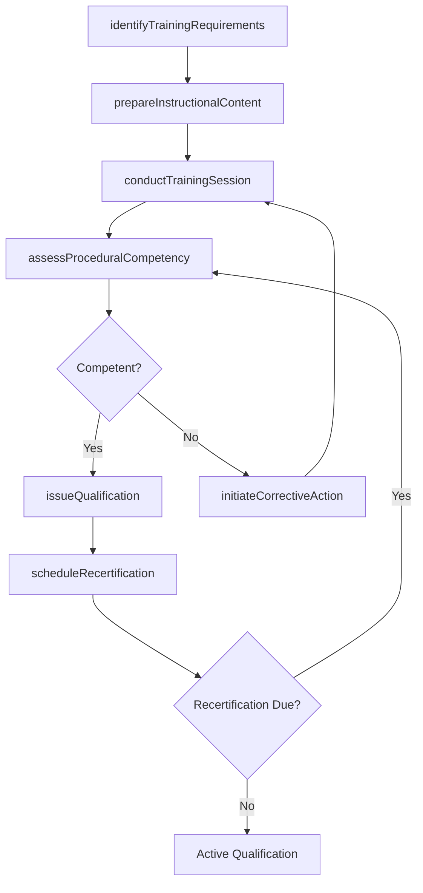
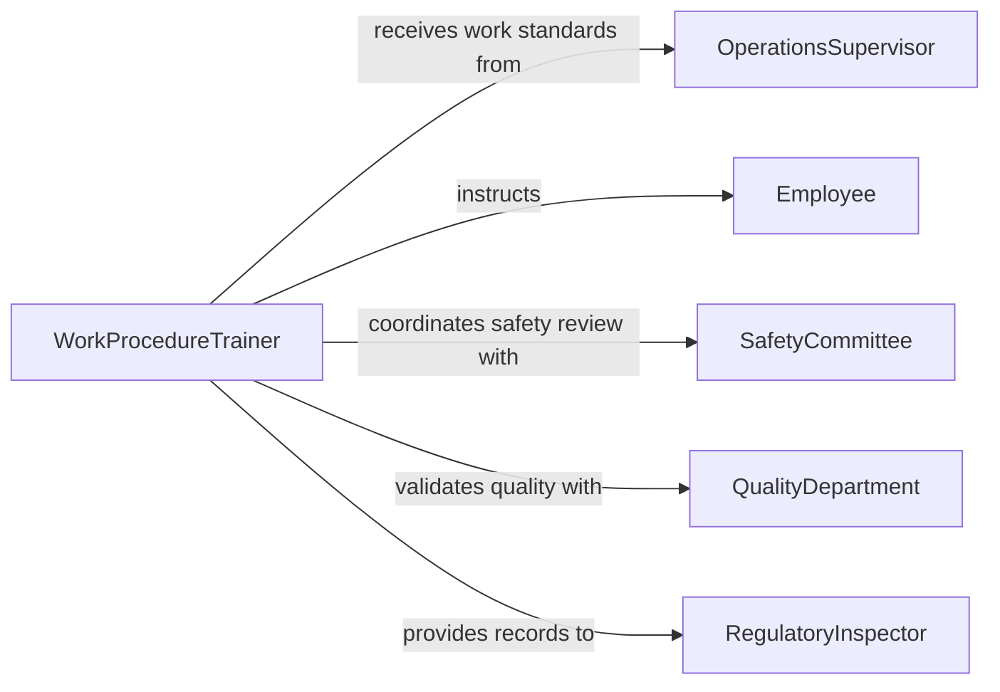

# Train Employees Proper Work Procedures

> Business-as-Code definition for training employees in proper work procedures. Models the process of documenting correct work methods, delivering procedural instruction, verifying employee competency, and maintaining ongoing compliance with established standards.

## Overview

Training employees in proper work procedures involves translating documented work instructions into instructional programs, delivering hands-on and classroom training, verifying that employees can perform tasks correctly, and managing recertification cycles. This definition exposes actions for aligning training content with work instructions, delivering multi-format instruction, assessing procedural adherence, and tracking workforce qualification status.

## Actors

| Actor | Description |
|-------|-------------|
| OperationsSupervisor | Defines work standards and identifies employees requiring training |
| Employee | The individual receiving instruction on correct work procedures |
| SafetyCommittee | Reviews procedures for safety compliance and hazard mitigation |
| QualityDepartment | Validates that trained procedures meet output quality standards |
| RegulatoryInspector | Audits adherence to mandated work procedures |

## Roles

| Role | Description |
|------|-------------|
| WorkProcedureTrainer | Delivers instruction on correct methods and work standards |
| ProcessDocumentationSpecialist | Maintains and updates work instruction documents |
| CompetencyAssessor | Evaluates employee performance against procedural standards |
| TrainingRecordsClerk | Manages qualification records and recertification schedules |

## Entities

| Entity | Description |
|--------|-------------|
| WorkInstruction | A step-by-step document describing the correct method for a task |
| ProceduralTrainingSession | A scheduled event for delivering work procedure instruction |
| CompetencyEvaluation | An assessment of an employee's ability to perform a procedure correctly |
| QualificationRecord | A formal document attesting to an employee's procedural proficiency |
| CorrectiveActionPlan | A remediation plan for employees who do not meet procedural standards |
| WorkStandard | The benchmark criteria defining acceptable procedure execution |

## Actions

| Action | Description |
|--------|-------------|
| identifyTrainingRequirements | Determine which employees need training on which procedures |
| prepareInstructionalContent | Develop training materials from current work instructions |
| conductTrainingSession | Deliver procedural instruction in classroom or on-the-job format |
| assessProceduralCompetency | Evaluate employee performance through observation or testing |
| issueQualification | Formally document that an employee meets procedural standards |
| initiateCorrectiveAction | Create a remediation plan for employees with procedural deficiencies |
| scheduleRecertification | Set periodic re-evaluation dates for qualified employees |

## Events

| Event | Description |
|-------|-------------|
| trainingRequirementsIdentified | Employees needing procedural training have been determined |
| instructionalContentPrepared | Training materials have been developed from work instructions |
| trainingSessionConducted | A procedural training session has been delivered |
| competencyAssessed | An employee has been evaluated on procedural performance |
| qualificationIssued | An employee has been formally qualified on a procedure |
| correctiveActionInitiated | A remediation plan has been created for a procedural deficiency |
| recertificationScheduled | A re-evaluation date has been established for a qualified employee |

## Searches

| Search | Description |
|--------|-------------|
| findUnqualifiedEmployees | Identify employees lacking qualifications for required procedures |
| getQualificationStatus | Retrieve an employee's current procedural qualification records |
| getRecertificationsDue | List employees whose qualifications expire within a given period |
| findCorrectiveActions | Retrieve open corrective action plans by employee or procedure |
| getTrainingHistory | List all procedural training sessions an employee has attended |

## Workflow



## Actor Relationships



## Usage

### Calling Actions

```typescript
import { trainEmployeesProperWorkProcedures } from '@headlessly/train-employees-proper-work-procedures'

const training = trainEmployeesProperWorkProcedures()

// Identify training requirements
const requirements = await training.identifyTrainingRequirements({
  department: 'Assembly',
  workInstructions: ['WI-ASM-001', 'WI-ASM-002', 'WI-ASM-003'],
  newHires: ['EMP-7701', 'EMP-7702']
})

// Conduct a training session
const session = await training.conductTrainingSession({
  workInstructionId: 'WI-ASM-001',
  format: 'on-the-job',
  trainerId: 'TRN-015',
  participants: ['EMP-7701', 'EMP-7702'],
  date: '2026-03-20'
})

// Issue qualification after assessment
await training.issueQualification({
  employeeId: 'EMP-7701',
  workInstructionId: 'WI-ASM-001',
  qualifiedDate: '2026-03-20',
  validUntil: '2027-03-20'
})
```

### Event-Driven Automation

```typescript
// Initiate corrective action on failed assessment
training.competencyAssessed(async ({ employeeId, workInstructionId, passed, deficiencies }) => {
  if (!passed) {
    await training.initiateCorrectiveAction({
      employeeId,
      workInstructionId,
      deficiencies,
      targetCompletionDate: addDays(new Date(), 14)
    })
  }
})

// Notify before recertification expires
training.recertificationScheduled(async ({ employeeId, workInstructionId, dueDate }) => {
  await scheduleReminder({
    date: daysBeforeDate(dueDate, 30),
    to: employeeId,
    message: `Your qualification for ${workInstructionId} expires on ${dueDate}. Please schedule reassessment.`
  })
})
```
