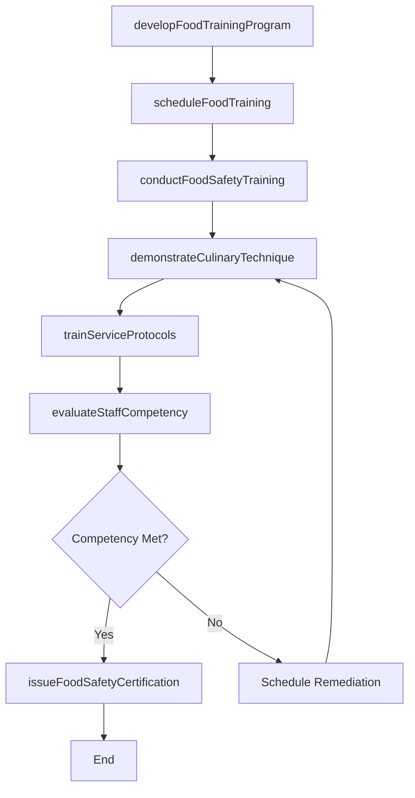
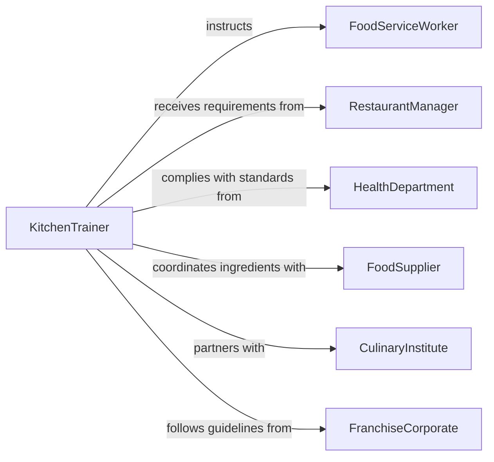

# Train Food Preparation Food Service

> Business-as-Code definition for training food preparation or food service personnel. Models the process of developing culinary and service instruction programs, delivering kitchen and front-of-house training, and certifying staff in food safety and service standards.

## Overview

Training food preparation or food service personnel involves instructing kitchen staff, servers, and hospitality workers on cooking techniques, food handling standards, customer service protocols, and health code compliance. This definition exposes actions for designing food service training curricula, scheduling hands-on kitchen and floor training, conducting food safety certifications, and evaluating staff readiness to perform in food preparation and service environments.

## Actors

| Actor | Description |
|-------|-------------|
| FoodServiceWorker | Individual receiving training on food preparation or customer service |
| RestaurantManager | Oversees dining operations and identifies staff training requirements |
| HealthDepartment | Regulatory authority enforcing food safety and sanitation standards |
| FoodSupplier | Provides ingredients and may offer product-specific handling training |
| CulinaryInstitute | External educational partner providing advanced technique instruction |
| FranchiseCorporate | Parent organization establishing standardized training requirements |

## Roles

| Role | Description |
|------|-------------|
| KitchenTrainer | Delivers instruction on food preparation techniques and kitchen procedures |
| ServiceTrainer | Teaches front-of-house protocols including customer interaction and table service |
| FoodSafetyInstructor | Conducts food handling and sanitation certification training |
| TrainingCoordinator | Manages scheduling, materials, and training record documentation |

## Entities

| Entity | Description |
|--------|-------------|
| TrainingProgram | A structured curriculum covering food preparation or service skills |
| FoodSafetyCertification | A credential confirming compliance with health code and food handling standards |
| RecipeStandard | A documented preparation method specifying ingredients, portions, and techniques |
| ServiceProtocol | A defined procedure for customer interaction, order taking, or table management |
| TrainingSession | A scheduled event for delivering food service instruction |
| CompetencyEvaluation | An assessment of staff ability to perform food preparation or service tasks |

## Actions

| Action | Description |
|--------|-------------|
| developFoodTrainingProgram | Create training content for kitchen or service operations |
| scheduleFoodTraining | Plan a training session with participants, station assignments, and timing |
| conductFoodSafetyTraining | Deliver instruction on food handling, sanitation, and health code compliance |
| demonstrateCulinaryTechnique | Perform hands-on demonstration of cooking methods or plating standards |
| trainServiceProtocols | Instruct front-of-house staff on customer service and order procedures |
| evaluateStaffCompetency | Assess whether personnel can perform food preparation or service tasks |
| issueFoodSafetyCertification | Grant food handling certification upon successful training completion |

## Events

| Event | Description |
|-------|-------------|
| foodTrainingProgramDeveloped | A food service or preparation training curriculum has been created |
| foodTrainingScheduled | A kitchen or service training session has been planned |
| foodSafetyTrainingCompleted | Food handling and sanitation instruction has been delivered |
| culinaryTechniqueDemonstrated | A cooking technique demonstration has been completed |
| serviceProtocolsTrained | Front-of-house service instruction has been delivered |
| staffCompetencyEvaluated | Staff food preparation or service ability has been assessed |
| foodSafetyCertificationIssued | A food handling certification has been granted to a worker |

## Searches

| Search | Description |
|--------|-------------|
| findTrainingPrograms | List food service training programs by type, location, or certification level |
| getCertifications | Retrieve food safety certifications by worker, status, or expiration date |
| getCompetencyResults | Look up staff evaluation outcomes by role, session, or skill area |
| findCertificationGaps | Identify staff members with expired or missing food safety certifications |

## Workflow



## Actor Relationships



## Usage

### Calling Actions

```typescript
import { trainFoodPreparationFoodService } from '@headlessly/train-food-preparation-food-service'

const foodTraining = trainFoodPreparationFoodService()

// Develop a kitchen training program
const program = await foodTraining.developFoodTrainingProgram({
  type: 'line-cook-onboarding',
  modules: ['knife-skills', 'station-setup', 'cooking-methods', 'plating-standards'],
  safetyModules: ['food-handling', 'allergen-awareness', 'fire-safety']
})

// Conduct food safety certification training
await foodTraining.conductFoodSafetyTraining({
  participantIds: ['staff-101', 'staff-102', 'staff-103'],
  topics: ['temperature-control', 'cross-contamination-prevention', 'personal-hygiene'],
  certificationLevel: 'servsafe-food-handler'
})

// Evaluate staff competency
const evaluation = await foodTraining.evaluateStaffCompetency({
  workerId: 'staff-101',
  programId: program.id,
  criteria: ['food-safety-compliance', 'preparation-accuracy', 'timing-efficiency']
})
```

### Event-Driven Automation

```typescript
// Auto-issue certification when safety training is passed
foodTraining.staffCompetencyEvaluated(async ({ workerId, passed, certificationLevel }) => {
  if (passed && certificationLevel) {
    await foodTraining.issueFoodSafetyCertification({
      workerId,
      type: certificationLevel,
      validUntil: '2028-03-01'
    })
  }
})

// Alert manager when certifications are about to expire
foodTraining.foodSafetyCertificationIssued(async ({ workerId, validUntil }) => {
  const expirationWarning = subtractDays(validUntil, 30)
  await scheduleReminder({
    date: expirationWarning,
    to: 'restaurant-manager',
    message: `Food safety certification for ${workerId} expires on ${validUntil}`
  })
})
```
