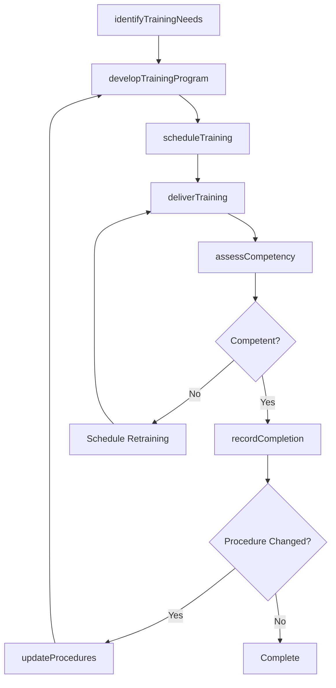
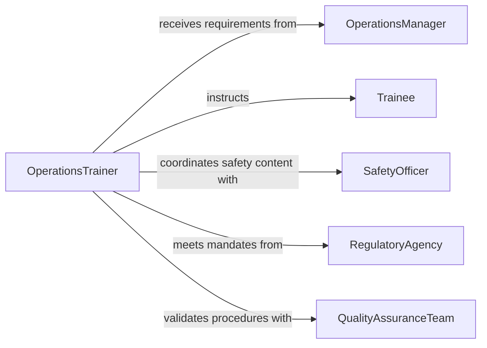

# Train Others Operational Procedures

> Business-as-Code definition for training others in operational procedures. Models the process of developing procedural training programs, delivering instruction, and verifying that personnel can perform standard operations correctly and safely.

## Overview

Training others in operational procedures involves identifying required procedural knowledge, creating instructional content aligned with standard operating procedures, delivering classroom or on-the-job training, and assessing participant comprehension. This definition exposes actions for training lifecycle management, events for compliance tracking, and searches for monitoring training status across the organization.

## Actors

| Actor | Description |
|-------|-------------|
| OperationsManager | Defines operational standards and identifies training requirements |
| Trainee | The individual receiving instruction on operational procedures |
| SafetyOfficer | Ensures training content addresses safety-critical procedures |
| RegulatoryAgency | Mandates procedural training requirements for the industry |
| QualityAssuranceTeam | Validates that trained procedures meet quality standards |

## Roles

| Role | Description |
|------|-------------|
| OperationsTrainer | Designs and delivers training on standard operating procedures |
| TrainingCoordinator | Manages scheduling, enrollment, and record-keeping |
| SubjectMatterExpert | Provides technical content and validates procedural accuracy |
| TrainingAssessor | Evaluates trainee competency through observation and testing |

## Entities

| Entity | Description |
|--------|-------------|
| OperatingProcedure | A documented standard operating procedure used as training basis |
| TrainingProgram | The structured plan covering scope, schedule, and objectives |
| TrainingSession | A scheduled delivery event for procedural instruction |
| CompetencyRecord | Documentation of a trainee's assessed procedural proficiency |
| TrainingMaterial | Job aids, procedure manuals, and instructional presentations |
| ComplianceRequirement | A regulatory or organizational mandate for procedural training |

## Actions

| Action | Description |
|--------|-------------|
| identifyTrainingNeeds | Assess gaps between current skills and procedural requirements |
| developTrainingProgram | Create a structured program with objectives and materials |
| scheduleTraining | Set session dates, assign trainers, and enroll participants |
| deliverTraining | Conduct the procedural training session |
| assessCompetency | Evaluate trainee understanding through tests or observations |
| recordCompletion | Document that a trainee has successfully completed training |
| updateProcedures | Revise training content when operating procedures change |

## Events

| Event | Description |
|-------|-------------|
| trainingNeedsIdentified | A gap analysis has revealed required procedural training |
| trainingProgramDeveloped | A new training program has been created and approved |
| trainingScheduled | A session has been added to the training calendar |
| trainingDelivered | An operational procedures training session has been completed |
| competencyAssessed | A trainee has been evaluated on procedural knowledge |
| completionRecorded | A trainee's successful completion has been documented |
| proceduresUpdated | Training content has been revised to reflect procedure changes |

## Searches

| Search | Description |
|--------|-------------|
| findTrainingByProcedure | List training programs associated with a specific operating procedure |
| getTraineeStatus | Retrieve completion and competency records for a given individual |
| getOverdueTraining | Identify personnel with expired or incomplete procedural training |
| findUpcomingSessions | List scheduled training sessions within a date range |

## Workflow



## Actor Relationships



## Usage

### Calling Actions

```typescript
import { trainOthersOperationalProcedures } from '@headlessly/train-others-operational-procedures'

const training = trainOthersOperationalProcedures()

// Identify training needs for a department
const needs = await training.identifyTrainingNeeds({
  department: 'Manufacturing',
  procedures: ['SOP-200', 'SOP-201', 'SOP-205'],
  personnel: ['EMP-1001', 'EMP-1002', 'EMP-1003']
})

// Develop a training program
const program = await training.developTrainingProgram({
  name: 'Q2 Manufacturing Procedures Update',
  procedures: needs.gaps.map(g => g.procedureId),
  objectives: ['Understand revised safety lockout procedures', 'Demonstrate correct equipment startup sequence'],
  duration: { hours: 4 }
})

// Record completion after assessment
await training.recordCompletion({
  sessionId: 'SES-20260315',
  traineeId: 'EMP-1001',
  score: 92,
  certifiedUntil: '2027-03-15'
})
```

### Event-Driven Automation

```typescript
// Alert when procedures are updated
training.proceduresUpdated(async ({ procedureId, changes }) => {
  const affected = await training.findTrainingByProcedure({ procedureId })
  await notify({
    to: 'training-coordinators',
    message: `Procedure ${procedureId} updated. ${affected.length} training programs require revision.`
  })
})

// Flag overdue training
training.completionRecorded(async ({ traineeId, certifiedUntil }) => {
  await scheduleReminder({
    date: daysBeforeDate(certifiedUntil, 30),
    to: traineeId,
    message: 'Your operational procedures certification expires in 30 days. Please schedule retraining.'
  })
})
```
