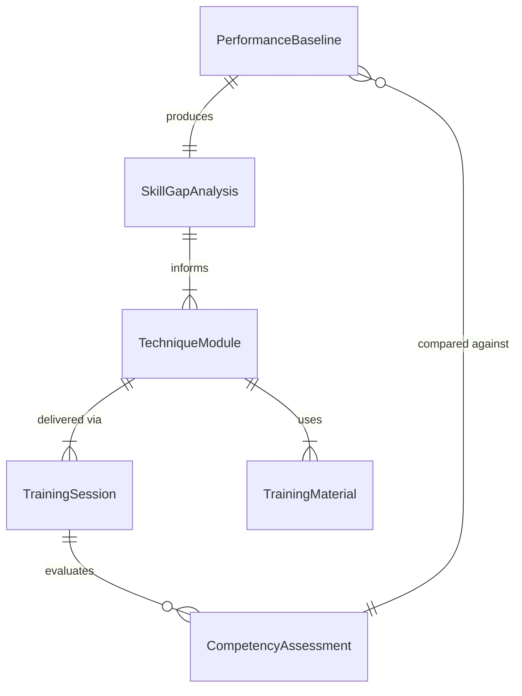
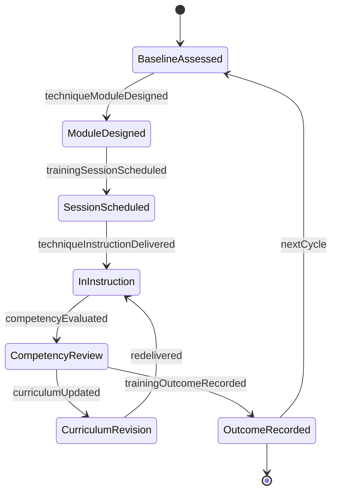
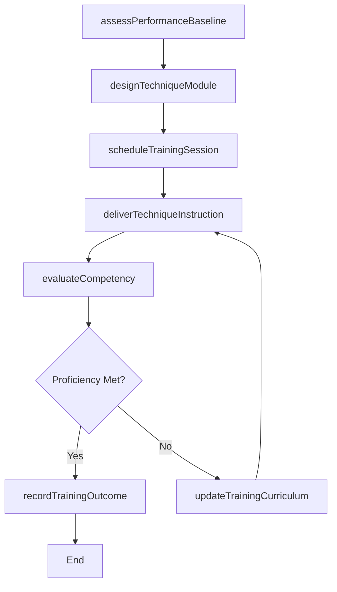
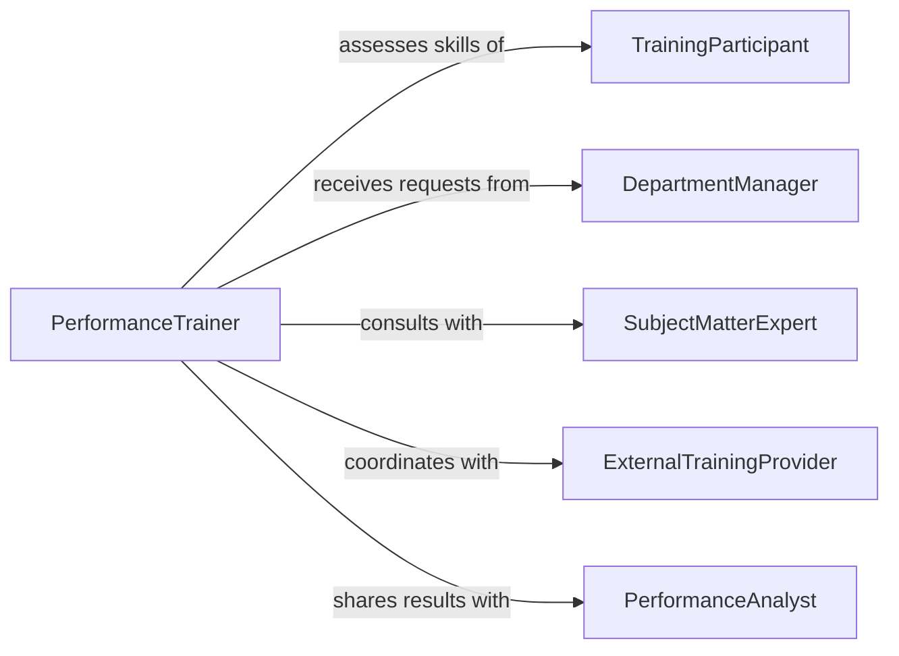

# Train Others Performance Techniques

> Business-as-Code definition for training others on performance techniques. Models the end-to-end process of identifying performance gaps, designing technique-focused training sessions, delivering instruction, and measuring skill acquisition outcomes.

## Overview

Training others on performance techniques involves coaching individuals and teams on methods, practices, and approaches that improve operational effectiveness and output quality. This definition exposes actions for assessing current performance levels, designing targeted technique training, delivering hands-on instruction sessions, and evaluating post-training proficiency gains across disciplines such as athletics, performing arts, manufacturing, and professional services.

## Actors

| Actor | Description |
|-------|-------------|
| TrainingParticipant | Individual receiving instruction on performance techniques |
| DepartmentManager | Requests training for team members and validates relevance |
| SubjectMatterExpert | Provides domain-specific knowledge for technique development |
| ExternalTrainingProvider | Third-party organization delivering specialized technique programs |
| PerformanceAnalyst | Evaluates baseline and post-training performance metrics |

## Roles

| Role | Description |
|------|-------------|
| PerformanceTrainer | Designs and delivers technique-focused training sessions |
| TrainingCoordinator | Schedules sessions, manages logistics, and tracks enrollment |
| SkillsAssessor | Evaluates trainee competency before and after instruction |
| CurriculumDesigner | Develops training materials and technique demonstration guides |

## Entities

| Entity | Description |
|--------|-------------|
| TechniqueModule | A structured unit of instruction focused on a specific performance method |
| TrainingSession | A scheduled event where technique instruction is delivered |
| PerformanceBaseline | Pre-training measurement of a participant's current skill level |
| CompetencyAssessment | Evaluation of technique mastery following training delivery |
| TrainingMaterial | Documentation, videos, or guides supporting technique instruction |
| SkillGapAnalysis | Report identifying the difference between current and target proficiency |

## Actions

| Action | Description |
|--------|-------------|
| assessPerformanceBaseline | Measure current technique proficiency of participants |
| designTechniqueModule | Create a structured training unit for a specific performance method |
| scheduleTrainingSession | Plan and assign a session with participants, venue, and timing |
| deliverTechniqueInstruction | Conduct hands-on coaching and demonstration of techniques |
| evaluateCompetency | Assess participant mastery after training delivery |
| recordTrainingOutcome | Document results, attendance, and assessment scores |
| updateTrainingCurriculum | Revise materials based on feedback and outcome analysis |

## Events

| Event | Description |
|-------|-------------|
| performanceBaselineAssessed | Participant skill levels have been measured prior to training |
| techniqueModuleDesigned | A new training module for a performance technique has been created |
| trainingSessionScheduled | A technique training session has been planned and confirmed |
| techniqueInstructionDelivered | Hands-on technique coaching has been completed |
| competencyEvaluated | Post-training assessment of technique mastery has been recorded |
| trainingOutcomeRecorded | Session results and participant scores have been documented |
| curriculumUpdated | Training materials have been revised based on outcomes |

## Searches

| Search | Description |
|--------|-------------|
| findTechniqueModules | List training modules by technique type, skill level, or domain |
| getTrainingSessions | Retrieve scheduled or completed sessions by date, trainer, or group |
| getCompetencyResults | Look up assessment scores by participant, session, or technique |
| findSkillGaps | Identify participants or teams with performance below target thresholds |

## Entity Relationships



## State Diagram



## Workflow



## Actor Relationships



## Usage

### Calling Actions

```typescript
import { trainOthersPerformanceTechniques } from '@headlessly/train-others-performance-techniques'

const techniques = trainOthersPerformanceTechniques()

// Assess current performance levels
const baseline = await techniques.assessPerformanceBaseline({
  participantIds: ['emp-401', 'emp-402', 'emp-403'],
  techniqueArea: 'precision-assembly',
  metrics: ['speed', 'accuracy', 'consistency']
})

// Design a technique training module
const module = await techniques.designTechniqueModule({
  name: 'Advanced Precision Assembly Techniques',
  targetSkillLevel: 'intermediate',
  duration: { hours: 4 },
  prerequisites: ['basic-assembly-certification']
})

// Schedule and deliver training
const session = await techniques.scheduleTrainingSession({
  moduleId: module.id,
  participantIds: baseline.participantsBelow('intermediate'),
  scheduledDate: '2026-03-15',
  location: 'Training Lab B'
})
```

### Event-Driven Automation

```typescript
// Trigger remediation when competency is not met
techniques.competencyEvaluated(async ({ participantId, score, threshold }) => {
  if (score < threshold) {
    await techniques.scheduleTrainingSession({
      moduleId: 'remediation-module',
      participantIds: [participantId],
      scheduledDate: nextAvailableDate()
    })
  }
})

// Notify managers when training outcomes are recorded
techniques.trainingOutcomeRecorded(async ({ sessionId, averageScore }) => {
  const session = await techniques.getTrainingSessions({ sessionId })
  await notify({
    to: session.requestedBy,
    message: `Training session completed with average score of ${averageScore}%`
  })
})
```
