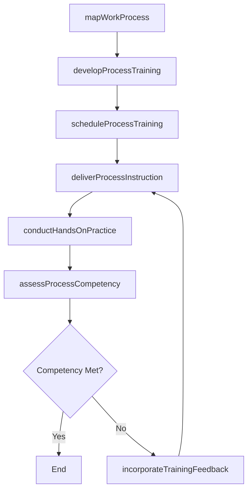
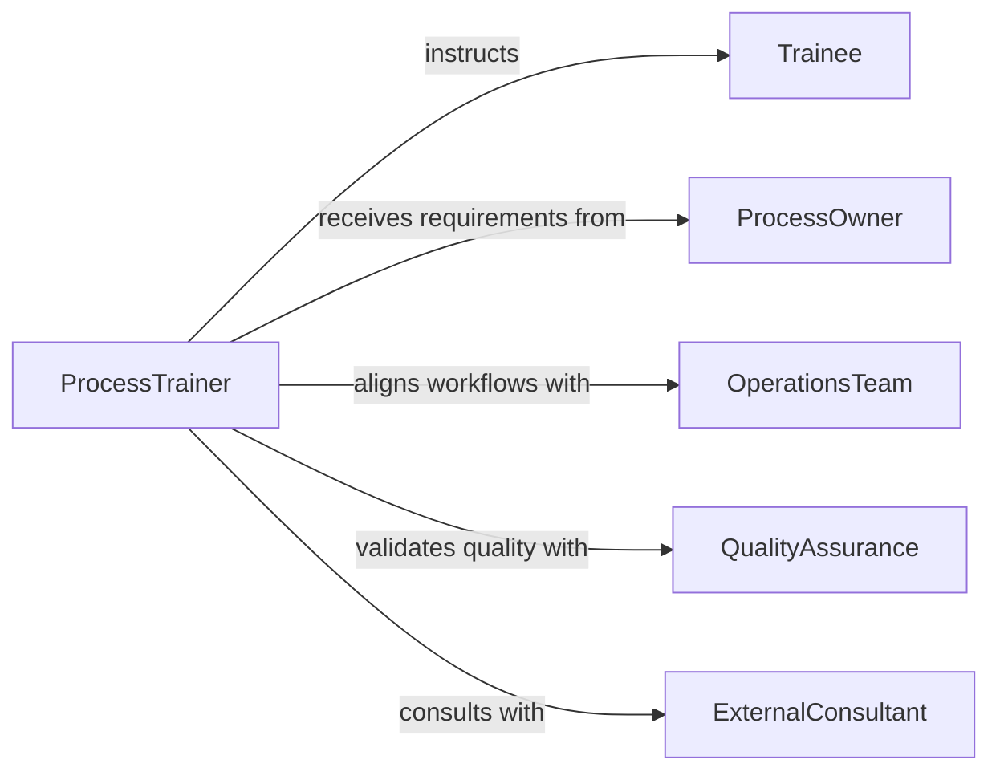

# Train Others Work Processes

> Business-as-Code definition for training others on work processes. Models the full cycle of identifying process knowledge gaps, designing workflow-based training, delivering structured instruction, and verifying that personnel can execute business processes independently.

## Overview

Training others on work processes involves instructing employees and team members on the standard workflows, methods, and operational sequences that define how work gets done within an organization. This definition exposes actions for mapping current processes, creating process-oriented training materials, conducting hands-on workflow training, assessing trainee readiness, and continuously improving training content based on process changes and feedback.

## Actors

| Actor | Description |
|-------|-------------|
| Trainee | Individual learning to execute a specific work process |
| ProcessOwner | Manager or lead responsible for a business process and its training requirements |
| OperationsTeam | Department that defines and maintains standard work processes |
| QualityAssurance | Internal function validating that trained processes meet quality standards |
| ExternalConsultant | Third-party specialist engaged for process improvement and training design |

## Roles

| Role | Description |
|------|-------------|
| ProcessTrainer | Delivers instruction on standard work processes and operational workflows |
| TrainingDeveloper | Creates process documentation, job aids, and training materials |
| WorkflowAnalyst | Maps existing processes and identifies training priorities |
| CompetencyReviewer | Evaluates whether trainees can perform processes independently |

## Entities

| Entity | Description |
|--------|-------------|
| WorkProcess | A defined sequence of steps that produces a business outcome |
| ProcessMap | A visual representation of a workflow showing steps, decisions, and handoffs |
| TrainingModule | A structured instructional unit covering one or more process steps |
| JobAid | A quick-reference guide used on-the-job to support process execution |
| CompetencyCheckpoint | An evaluation point confirming trainee readiness at a specific process stage |
| TrainingFeedback | Input from trainees or supervisors on training effectiveness |

## Actions

| Action | Description |
|--------|-------------|
| mapWorkProcess | Document the steps, decisions, and handoffs in a business process |
| developProcessTraining | Create training modules and job aids for a specific work process |
| scheduleProcessTraining | Plan a training session with participants, timing, and format |
| deliverProcessInstruction | Conduct structured training on work process execution |
| conductHandsOnPractice | Facilitate supervised practice where trainees execute the process |
| assessProcessCompetency | Evaluate whether trainees can independently execute the process |
| incorporateTrainingFeedback | Update training materials based on participant and supervisor input |

## Events

| Event | Description |
|-------|-------------|
| workProcessMapped | A business process has been documented with steps and decision points |
| processTrainingDeveloped | Training modules for a work process have been created |
| processTrainingScheduled | A process training session has been planned and confirmed |
| processInstructionDelivered | Structured training on a work process has been completed |
| handsOnPracticeCompleted | Supervised process practice has been finished |
| processCompetencyAssessed | Trainee ability to execute a process independently has been evaluated |
| trainingFeedbackIncorporated | Training materials have been updated based on feedback |

## Searches

| Search | Description |
|--------|-------------|
| findWorkProcesses | List documented processes by department, type, or training status |
| getTrainingModules | Retrieve process training modules by process, version, or difficulty |
| getCompetencyResults | Look up trainee assessment outcomes by process, date, or status |
| findTrainingGaps | Identify personnel who have not been trained on required processes |

## Workflow



## Actor Relationships



## Usage

### Calling Actions

```typescript
import { trainOthersWorkProcesses } from '@headlessly/train-others-work-processes'

const workProcesses = trainOthersWorkProcesses()

// Map a business process
const processMap = await workProcesses.mapWorkProcess({
  name: 'Purchase Order Approval',
  department: 'procurement',
  steps: [
    { order: 1, name: 'Submit requisition', actor: 'Requester' },
    { order: 2, name: 'Review and validate', actor: 'ProcurementAnalyst' },
    { order: 3, name: 'Approve purchase order', actor: 'BudgetApprover' },
    { order: 4, name: 'Issue to supplier', actor: 'ProcurementAnalyst' }
  ]
})

// Develop and schedule training
const module = await workProcesses.developProcessTraining({
  processId: processMap.id,
  includeJobAids: true,
  targetAudience: 'new-procurement-staff'
})

const session = await workProcesses.scheduleProcessTraining({
  moduleId: module.id,
  participantIds: ['emp-501', 'emp-502'],
  scheduledDate: '2026-04-01',
  format: 'in-person-workshop'
})
```

### Event-Driven Automation

```typescript
// Notify process owner when competency assessment is complete
workProcesses.processCompetencyAssessed(async ({ traineeId, processId, passed }) => {
  const process = await workProcesses.findWorkProcesses({ processId })
  await notify({
    to: process.ownerId,
    message: `${traineeId} ${passed ? 'passed' : 'did not pass'} competency for ${process.name}`
  })
})

// Auto-retrain when a process map is updated
workProcesses.workProcessMapped(async ({ processId, isRevision }) => {
  if (isRevision) {
    const gaps = await workProcesses.findTrainingGaps({ processId })
    if (gaps.length > 0) {
      await workProcesses.scheduleProcessTraining({
        processId,
        participantIds: gaps.map(g => g.employeeId),
        scheduledDate: nextAvailableDate(),
        format: 'refresher'
      })
    }
  }
})
```
