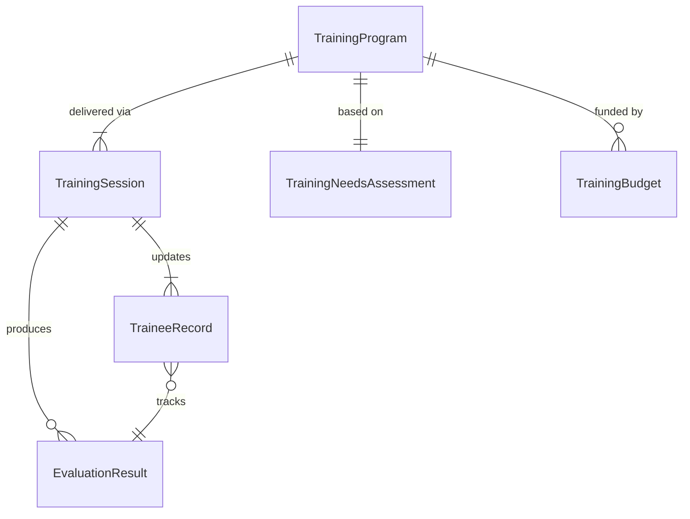
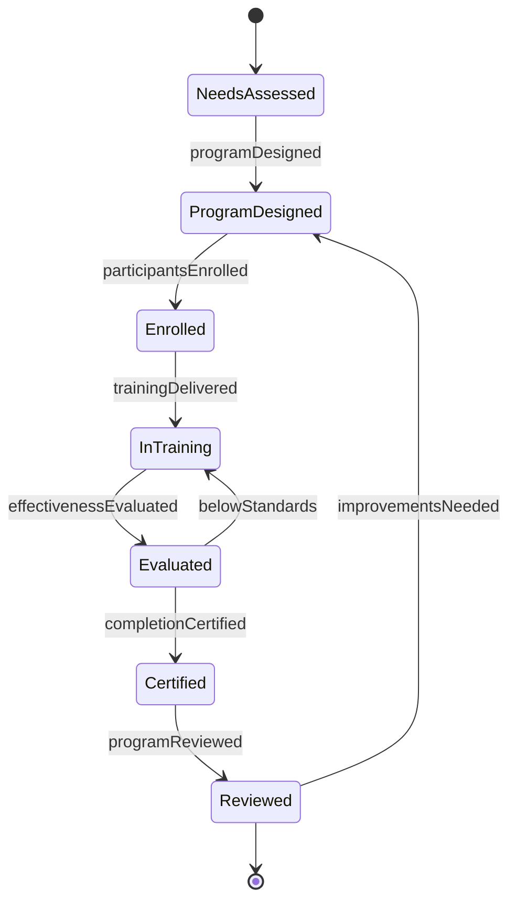
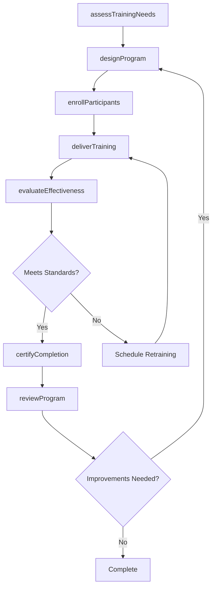
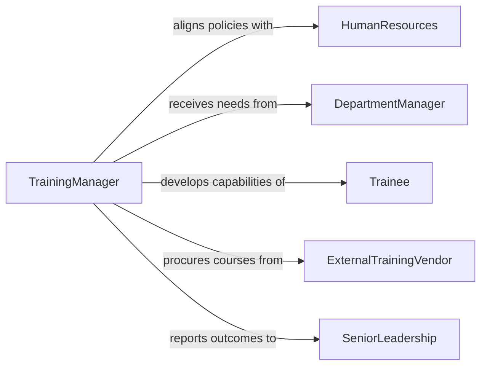

# Train Personnel

> Business-as-Code definition for training personnel. Models the general-purpose workforce training lifecycle from needs assessment through program delivery, evaluation, and continuous improvement.

## Overview

Training personnel encompasses the broad activity of assessing workforce development needs, designing training programs, delivering instruction across multiple formats, and measuring effectiveness. This definition exposes actions for each phase of the training cycle, events for tracking progress and outcomes, and searches for managing training records across the organization. It serves as the foundational training pattern applicable to any department or function.

## Actors

| Actor | Description |
|-------|-------------|
| HumanResources | Defines organizational training policies and budgets |
| DepartmentManager | Identifies team-level training needs and approves participation |
| Trainee | The employee receiving instruction and development |
| ExternalTrainingVendor | Provides specialized courses, certifications, or platforms |
| SeniorLeadership | Sets strategic priorities that drive training initiatives |

## Roles

| Role | Description |
|------|-------------|
| TrainingManager | Oversees the training function and program portfolio |
| Trainer | Designs and delivers instructional sessions |
| TrainingCoordinator | Handles logistics, enrollment, and scheduling |
| PerformanceConsultant | Links training programs to measurable performance outcomes |

## Entities

| Entity | Description |
|--------|-------------|
| TrainingProgram | A structured initiative with defined objectives and curriculum |
| TrainingSession | A scheduled delivery event for a training module |
| TraineeRecord | An individual employee's training history and certifications |
| TrainingNeedsAssessment | An analysis identifying skill gaps and development priorities |
| EvaluationResult | Measured outcomes from post-training assessments or surveys |
| TrainingBudget | The allocated financial resources for training activities |

## Actions

| Action | Description |
|--------|-------------|
| assessTrainingNeeds | Identify organizational and individual skill gaps |
| designProgram | Create a training program with objectives, content, and methods |
| enrollParticipants | Register employees for scheduled training sessions |
| deliverTraining | Conduct the training session in the designated format |
| evaluateEffectiveness | Measure training outcomes through assessments and feedback |
| certifyCompletion | Issue formal documentation of training completion |
| reviewProgram | Analyze program performance and identify improvements |

## Events

| Event | Description |
|-------|-------------|
| trainingNeedsAssessed | A workforce skill gap analysis has been completed |
| programDesigned | A new training program has been created and approved |
| participantsEnrolled | Employees have been registered for a training session |
| trainingDelivered | A training session has been conducted |
| effectivenessEvaluated | Post-training assessment results have been compiled |
| completionCertified | An employee's training completion has been formally documented |
| programReviewed | A training program performance review has been completed |

## Searches

| Search | Description |
|--------|-------------|
| findProgramsByDepartment | List training programs available for a specific department |
| getTraineeHistory | Retrieve the full training record for an individual employee |
| getCompletionRates | Calculate training completion percentages by program or department |
| findScheduledSessions | List upcoming training sessions with availability |

## Entity Relationships



## State Diagram



## Workflow



## Actor Relationships



## Usage

### Calling Actions

```typescript
import { trainPersonnel } from '@headlessly/train-personnel'

const training = trainPersonnel()

// Assess training needs
const needs = await training.assessTrainingNeeds({
  department: 'Customer Support',
  period: 'Q2-2026',
  competencyFramework: 'customer-service-excellence'
})

// Design a training program
const program = await training.designProgram({
  name: 'Customer Escalation Handling',
  objectives: ['De-escalation techniques', 'Complaint resolution workflows', 'CRM system proficiency'],
  format: 'blended',
  duration: { hours: 8 }
})

// Enroll participants
await training.enrollParticipants({
  programId: program.id,
  sessionId: 'SES-20260401',
  employeeIds: needs.priorityEmployees
})
```

### Event-Driven Automation

```typescript
// Notify managers of completion
training.completionCertified(async ({ traineeId, programId }) => {
  const manager = await getManager(traineeId)
  await notify({
    to: manager,
    message: `${traineeId} has completed training program ${programId}`
  })
})

// Auto-review programs after each cohort
training.effectivenessEvaluated(async ({ programId, averageScore, completionRate }) => {
  if (averageScore < 70 || completionRate < 0.85) {
    await training.reviewProgram({
      programId,
      reason: `Below threshold: score=${averageScore}, completion=${completionRate}`
    })
  }
})
```
