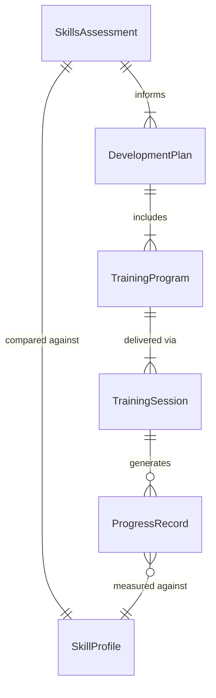
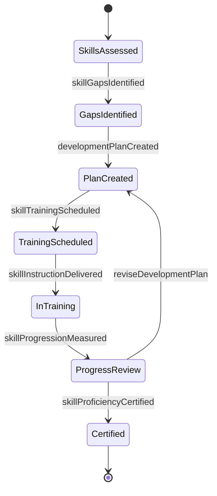
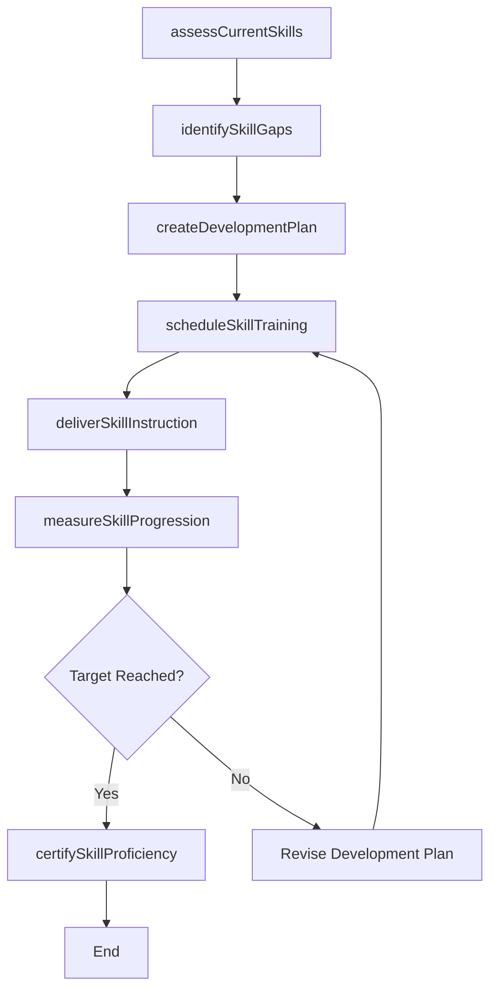
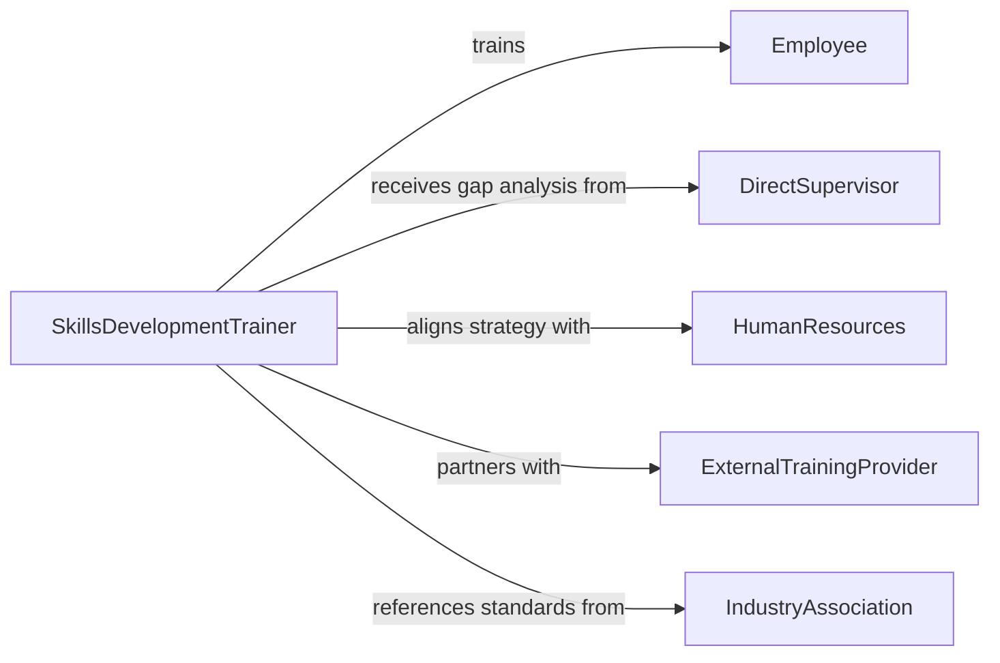

# Train Personnel Enhance Job Skills

> Business-as-Code definition for training personnel to enhance job skills. Models the end-to-end process of identifying skill development needs, designing targeted upskilling programs, delivering training, and measuring proficiency improvement.

## Overview

Training personnel to enhance job skills involves assessing current workforce capabilities, identifying skill gaps relative to job requirements, designing targeted development programs, and delivering instruction that improves employee proficiency and performance. This definition exposes actions for conducting skills assessments, building individualized development plans, scheduling and delivering training, and tracking skill progression over time.

## Actors

| Actor | Description |
|-------|-------------|
| Employee | Individual receiving training to enhance their job-related skills |
| DirectSupervisor | Manager who identifies skill gaps and nominates staff for training |
| HumanResources | Department overseeing workforce development strategy and training budgets |
| ExternalTrainingProvider | Third-party organization delivering specialized skill development programs |
| IndustryAssociation | Professional body establishing skill standards and certification benchmarks |

## Roles

| Role | Description |
|------|-------------|
| SkillsDevelopmentTrainer | Designs and delivers targeted skill enhancement instruction |
| LearningAndDevelopmentManager | Oversees the organizational skill development strategy and program portfolio |
| SkillsAssessor | Evaluates current competency levels and identifies development priorities |
| CareerDevelopmentAdvisor | Guides employees on skill progression paths and learning opportunities |

## Entities

| Entity | Description |
|--------|-------------|
| SkillsAssessment | An evaluation of an employee's current proficiency across job-relevant skills |
| DevelopmentPlan | A structured plan outlining targeted skills, training activities, and milestones |
| TrainingProgram | A designed curriculum for developing a specific set of job skills |
| SkillProfile | A catalog of competencies required for a specific job role |
| TrainingSession | A scheduled event for delivering skill development instruction |
| ProgressRecord | Documentation tracking an employee's skill improvement over time |

## Actions

| Action | Description |
|--------|-------------|
| assessCurrentSkills | Evaluate an employee's proficiency levels across job-relevant competencies |
| identifySkillGaps | Compare current proficiency against role requirements to find development needs |
| createDevelopmentPlan | Design an individualized plan with targeted skills, activities, and timelines |
| scheduleSkillTraining | Plan training sessions matched to identified skill gaps |
| deliverSkillInstruction | Conduct training focused on developing specific job competencies |
| measureSkillProgression | Track and record improvement in proficiency following training |
| certifySkillProficiency | Formally recognize that an employee has reached target skill levels |

## Events

| Event | Description |
|-------|-------------|
| currentSkillsAssessed | An employee's competency levels have been evaluated |
| skillGapsIdentified | Development needs have been determined based on role requirements |
| developmentPlanCreated | An individualized skill development plan has been established |
| skillTrainingScheduled | A skill enhancement training session has been planned |
| skillInstructionDelivered | Targeted skill development training has been completed |
| skillProgressionMeasured | Post-training proficiency improvement has been documented |
| skillProficiencyCertified | An employee has been formally recognized for reaching target skill levels |

## Searches

| Search | Description |
|--------|-------------|
| findSkillGaps | Identify employees or teams with proficiency below target levels |
| getDevelopmentPlans | Retrieve active development plans by employee, department, or status |
| getProgressRecords | Look up skill progression data by employee, skill area, or date range |
| findTrainingOpportunities | List available training programs matched to specific skill development needs |

## Entity Relationships



## State Diagram



## Workflow



## Actor Relationships



## Usage

### Calling Actions

```typescript
import { trainPersonnelEnhanceJobSkills } from '@headlessly/train-personnel-enhance-job-skills'

const skillDev = trainPersonnelEnhanceJobSkills()

// Assess current skills and identify gaps
const assessment = await skillDev.assessCurrentSkills({
  employeeId: 'emp-701',
  roleId: 'senior-data-analyst',
  skills: ['sql-querying', 'statistical-modeling', 'data-visualization', 'stakeholder-presentation']
})

const gaps = await skillDev.identifySkillGaps({
  assessmentId: assessment.id,
  targetProfile: 'senior-data-analyst'
})

// Create a development plan
const plan = await skillDev.createDevelopmentPlan({
  employeeId: 'emp-701',
  targetSkills: gaps.skills,
  timeline: { months: 3 },
  activities: ['online-courses', 'mentoring-sessions', 'project-assignments']
})

// Schedule and deliver training
await skillDev.scheduleSkillTraining({
  planId: plan.id,
  sessions: [
    { skill: 'statistical-modeling', date: '2026-04-10', format: 'workshop' },
    { skill: 'stakeholder-presentation', date: '2026-04-17', format: 'coaching' }
  ]
})
```

### Event-Driven Automation

```typescript
// Certify proficiency when targets are met
skillDev.skillProgressionMeasured(async ({ employeeId, planId, allTargetsMet }) => {
  if (allTargetsMet) {
    await skillDev.certifySkillProficiency({
      employeeId,
      planId,
      certificationDate: new Date().toISOString()
    })
  }
})

// Notify supervisor when skill gaps are identified
skillDev.skillGapsIdentified(async ({ employeeId, gaps }) => {
  const supervisor = await getSupervisorFor(employeeId)
  await notify({
    to: supervisor.id,
    message: `Skill gaps identified for ${employeeId}: ${gaps.map(g => g.skillName).join(', ')}`
  })
})
```
