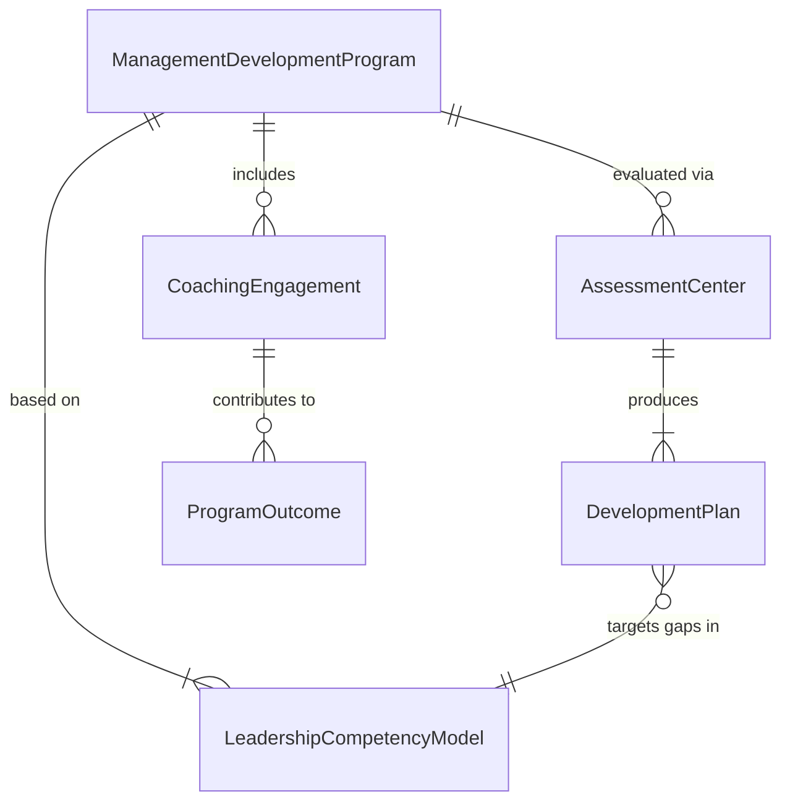
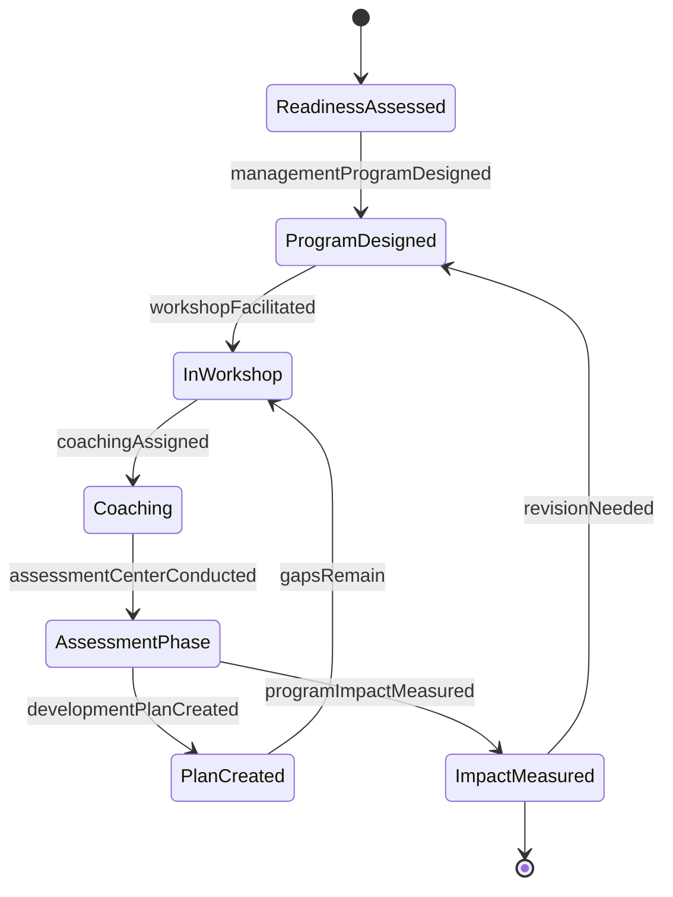
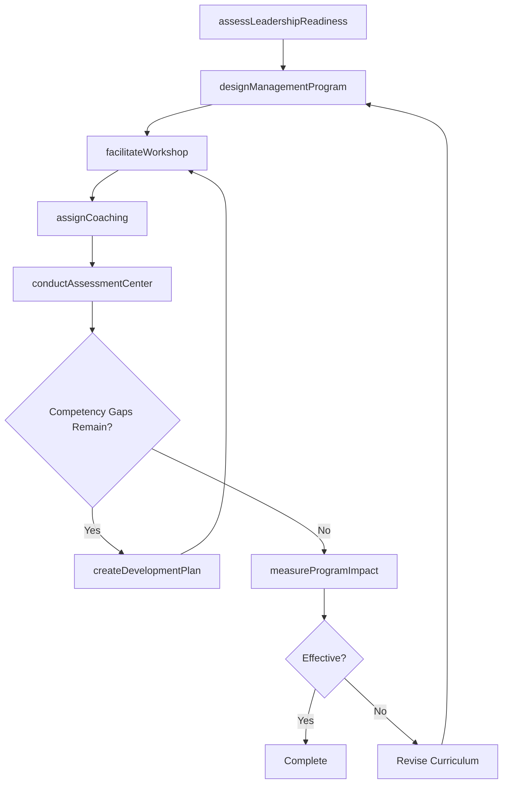
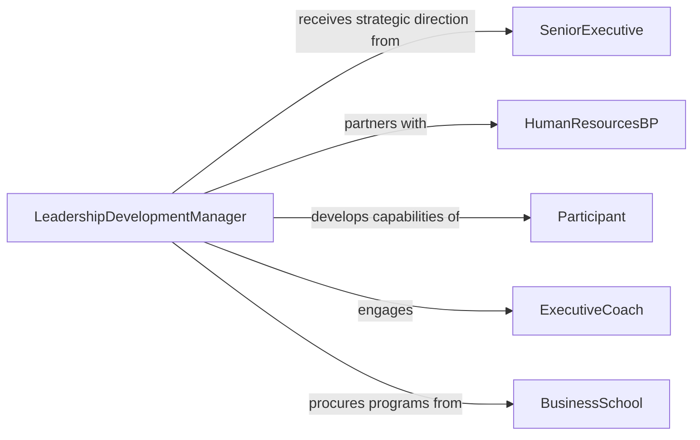

# Train Personnel Managerial Topics

> Business-as-Code definition for training personnel on managerial topics. Models the process of developing leadership curricula, delivering management development programs, and measuring the growth of supervisory and strategic competencies.

## Overview

Training personnel on managerial topics involves designing and delivering programs that develop leadership, decision-making, team management, and strategic thinking capabilities. This definition exposes actions for assessing leadership readiness, building management development curricula, facilitating workshops and coaching sessions, and evaluating competency growth. It supports succession planning and organizational leadership pipeline development.

## Actors

| Actor | Description |
|-------|-------------|
| SeniorExecutive | Sponsors management development initiatives and defines leadership expectations |
| HumanResourcesBP | Partners with business units to identify management development needs |
| Participant | The current or aspiring manager receiving training |
| ExecutiveCoach | Provides individualized leadership coaching and mentoring |
| BusinessSchool | Offers accredited management education programs and certifications |

## Roles

| Role | Description |
|------|-------------|
| LeadershipDevelopmentManager | Designs and oversees the management training portfolio |
| ManagementTrainer | Facilitates workshops, simulations, and classroom instruction |
| TalentDevelopmentSpecialist | Aligns training with succession planning and career paths |
| ProgramEvaluator | Measures training impact on managerial performance |

## Entities

| Entity | Description |
|--------|-------------|
| ManagementDevelopmentProgram | A structured curriculum covering managerial competencies |
| LeadershipCompetencyModel | The framework defining required managerial skills and behaviors |
| CoachingEngagement | A formal one-on-one coaching arrangement for leadership growth |
| AssessmentCenter | A structured evaluation of managerial capabilities through simulations |
| DevelopmentPlan | An individual's plan for building specific management competencies |
| ProgramOutcome | Measured results linking training to performance improvements |

## Actions

| Action | Description |
|--------|-------------|
| assessLeadershipReadiness | Evaluate individuals against the leadership competency model |
| designManagementProgram | Create a curriculum covering targeted managerial competencies |
| facilitateWorkshop | Conduct interactive sessions on management topics |
| assignCoaching | Pair participants with executive coaches for individualized development |
| conductAssessmentCenter | Run simulation-based evaluations of managerial capabilities |
| createDevelopmentPlan | Build an individual plan for closing management skill gaps |
| measureProgramImpact | Evaluate the effect of training on managerial performance metrics |

## Events

| Event | Description |
|-------|-------------|
| leadershipReadinessAssessed | An individual's management potential has been evaluated |
| managementProgramDesigned | A new management development curriculum has been published |
| workshopFacilitated | A management training workshop has been completed |
| coachingAssigned | A participant has been paired with an executive coach |
| assessmentCenterConducted | A simulation-based managerial evaluation has been completed |
| developmentPlanCreated | An individual management development plan has been established |
| programImpactMeasured | Training effectiveness metrics have been compiled and analyzed |

## Searches

| Search | Description |
|--------|-------------|
| findHighPotentialCandidates | Identify individuals with strong leadership readiness scores |
| getProgramsByCompetency | List programs that develop a specific managerial competency |
| getDevelopmentPlans | Retrieve individual development plans by department or participant |
| getCoachingEngagements | List active coaching arrangements and their progress |
| getProgramOutcomes | Retrieve effectiveness metrics for management programs |

## Entity Relationships



## State Diagram



## Workflow



## Actor Relationships



## Usage

### Calling Actions

```typescript
import { trainPersonnelManagerialTopics } from '@headlessly/train-personnel-managerial-topics'

const leadership = trainPersonnelManagerialTopics()

// Assess leadership readiness
const assessment = await leadership.assessLeadershipReadiness({
  participantId: 'EMP-5501',
  competencyModel: 'enterprise-leadership-v3',
  assessmentMethod: 'multi-rater-feedback'
})

// Design a management program
const program = await leadership.designManagementProgram({
  name: 'Emerging Leaders Accelerator',
  competencies: ['strategic-thinking', 'team-leadership', 'change-management', 'financial-acumen'],
  format: 'cohort-based',
  duration: { months: 6 }
})

// Assign executive coaching
await leadership.assignCoaching({
  participantId: 'EMP-5501',
  coachId: 'COACH-012',
  focusAreas: ['delegation', 'conflict-resolution'],
  sessions: 12,
  cadence: 'biweekly'
})
```

### Event-Driven Automation

```typescript
// Create development plans after assessment
leadership.assessmentCenterConducted(async ({ participantId, results }) => {
  const gaps = results.competencies.filter(c => c.score < c.target)
  if (gaps.length > 0) {
    await leadership.createDevelopmentPlan({
      participantId,
      gaps: gaps.map(g => ({ competency: g.name, currentScore: g.score, targetScore: g.target }))
    })
  }
})

// Report program impact to senior leadership
leadership.programImpactMeasured(async ({ programId, metrics }) => {
  await notify({
    to: 'senior-executive-team',
    message: `Management program ${programId}: ${metrics.participantCount} graduated, avg competency improvement ${metrics.avgImprovement}%`
  })
})
```
