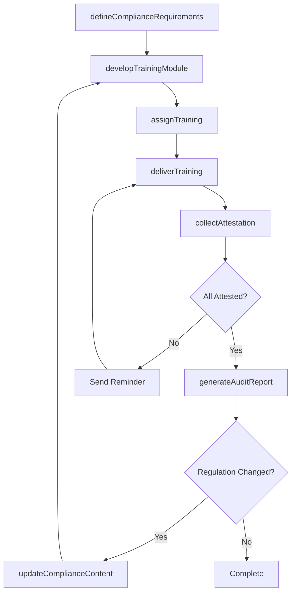
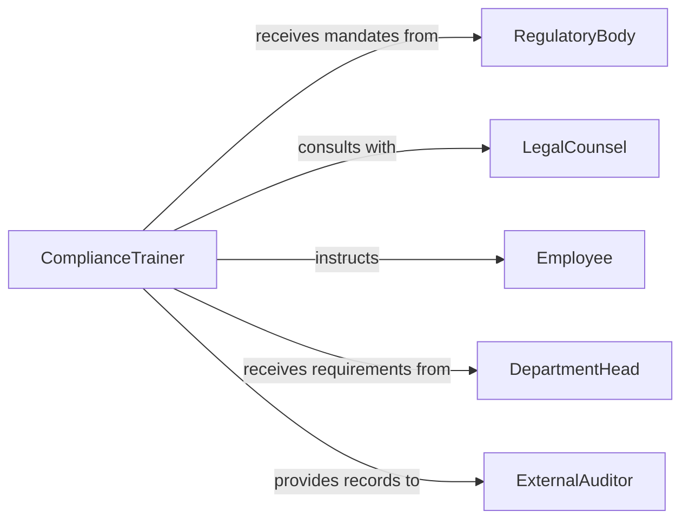

# Train Personnel Organizational Compliance Procedures

> Business-as-Code definition for training personnel in organizational or compliance procedures. Models the end-to-end process of developing compliance curricula, delivering mandatory training, tracking attestations, and maintaining audit-ready records.

## Overview

Training personnel in organizational or compliance procedures involves developing instructional programs that address regulatory mandates, internal policies, and industry standards. This definition exposes actions for creating compliance training content, scheduling and delivering sessions, tracking individual attestations, and generating audit reports. It ensures organizations maintain a documented, defensible record of workforce compliance education.

## Actors

| Actor | Description |
|-------|-------------|
| RegulatoryBody | Issues compliance mandates and conducts enforcement reviews |
| LegalCounsel | Advises on legal requirements and liability implications of training gaps |
| Employee | The individual required to complete compliance training |
| DepartmentHead | Identifies department-specific compliance requirements and nominates participants |
| ExternalAuditor | Reviews training records during compliance audits |

## Roles

| Role | Description |
|------|-------------|
| ComplianceTrainer | Develops and delivers organizational and regulatory compliance training |
| ComplianceOfficer | Defines compliance requirements and monitors organizational adherence |
| TrainingAdministrator | Manages enrollment, scheduling, and completion records |
| PolicyAnalyst | Translates regulatory changes into training content updates |

## Entities

| Entity | Description |
|--------|-------------|
| ComplianceProgram | A structured training initiative covering specific regulatory or policy areas |
| TrainingModule | An individual unit of instruction within a compliance program |
| Attestation | A signed acknowledgment that an employee has completed and understood training |
| PolicyDocument | The organizational policy or regulation referenced by the training |
| ComplianceRecord | A per-employee log of completed compliance training and certifications |
| AuditReport | A summary of training completion rates and compliance gaps |

## Actions

| Action | Description |
|--------|-------------|
| defineComplianceRequirements | Establish training mandates based on regulations and policies |
| developTrainingModule | Create instructional content for a specific compliance topic |
| assignTraining | Enroll employees in required compliance training modules |
| deliverTraining | Conduct the compliance training session or launch e-learning |
| collectAttestation | Record employee acknowledgment of training completion |
| generateAuditReport | Produce a compliance training status report for auditors |
| updateComplianceContent | Revise training materials when regulations or policies change |

## Events

| Event | Description |
|-------|-------------|
| complianceRequirementsDefined | New compliance training mandates have been established |
| trainingModuleDeveloped | A new compliance training module has been published |
| trainingAssigned | Employees have been enrolled in a compliance training module |
| trainingCompleted | An employee has finished a compliance training session |
| attestationCollected | An employee has signed the training acknowledgment |
| auditReportGenerated | A compliance training audit report has been produced |
| complianceContentUpdated | Training materials have been revised for regulatory changes |

## Searches

| Search | Description |
|--------|-------------|
| findNonCompliantPersonnel | Identify employees who have not completed required training |
| getComplianceRecords | Retrieve training completion history for an employee or department |
| getTrainingByRegulation | List training modules associated with a specific regulation |
| getAuditReports | Retrieve compliance audit reports by date range or department |
| getExpiringCertifications | Find employees whose compliance certifications are nearing expiration |

## Workflow



## Actor Relationships



## Usage

### Calling Actions

```typescript
import { trainPersonnelOrganizationalComplianceProcedures } from '@headlessly/train-personnel-organizational-compliance-procedures'

const compliance = trainPersonnelOrganizationalComplianceProcedures()

// Define compliance requirements
const requirements = await compliance.defineComplianceRequirements({
  regulation: 'OSHA-29CFR1910',
  topics: ['Hazard Communication', 'Personal Protective Equipment', 'Lockout/Tagout'],
  frequency: 'annual',
  applicableDepartments: ['Manufacturing', 'Warehouse']
})

// Assign training to employees
await compliance.assignTraining({
  moduleId: 'MOD-OSHA-2026',
  employeeIds: ['EMP-4001', 'EMP-4002', 'EMP-4003'],
  deadline: '2026-04-30'
})

// Generate an audit report
const report = await compliance.generateAuditReport({
  department: 'Manufacturing',
  period: { start: '2026-01-01', end: '2026-03-31' },
  includeNonCompliant: true
})
```

### Event-Driven Automation

```typescript
// Escalate non-completion before deadline
compliance.trainingAssigned(async ({ moduleId, employeeIds, deadline }) => {
  await scheduleReminder({
    date: daysBeforeDate(deadline, 7),
    action: async () => {
      const incomplete = await compliance.findNonCompliantPersonnel({ moduleId })
      if (incomplete.length > 0) {
        await notify({
          to: 'compliance-officer',
          message: `${incomplete.length} employees have not completed ${moduleId} with 7 days remaining`
        })
      }
    }
  })
})

// Auto-reassign training on regulation change
compliance.complianceContentUpdated(async ({ moduleId, regulation }) => {
  const affected = await compliance.getComplianceRecords({ moduleId })
  for (const record of affected) {
    await compliance.assignTraining({
      moduleId,
      employeeIds: [record.employeeId],
      deadline: addDays(new Date(), 30)
    })
  }
})
```
