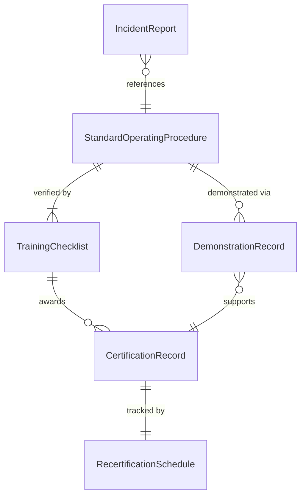
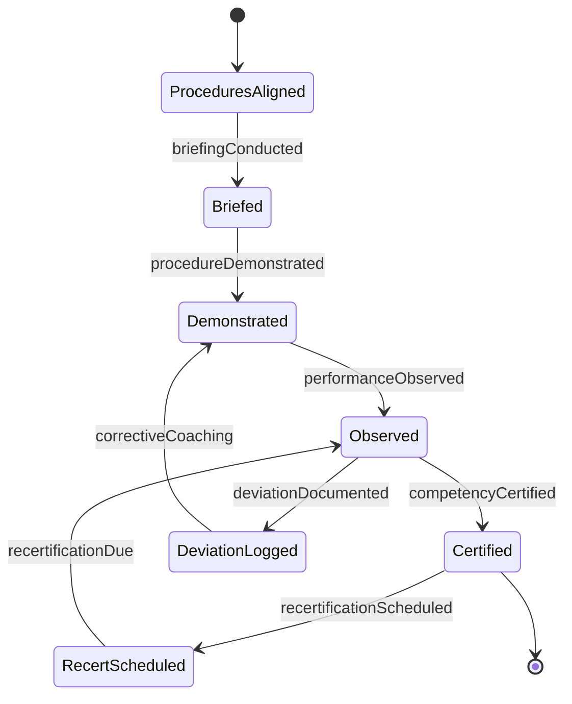
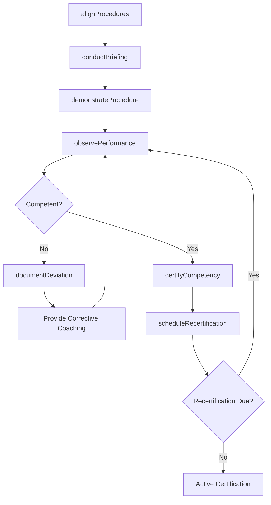
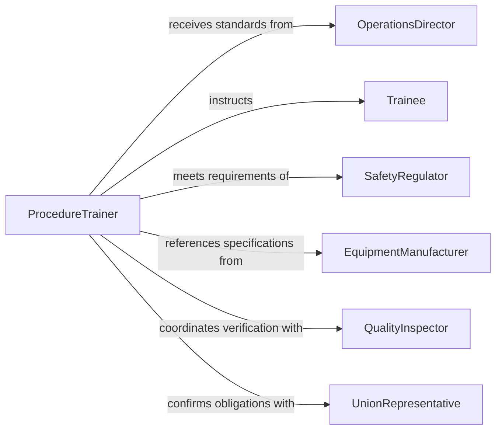

# Train Personnel Proper Operational Procedures

> Business-as-Code definition for training personnel on proper operational procedures. Models the structured process of documenting correct procedures, delivering hands-on instruction, verifying adherence, and maintaining certification records.

## Overview

Training personnel on proper operational procedures focuses on ensuring that employees understand and can correctly execute standard operating procedures for their roles. This definition exposes actions for procedure documentation alignment, practical training delivery, competency verification through demonstration, and ongoing recertification management. It emphasizes safety, consistency, and regulatory adherence in operational execution.

## Actors

| Actor | Description |
|-------|-------------|
| OperationsDirector | Establishes operational standards and approves procedure changes |
| Trainee | The employee learning to perform procedures correctly |
| SafetyRegulator | Enforces industry safety standards that procedures must satisfy |
| EquipmentManufacturer | Provides operational specifications and recommended procedures |
| QualityInspector | Verifies that trained procedures produce compliant output |
| UnionRepresentative | Ensures training obligations align with labor agreements |

## Roles

| Role | Description |
|------|-------------|
| ProcedureTrainer | Delivers hands-on instruction on correct operational methods |
| ProcessEngineer | Documents and validates standard operating procedures |
| TrainingRecordsManager | Maintains certification and recertification documentation |
| ShiftSupervisor | Reinforces proper procedures during daily operations |

## Entities

| Entity | Description |
|--------|-------------|
| StandardOperatingProcedure | The documented correct method for performing an operation |
| TrainingChecklist | A step-by-step verification list for procedural competency |
| DemonstrationRecord | Documentation of a trainee successfully performing the procedure |
| CertificationRecord | Formal record of a trainee's procedural qualification |
| IncidentReport | A record of procedural deviation or safety occurrence |
| RecertificationSchedule | Timeline for periodic re-evaluation of procedural competency |

## Actions

| Action | Description |
|--------|-------------|
| alignProcedures | Map training content to current standard operating procedures |
| conductBriefing | Deliver classroom instruction on procedural requirements |
| demonstrateProcedure | Perform the procedure for trainees as a reference model |
| observePerformance | Watch and evaluate trainee execution of the procedure |
| certifyCompetency | Formally qualify a trainee on a specific procedure |
| scheduleRecertification | Set up periodic re-evaluation for certified personnel |
| documentDeviation | Record instances where procedures were not followed correctly |

## Events

| Event | Description |
|-------|-------------|
| proceduresAligned | Training content has been synchronized with current SOPs |
| briefingConducted | Classroom instruction on procedures has been delivered |
| procedureDemonstrated | A reference demonstration of the procedure has been performed |
| performanceObserved | A trainee's procedure execution has been evaluated |
| competencyCertified | A trainee has been formally qualified on the procedure |
| recertificationScheduled | A re-evaluation date has been set for certified personnel |
| deviationDocumented | A procedural non-conformance has been recorded |

## Searches

| Search | Description |
|--------|-------------|
| findCertifiedPersonnel | List employees certified on a specific operating procedure |
| getRecertificationDue | Identify personnel whose certifications are expiring |
| getDeviationHistory | Retrieve procedural deviation records by employee or procedure |
| findTrainingByProcedure | List training sessions associated with a specific SOP |
| getCertificationStatus | Check an individual's current procedural qualifications |

## Entity Relationships



## State Diagram



## Workflow



## Actor Relationships



## Usage

### Calling Actions

```typescript
import { trainPersonnelProperOperationalProcedures } from '@headlessly/train-personnel-proper-operational-procedures'

const training = trainPersonnelProperOperationalProcedures()

// Align training with current procedures
await training.alignProcedures({
  sopIds: ['SOP-MFG-101', 'SOP-MFG-102'],
  effectiveDate: '2026-03-01'
})

// Observe trainee performance
const observation = await training.observePerformance({
  traineeId: 'EMP-2201',
  procedureId: 'SOP-MFG-101',
  evaluatorId: 'TRN-005',
  checklist: ['PPE donned correctly', 'Machine startup sequence followed', 'Safety interlock verified']
})

// Certify competency
await training.certifyCompetency({
  traineeId: 'EMP-2201',
  procedureId: 'SOP-MFG-101',
  certifiedDate: '2026-03-15',
  validUntil: '2027-03-15'
})
```

### Event-Driven Automation

```typescript
// Alert on procedural deviations
training.deviationDocumented(async ({ traineeId, procedureId, severity }) => {
  if (severity === 'critical') {
    await notify({
      to: 'safety-team',
      message: `Critical procedural deviation by ${traineeId} on ${procedureId}. Immediate retraining required.`
    })
  }
})

// Auto-notify for recertification
training.recertificationScheduled(async ({ traineeId, procedureId, dueDate }) => {
  await scheduleReminder({
    date: daysBeforeDate(dueDate, 30),
    to: traineeId,
    message: `Your certification for ${procedureId} expires on ${dueDate}. Please schedule recertification.`
  })
})
```
