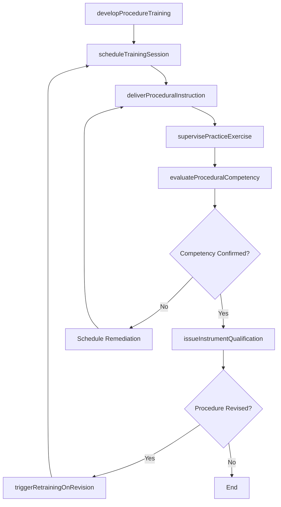
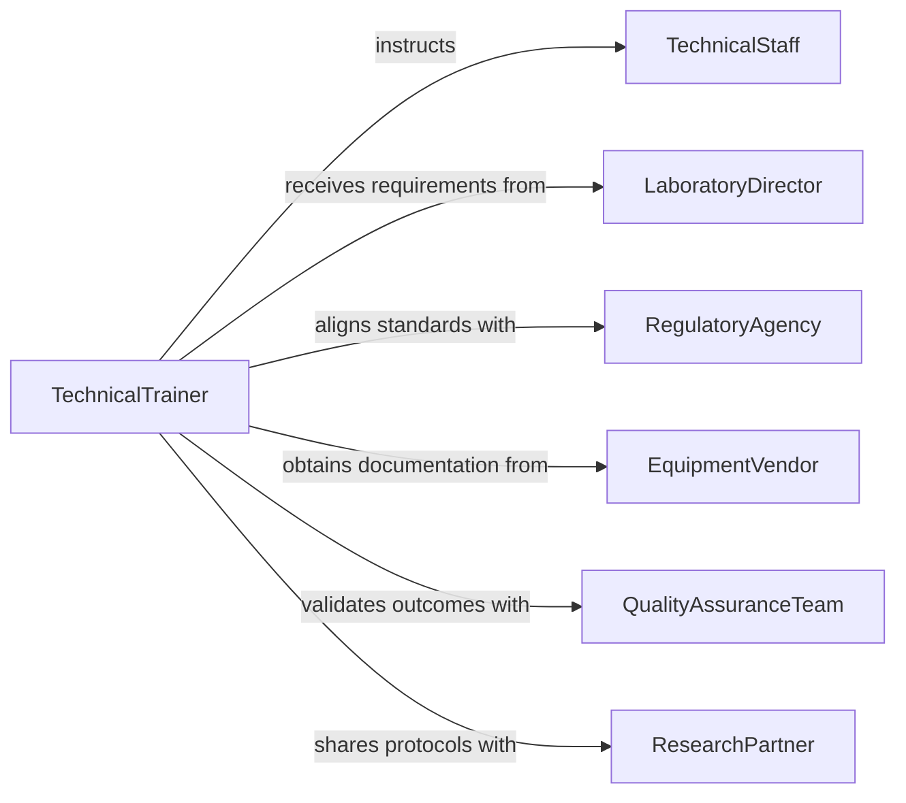

# Train Personnel Technical Scientific Procedures

> Business-as-Code definition for training personnel in technical or scientific procedures. Models the complete process of developing procedure-based instruction, delivering laboratory and technical training, and validating procedural competency.

## Overview

Training personnel in technical or scientific procedures involves instructing staff on standardized methods for laboratory operations, scientific experimentation, technical equipment use, quality testing, and data collection protocols. This definition exposes actions for designing procedure-specific curricula, scheduling technical training sessions, conducting supervised practice, and verifying that personnel can execute procedures accurately and in compliance with established standards.

## Actors

| Actor | Description |
|-------|-------------|
| TechnicalStaff | Individual receiving instruction on scientific or technical procedures |
| LaboratoryDirector | Oversees laboratory operations and identifies training requirements |
| RegulatoryAgency | Government body establishing procedural compliance standards |
| EquipmentVendor | Supplier providing instrument-specific training and documentation |
| QualityAssuranceTeam | Internal group validating procedural adherence and training effectiveness |
| ResearchPartner | External institution collaborating on shared procedural standards |

## Roles

| Role | Description |
|------|-------------|
| TechnicalTrainer | Designs and delivers instruction on scientific and technical procedures |
| ProcedureSpecialist | Maintains standard operating procedures and ensures training alignment |
| CompetencyEvaluator | Assesses whether personnel can execute procedures correctly |
| TrainingAdministrator | Manages scheduling, enrollment, and training documentation |

## Entities

| Entity | Description |
|--------|-------------|
| StandardOperatingProcedure | A documented step-by-step method for a technical or scientific task |
| TrainingModule | A structured instructional unit covering one or more procedures |
| CompetencyRecord | Documentation of a staff member's procedural proficiency evaluation |
| TrainingSession | A scheduled event for delivering procedural instruction |
| InstrumentQualification | Certification that a technician is authorized to operate specific equipment |
| ProcedureRevision | An updated version of a standard operating procedure requiring retraining |

## Actions

| Action | Description |
|--------|-------------|
| developProcedureTraining | Create instructional content for a specific technical or scientific procedure |
| scheduleTrainingSession | Plan a session with participants, location, and required equipment |
| deliverProceduralInstruction | Conduct training on step-by-step execution of a procedure |
| supervisePracticeExercise | Observe trainees performing procedures under controlled conditions |
| evaluateProceduralCompetency | Assess whether personnel can execute procedures accurately |
| issueInstrumentQualification | Certify a technician to independently operate specific equipment |
| triggerRetrainingOnRevision | Initiate mandatory retraining when a procedure is updated |

## Events

| Event | Description |
|-------|-------------|
| procedureTrainingDeveloped | Instructional content for a procedure has been created or updated |
| trainingSessionScheduled | A procedural training session has been planned and confirmed |
| proceduralInstructionDelivered | Training on a specific procedure has been completed |
| practiceExerciseCompleted | Supervised practice of a procedure has been finished |
| proceduralCompetencyEvaluated | A staff member's procedure execution has been assessed |
| instrumentQualificationIssued | Equipment operation authorization has been granted |
| retrainingTriggered | A procedure revision has initiated mandatory retraining |

## Searches

| Search | Description |
|--------|-------------|
| findTrainingModules | List procedure training modules by discipline, instrument, or difficulty |
| getCompetencyRecords | Retrieve staff competency evaluations by procedure, date, or status |
| getQualifications | Look up instrument qualifications by technician or equipment type |
| findRetrainingNeeds | Identify personnel requiring retraining due to procedure revisions |

## Workflow



## Actor Relationships



## Usage

### Calling Actions

```typescript
import { trainPersonnelTechnicalScientificProcedures } from '@headlessly/train-personnel-technical-scientific-procedures'

const procedures = trainPersonnelTechnicalScientificProcedures()

// Develop procedure-specific training
const module = await procedures.developProcedureTraining({
  procedureId: 'SOP-2026-044',
  title: 'HPLC Column Calibration and Sample Analysis',
  instruments: ['hplc-system-agilent-1260'],
  estimatedDuration: { hours: 6 }
})

// Schedule and deliver training
const session = await procedures.scheduleTrainingSession({
  moduleId: module.id,
  participantIds: ['tech-101', 'tech-102'],
  scheduledDate: '2026-04-22',
  location: 'Analytical Chemistry Lab'
})

// Evaluate competency
const evaluation = await procedures.evaluateProceduralCompetency({
  sessionId: session.id,
  participantId: 'tech-101',
  criteria: ['sample-preparation', 'instrument-setup', 'data-interpretation']
})
```

### Event-Driven Automation

```typescript
// Auto-qualify technicians on instruments after passing
procedures.proceduralCompetencyEvaluated(async ({ participantId, passed, instrumentIds }) => {
  if (passed) {
    for (const instrumentId of instrumentIds) {
      await procedures.issueInstrumentQualification({
        technicianId: participantId,
        instrumentId,
        validUntil: '2027-04-22'
      })
    }
  }
})

// Trigger retraining when procedures are revised
procedures.retrainingTriggered(async ({ procedureId, affectedStaff }) => {
  await notify({
    to: 'training-admin',
    message: `Procedure ${procedureId} revised. ${affectedStaff.length} personnel require retraining.`
  })
})
```
